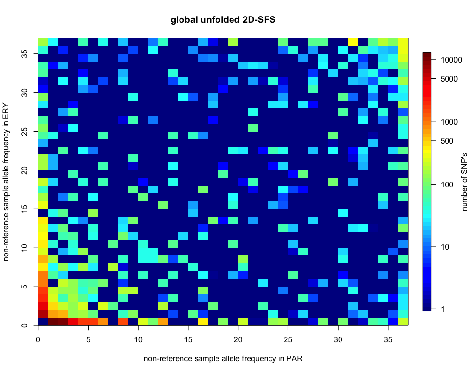

Sequence divergene from 2D SFS
================
Claudius
16/01/2018

``` r
library(knitr)
knitr::opts_chunk$set(echo = TRUE, dev=c("png", "pdf"), eval=TRUE, fig.width=10, fig.height=8, warning = FALSE)
options(digits=10)
setwd("/Users/Claudius/Documents/PhD/THESIS/kks32/LaTeX/Data_analysis/SNP-indel-calling/ANGSD/BOOTSTRAP_CONTIGS/minInd9_overlapping/SFS")
```

``` r
# plot 2D SFS
sfs2d = scan("original/EryPar.unfolded.sfs")
sfs2d = t(matrix(sfs2d, nrow=37, ncol=37)) # rows should be PAR, columns should be ERY
sfs2d[1,1] = 0
ticks = c(1, 10, 100, 500, 1000, 5000, 10000)
# rows in the matrix are on the x-axis, columns are on the y-axis:
image.plot(0:37, 0:37, log10(sfs2d+1), xlab="non-reference sample allele frequency in PAR", 
           ylab="non-reference sample allele frequency in ERY", main="global unfolded 2D-SFS",
           axis.args = list(at=log10(ticks), labels=ticks), legend.lab="number of SNP's",
           legend.line = 3,
           graphics.reset=TRUE
           )
```



I would like to calculate *K*<sub>*S**T*</sub> as:
$$
K\_{ST} = 1 - \\frac{K\_S}{K\_T}
$$

*K*<sub>*S*</sub> is the average within population *π* from ERY and PAR, weighted by sample size:
$$
K\_S = \\frac{n}{n+m} \\times \\pi\_{ery} + \\frac{m}{n+m} \\times \\pi\_{par}
$$

where *n* is the sample size of ERY (36 alleles) and *m* is the sample size of PAR (36 alleles). *π*<sub>*e**r**y*</sub> and *π*<sub>*p**a**r*</sub> can be calculated from the 1D spectra taken from the 2D SFS by marginalising over one dimension, i. e. `colSums` or `rowSums`. *K*<sub>*T*</sub> is:
*K*<sub>*T*</sub> = *K*<sub>*S*</sub> + *K*<sub>*B*</sub>
 *K*<sub>*B*</sub> is the average pairwise sequence divergence between ERY and PAR. It can be calculated from the unfolded 2D SFS with:
$$
K\_B = \\frac{1}{nm} \\left\[ \\sum\_{i=0}^{m} \\sum\_{j=0}^{n} \[i(n-j) + j(m-i)\]\\xi\_{ij} \\right\]
$$
 where *ξ*<sub>*i**j*</sub> is the count in the unfolded joint allele frequency class \[i, j\] in the 2D-SFS. The allele frequency classes in the 2D SFS refer to the non-reference allele. The joint reference allele frequency is given by \[m-i, n-j\]. *K*<sub>*B*</sub> should be equivalent to *d*<sub>*x**y*</sub> as given in eq. 12.66 on p. 256 in Nei & Kumar (2000).

``` r
get_Kb = function(sfs2d){
  m = dim(sfs2d)[1]-1
  n = dim(sfs2d)[2]-1
  Kb = 0
  for(i in 0:n){
    for(j in 0:m){
      Kb = Kb + (i*(n-j)+j*(m-i))*sfs2d[i+1,j+1]
    }
  }
  return(Kb/(n*m))
}
```

``` r
# get 2D SFS including count for [0, 0]
sfs2d = scan("original/EryPar.unfolded.sfs")
sfs2d = t(matrix(sfs2d, nrow=37, ncol=37)) # rows should be PAR, columns should be ERY
# get number of sites over which 2D SFS has been estimated
n.Sites = sum(sfs2d)
```

``` r
Kb = get_Kb(sfs2d)/n.Sites
Kb
```

    ## [1] 0.01072398531

The average sequence divergence between ERY and PAR is 10.7%. This average sequence divergence includes mutations that are not fixed in either or both subspecies.

``` r
# define function to calculate average number of pairwise differences
# from a unfolded SFS

PI_unfolded = function(sfs){
  # takes UN-folded SFS
  # expects that first count is for reference alleles
  n = length(sfs)-1
  # modified from equation 1.4 in Wakeley2009 for unfolded SFS:
  2/(n*(n-1)) * sum( sapply(1:n, function(i) i*(n-i)*sfs[i+1]) )
}
```

``` r
# marginalise
# rowSums should give the marginal spectrum for PAR, colSums should give the marginal spectrum for ERY

marginalise = function(sfs2d, over){
  # if 'over' is 1, returns the marginal spectrum for ERY,
  # if 'over' is 2, returns the marginal spectrum for PAR
  if(over==2){
    return(rowSums(sfs2d))
  }else{
    if(over==1){
      return(colSums(sfs2d))
    }else{
      print("over must be given 1 or 2")
      }
  }
}
```

``` r
# get within population pi for PAR
PI_unfolded(marginalise(sfs2d, over=2))/n.Sites
```

    ## [1] 0.008161036602

``` r
# get within population pi for ERY
PI_unfolded(marginalise(sfs2d, over=1))/n.Sites
```

    ## [1] 0.007236938318

These values are very similar to those estimated from 1D spectra of overlapping sites (see table 1.1 in thesis).

``` r
n = 36
m = 36
Ks = 36/72 * PI_unfolded(marginalise(sfs2d, over=2))/n.Sites + 36/72 * PI_unfolded(marginalise(sfs2d, over=1))/n.Sites
Ks
```

    ## [1] 0.00769898746

``` r
Kt = Ks + Kb
Kt
```

    ## [1] 0.01842297277

``` r
Kst = 1 - Ks/Kt
Kst
```

    ## [1] 0.5820985269

This *K*<sub>*S**T*</sub> estimate is roughly concordant with estimates of *K*<sub>*S**T*</sub> between French and Spanish regions given in Cooper (1995).

The net sequence divergence between ERY and PAR is:
*D*<sub>*a*</sub> = *K*<sub>*B*</sub> − *K*<sub>*S*</sub>

see equation 12.67, p. 256 in Nei & Kumar (2000).

``` r
Da = Kb - Ks
Da
```

    ## [1] 0.003024997853

*E*\[*D*<sub>*a*</sub>\]=2*μ**T*
 eq. 12.69, p. 256 in Nei & Kumar (2000).

``` r
T = Da/2/3*10^9
T
```

    ## [1] 504166.3088

The divergence time as estimated from genome-wide *D*<sub>*a*</sub> is close to 500,000 years (assuming a mutation rate of 3 × 10<sup>−9</sup>). This is remarkably close to the estimate given by dadi in the *divergence-in-isolation* model (486,848, CI:476,703 – 496,994).

``` r
(sum(sfs2d[37,1:37]) + sum(sfs2d[1:37,37]))/n.Sites
```

    ## [1] 0.00364968356
