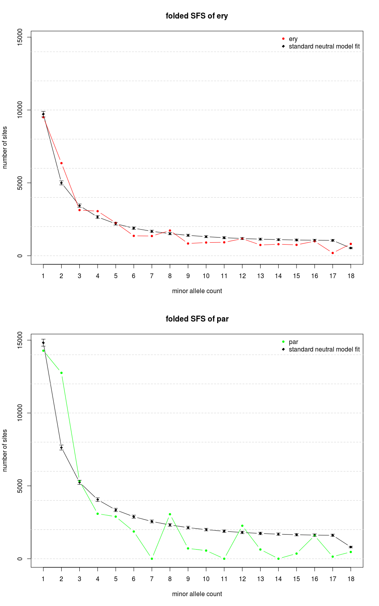
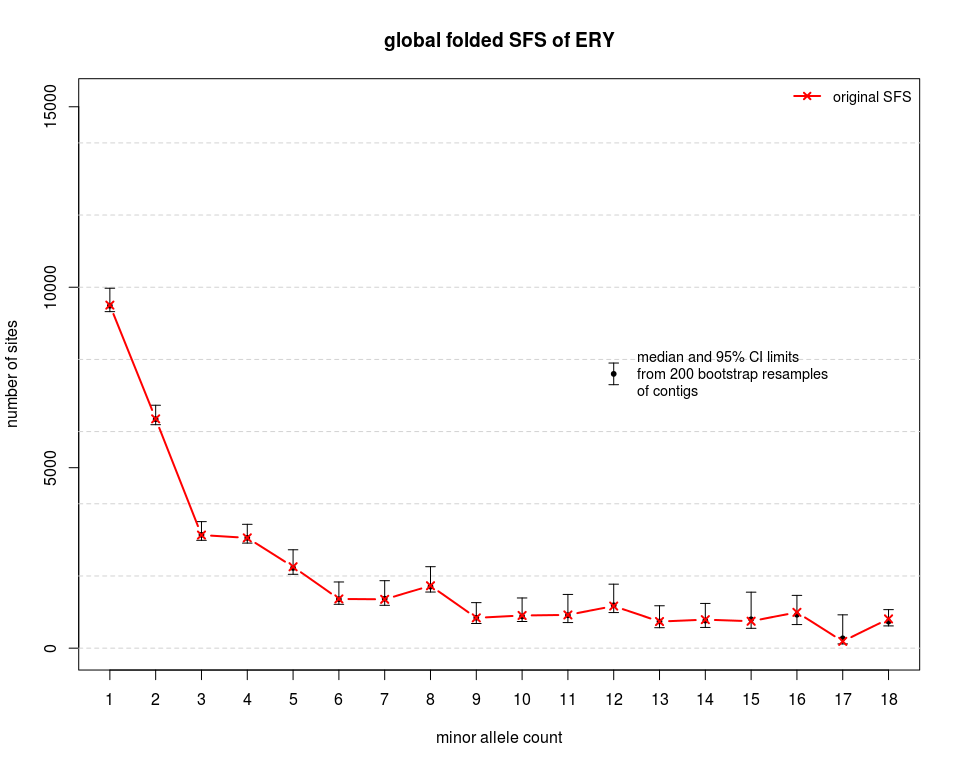
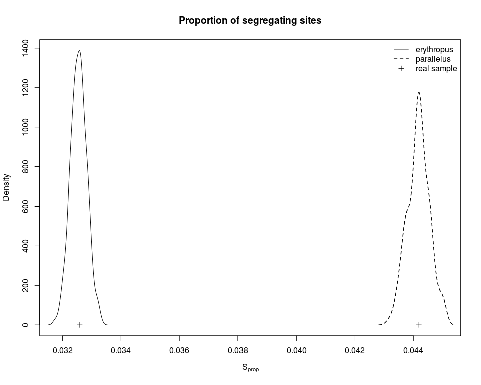

new 1D SFS
================
Claudius
19/08/2017

-   [Introduction](#introduction)
-   [Plot the data](#plot-the-data)
-   [Fit standard neutral model spectrum](#fit-standard-neutral-model-spectrum)
-   [Add bootstrap confidence intervals](#add-bootstrap-confidence-intervals)
-   [Calculate genetic diversity parameters](#calculate-genetic-diversity-parameters)
    -   [S and *π*](#s-and-pi)
    -   [Global Tajima's D](#global-tajimas-d)
    -   [Check including non-overlapping sites](#check-including-non-overlapping-sites)
-   [References](#references)

``` r
library(knitr)
opts_chunk$set(dev=c("png", "pdf"), eval=TRUE, fig.width=10, fig.height=8)
options(digits=10)
setwd("/data3/claudius/Big_Data/ANGSD/BOOTSTRAP_CONTIGS/minInd9_overlapping/SFS")
```

Introduction
============

This notebook analyses 1D site frequency spectra of ERY and PAR. There is a similar notebook in `/data3/claudius/Big_Data/ANGSD/SFS/SFS.Rmd`. The current notebook differs from this other notebook by:

1.  analysing spectra that have been estimated with a newer version of `angsd` and `realSFS` (0.917-142-ge3dbeaa (htslib: 1.4.1-33-g979571b) build(Jun 20 2017 11:03:58)), see `angsd` issue [\#97](https://github.com/ANGSD/angsd/issues/97).

2.  analysing spectra that have been estimated with a `sites` file only containing overlapping sites between ERY and PAR. An overlapping site needed to have read data for at least 9 individuals in *each* population. For the creation of the `sites` file, see line 2531 onwards in `assembly.sh`.

3.  analysing only spectra that have been estimated with exhaustive search parameters to guarantee convergence: `-maxIter 50000 -tole 1e-6 -m 0` (see line 2611 onwards and 2692 onwards in `assembly.sh`)

``` r
ery.sfs = scan("original/ERY/ERY.unfolded.sfs.folded")
par.sfs = scan("original/PAR/PAR.unfolded.sfs.folded")
```

``` r
# get total number of sites in the spectra (including monomorphic sites)

sum(ery.sfs)
```

    ## [1] 1130775

``` r
sum(par.sfs)
```

    ## [1] 1130775

As expected, both spectra are based on the same number of sites.

Plot the data
=============

``` r
barplot(rbind(ery.sfs[-1], par.sfs[-1]), 
        names.arg=1:length(ery.sfs[-1]),
        beside=TRUE,
        xlab="minor allele count",
        ylab="number of sites",
        main="ML folded site frequency spectrum"
        )
legend("topright",
        legend=c("erythropus", "parallelus"),
        fill=c(gray(.3), gray(.7))
        )
```


Fit standard neutral model spectrum
===================================

I am trying to fit eq. 4.21 of Wakeley (2009) to the oberseved 1D folded spectra:

$$
E\[\\eta\_i\] = \\theta \\frac{\\frac{1}{i} + \\frac{1}{n-i}}{1+\\delta\_{i,n-i}} \\qquad 1 \\le i \\le \\big\[n/2\\big\]
$$
 This formula gives the neutral expectation of counts in each frequency class (*i*) in a folded spectrum. The count in each frequency class, *η*<sub>*i*</sub>, provides an estimate of *θ*. However, I would like to find the value of *θ* that minimizes the deviation of the above equation from all observed counts *η*<sub>*i*</sub>.

``` r
# define function to optimise

f = function (theta, eta, n){ 
  #
  # theta: parameter to optimize
  # eta: will get the observed SFS
  # n: number of gene copies sampled per diploid locus
  #
  # returns sum of squared deviations (residuals) between observed counts
  # and a candidate model
  #
  sumofsq = numeric(length(ery.sfs))
  i = seq(1, length(eta))
  delta = ifelse(i == n-i, 1, 0)
  expected = theta * (1/i + 1/(n-i)) / (1 + delta)
  sumofsq = sum( (expected - eta)^2 )
  return(sumofsq)
}
```

``` r
# fit optimizal theta to ery and par SFS

ery_thetaOpt = optimize(f, interval=c(0, sum(ery.sfs[-1])),  eta=ery.sfs[-1], n=36, maximum=FALSE, tol=0.001)
par_thetaOpt = optimize(f, interval=c(0, sum(par.sfs[-1])),  eta=par.sfs[-1], n=36, maximum=FALSE, tol=0.001)
```

The optimal *θ* for the spectrum of *ery* is 9,443. The optimal *θ* for the spectrum of *par* is 14,414.

``` r
# define a function that returns expected counts given a theta under the assumption of
# the standard neutral model

snm = function(theta, len=0, n=36){
  #
  # theta: should be optimized theta
  # len: should be the length of the folded SFS, i. e. highest freq. class
  # n: should be number of gene copies sampled per locus, i. e. 2*N for diploid loci
  #
  # returns expected SFS
  #
  i = seq(1, len)
  delta = ifelse(i == n-i, 1, 0)
  expected = theta * (1/i + 1/(n-i)) / (1 + delta)
  return(expected)
}
```

``` r
# plot observed spectra and expected neutral fit for ery and par

par(mfrow=c(2,1))
# standard neutral model expectation:
snm_ery = snm(ery_thetaOpt$min, len=length(ery.sfs[-1]), n=36)
snm_par = snm(par_thetaOpt$min, len=length(par.sfs[-1]), n=36)

y_max = max(par.sfs[-1], snm_par, ery.sfs[-1], snm_ery)
plot(snm_ery, 
     xlab="minor allele count", 
     ylab="number of sites",
     ylim=c(0, y_max),
     pch=18, col="black", type="b",
     main="folded SFS of ery",
     xaxp=c(1, length(ery.sfs[-1]), length(ery.sfs[-1])-1)
)
abline(h=seq(0,y_max,2000), lty="dashed", col="lightgrey")
# observed:
lines(ery.sfs[-1], pch=20, col="red", type="b")
legend("topright", legend=c("ery", "standard neutral model fit"), pch=c(20, 18), col=c("red", "black"), bty="n")

# get lower and upper 95% Poisson quantiles for SNM:
low = qpois(p=0.025, lambda=snm_ery)
high = qpois(p=0.975, lambda=snm_ery)
# add 95% CI bars:
arrows(1:length(snm_ery), snm_ery, 
       1:length(snm_ery), high,
       angle=90,
       length=.05
       )
arrows(1:length(snm_ery), snm_ery, 
       1:length(snm_ery), low,
       angle=90,
       length=.05
       )
#
plot(snm_par, 
     xlab="minor allele count", 
     ylab="number of sites",
     ylim=c(0, y_max),
     pch=18, col="black", type="b",
     main="folded SFS of par",
     xaxp=c(1, length(par.sfs[-1]), length(par.sfs[-1])-1)
     )
abline(h=seq(0,y_max,2000), lty="dashed", col="lightgrey")
# observed:
lines(par.sfs[-1], pch=20, col="green", type="b")
legend("topright", legend=c("par", "standard neutral model fit"), pch=c(20, 18), col=c("green", "black"), bty="n")
# get lower and upper 95% Poisson quantiles for SNM:
low = qpois(p=0.025, lambda=snm_par)
high = qpois(p=0.975, lambda=snm_par)
# add 95% CI bars:
arrows(1:length(snm_par), snm_par, 
       1:length(snm_par), high,
       angle=90,
       length=.05
       )
arrows(1:length(snm_par), snm_par, 
       1:length(snm_par), low,
       angle=90,
       length=.05
       )
```



Add bootstrap confidence intervals
==================================

I have bootstrapped the regions file and estimated SAF's and SFS' from it (see line 2676 onwards in `assembly.sh`). These are therefore bootstraps over contigs, not over sites as done by the `bootstrap` function of `realSFS`.

``` r
pp = pipe("cat bootstrap/ERY/*.unfolded.sfs.folded", "r")
ery.sfs.boot = read.table(pp, header=FALSE)
close(pp)

pp = pipe("cat bootstrap/PAR/*.unfolded.sfs.folded", "r")
par.sfs.boot = read.table(pp, header=FALSE)
close(pp)
```

``` r
dim(ery.sfs.boot)
```

    ## [1] 200  19

``` r
dim(par.sfs.boot)
```

    ## [1] 200  19

``` r
# get total number of sites in bootstrap replicate SFS's

rowSums(ery.sfs.boot)
```

    ##   [1] 1125480 1133068 1133529 1123684 1130166 1130643 1138171 1131097
    ##   [9] 1132541 1133263 1128377 1133385 1129979 1128465 1129154 1126576
    ##  [17] 1127222 1129440 1127937 1128481 1132191 1128474 1131456 1127980
    ##  [25] 1142100 1130516 1132704 1124313 1135754 1132606 1134846 1134104
    ##  [33] 1131265 1122024 1128759 1128972 1132740 1132584 1132577 1128566
    ##  [41] 1124135 1133107 1133089 1130008 1137740 1132020 1129638 1123806
    ##  [49] 1130633 1129275 1132658 1131469 1130732 1132664 1138253 1130200
    ##  [57] 1129730 1140226 1137612 1131352 1130648 1133244 1131866 1126309
    ##  [65] 1125654 1131014 1132972 1129676 1128156 1131225 1134062 1136981
    ##  [73] 1129737 1129086 1129033 1129014 1135263 1131901 1131923 1126286
    ##  [81] 1131832 1136747 1129718 1128205 1133305 1136823 1129864 1132273
    ##  [89] 1127559 1127400 1131106 1129143 1130208 1134422 1127703 1132207
    ##  [97] 1136578 1130296 1134913 1127905 1130603 1128602 1135537 1134808
    ## [105] 1128174 1130525 1127327 1128558 1136489 1127802 1136384 1133667
    ## [113] 1128649 1128379 1125657 1135225 1133012 1131940 1133574 1135561
    ## [121] 1132973 1138981 1132188 1125308 1133335 1121438 1133112 1129421
    ## [129] 1134873 1126065 1128630 1127730 1132703 1132423 1134594 1125748
    ## [137] 1132951 1127975 1138682 1124195 1128605 1129801 1131624 1128560
    ## [145] 1136729 1131974 1132031 1128737 1136389 1129923 1134616 1129372
    ## [153] 1141659 1135279 1131091 1131173 1127343 1128887 1138862 1126491
    ## [161] 1137258 1130393 1126167 1127488 1136159 1127415 1132970 1131320
    ## [169] 1125861 1129829 1128870 1131155 1128897 1131982 1130001 1140591
    ## [177] 1129591 1131907 1123815 1135074 1125452 1131644 1129632 1129948
    ## [185] 1131167 1131376 1130840 1133280 1136812 1126252 1128008 1132940
    ## [193] 1131747 1134787 1124988 1129230 1127028 1131132 1130043 1131736

``` r
rowSums(par.sfs.boot)
```

    ##   [1] 1125480 1133068 1133529 1123684 1130166 1130643 1138171 1131097
    ##   [9] 1132541 1133263 1128377 1133385 1129979 1128465 1129154 1126576
    ##  [17] 1127222 1129440 1127937 1128481 1132191 1128474 1131456 1127980
    ##  [25] 1142100 1130516 1132704 1124313 1135754 1132606 1134846 1134104
    ##  [33] 1131265 1122024 1128759 1128972 1132740 1132584 1132577 1128566
    ##  [41] 1124135 1133107 1133089 1130008 1137740 1132020 1129638 1123806
    ##  [49] 1130633 1129275 1132658 1131469 1130732 1132664 1138253 1130200
    ##  [57] 1129730 1140226 1137612 1131352 1130648 1133244 1131866 1126309
    ##  [65] 1125654 1131014 1132972 1129676 1128156 1131225 1134062 1136981
    ##  [73] 1129737 1129086 1129033 1129014 1135263 1131901 1131923 1126286
    ##  [81] 1131832 1136747 1129718 1128205 1133305 1136823 1129864 1132273
    ##  [89] 1127559 1127400 1131106 1129143 1130208 1134422 1127703 1132207
    ##  [97] 1136578 1130296 1134913 1127905 1130603 1128602 1135537 1134808
    ## [105] 1128174 1130525 1127327 1128558 1136489 1127802 1136384 1133667
    ## [113] 1128649 1128379 1125657 1135225 1133012 1131940 1133574 1135561
    ## [121] 1132973 1138981 1132188 1125308 1133335 1121438 1133112 1129421
    ## [129] 1134873 1126065 1128630 1127730 1132703 1132423 1134594 1125748
    ## [137] 1132951 1127975 1138682 1124195 1128605 1129801 1131624 1128560
    ## [145] 1136729 1131974 1132031 1128737 1136389 1129923 1134616 1129372
    ## [153] 1141659 1135279 1131091 1131173 1127343 1128887 1138862 1126491
    ## [161] 1137258 1130393 1126167 1127488 1136159 1127415 1132970 1131320
    ## [169] 1125861 1129829 1128870 1131155 1128897 1131982 1130001 1140591
    ## [177] 1129591 1131907 1123815 1135074 1125452 1131644 1129632 1129948
    ## [185] 1131167 1131376 1130840 1133280 1136812 1126252 1128008 1132940
    ## [193] 1131747 1134787 1124988 1129230 1127028 1131132 1130043 1131736

``` r
ery.sfs.boot = ery.sfs.boot[,-1]
par.sfs.boot = par.sfs.boot[,-1]
```

``` r
# get 95% bootstrap confidence intervals

ery.sfs.CI95 = data.frame(
  low=vector("double", ncol(ery.sfs.boot)), 
  med=vector("double", ncol(ery.sfs.boot)), 
  high=vector("double", ncol(ery.sfs.boot))
  )
#
for(i in 1:ncol(ery.sfs.boot)){
  ery.sfs.CI95[i,] = quantile(ery.sfs.boot[,i], probs=c(0.25, 0.5, 0.975))
}


par.sfs.CI95 = data.frame(
  low=vector("double", ncol(par.sfs.boot)), 
  med=vector("double", ncol(par.sfs.boot)), 
  high=vector("double", ncol(par.sfs.boot))
  )
#
for(i in 1:ncol(par.sfs.boot)){
  par.sfs.CI95[i,] = quantile(par.sfs.boot[,i], probs=c(0.25, 0.5, 0.975))
}
```

``` r
# plot ERY spectrum with bootstrap CI95

y_max = max(ery.sfs.CI95, par.sfs.CI95)
plot(1:nrow(ery.sfs.CI95), ery.sfs.CI95$med, 
     ylim=c(0, y_max),
     pch=20,
     xlab="minor allele count",
     ylab="number of sites",
     main="global folded SFS of ERY",
     xaxp=c(1, length(ery.sfs[-1]), length(ery.sfs[-1])-1)
     )
abline(h=seq(0, y_max, 2000), lty="dashed", col="lightgrey")
arrows(1:nrow(ery.sfs.CI95), ery.sfs.CI95$med, 
       1:nrow(ery.sfs.CI95), ery.sfs.CI95$high,
       angle=90,
       length=.05
       )
arrows(1:nrow(ery.sfs.CI95), ery.sfs.CI95$med, 
       1:nrow(ery.sfs.CI95), ery.sfs.CI95$low,
       angle=90,
       length=.05
       )
points(1:18, ery.sfs[-1], pch=4, cex=1, col="red", type="b", lwd=2)
legend("topright", legend="original SFS", bty="n", col="red", pch=4, lwd=2, cex=.9)
#
points(12, 7600, pch=20)
arrows(12, 7600, 
       12, 7900,
       angle=90,
       length=.05
       )
arrows(12, 7600, 
       12, 7300,
       angle=90,
       length=.05
       )
#
text(12.3, 7400, 
     labels="median and 95% CI limits\nfrom 200 bootstrap resamples\nof contigs", 
     cex=.9, pos=4)
```


``` r
# plot PAR spectrum with bootstrap CI95

y_max = max(ery.sfs.CI95, par.sfs.CI95)
plot(1:nrow(par.sfs.CI95), par.sfs.CI95$med, 
     ylim=c(0, max(par.sfs.CI95)),
     pch=20,
     xlab="minor allele count",
     ylab="number of sites",
     main="global folded SFS of PAR",
     xaxp=c(1, length(par.sfs[-1]), length(par.sfs[-1])-1)
     )
abline(h=seq(0, y_max, 2000), lty="dashed", col="lightgrey")
arrows(1:nrow(par.sfs.CI95), par.sfs.CI95$med, 
       1:nrow(par.sfs.CI95), par.sfs.CI95$high,
       angle=90,
       length=.05
       )
arrows(1:nrow(par.sfs.CI95), par.sfs.CI95$med, 
       1:nrow(par.sfs.CI95), par.sfs.CI95$low,
       angle=90,
       length=.05
       )
points(1:18, par.sfs[-1], pch=4, cex=1, col="green", type="b", lwd=2)
legend("topright", legend="original SFS", bty="n", col="green", pch=4, lwd=2, cex=.9)
#
points(12, 7600, pch=20)
arrows(12, 7600, 
       12, 7900,
       angle=90,
       length=.05
       )
arrows(12, 7600, 
       12, 7300,
       angle=90,
       length=.05
       )
#
text(12.3, 7400, 
     labels="median and 95% CI limits\nfrom 200 bootstrap resamples\nof contigs", 
     cex=.9, pos=4)
```



Calculate genetic diversity parameters
======================================

### S and *π*

``` r
# define function to calculate average number of pairwise differences
# from a folded SFS

PI = function(sfs){
  # takes folded SFS
  n.half = length(sfs)
  n = 2*n.half
  # equation 1.4 in Wakeley2009:
  1/(n*(n-1)/2) * sum( sapply(1:n.half, function(i) i*(n-i)*sfs[i]) )
}
```

``` r
# get S and pi from observed spectra

ery.sfs = scan("original/ERY/ERY.unfolded.sfs.folded")
ery.nSites = sum(ery.sfs)
S.ery = sum(ery.sfs[-1])
S.ery # number of segregating sites
```

    ## [1] 36850.66312

``` r
pi.ery = PI( ery.sfs[-1] )
pi.ery/ery.nSites # pi per site
```

    ## [1] 0.007148491393

``` r
#
par.sfs = scan("original/PAR/PAR.unfolded.sfs.folded")
par.nSites = sum(par.sfs)
S.par = sum(par.sfs[-1])
S.par 
```

    ## [1] 49967.99911

``` r
pi.par = PI( par.sfs[-1] )
pi.par/par.nSites
```

    ## [1] 0.008045367247

PAR has 13,117 more SNP's than ERY (from exactly the same sites).

``` r
# read in bootstrap replicates again

pp = pipe("cat bootstrap/ERY/*.unfolded.sfs.folded", "r")
ery.sfs.boot = read.table(pp, header=FALSE)
close(pp)

pp = pipe("cat bootstrap/PAR/*.unfolded.sfs.folded", "r")
par.sfs.boot = read.table(pp, header=FALSE)
close(pp)
```

``` r
# number of segregating sites in bootstrap replicates

S.ery.boot = rowSums(ery.sfs.boot[,-1])
quantile(S.ery.boot, probs=c(.025, 0.5, .975))
```

    ##        2.5%         50%       97.5% 
    ## 36167.89426 36825.78645 37451.62196

``` r
S.par.boot = rowSums(par.sfs.boot[,-1])
quantile(S.par.boot, probs=c(.025, 0.5, .975))
```

    ##        2.5%         50%       97.5% 
    ## 49113.86858 49964.24362 50797.72090

``` r
# pi from bootstrap replicates

pi.ery.boot = apply( ery.sfs.boot, 1, function(sfs) PI( sfs[-1] ) )
quantile(pi.ery.boot, probs=c(.025, 0.5, .975))
```

    ##        2.5%         50%       97.5% 
    ## 7945.628706 8079.246440 8219.604046

``` r
pi.par.boot = apply( par.sfs.boot, 1, function(sfs) PI( sfs[-1] ) )
quantile(pi.par.boot, probs=c(.025, 0.5, .975))
```

    ##        2.5%         50%       97.5% 
    ## 8970.862721 9096.423843 9231.012206

``` r
plot(density(S.ery.boot/ery.nSites),
     xlab=expression(S[prop]),
     xlim=range(S.ery.boot/ery.nSites, S.par.boot/par.nSites),
     main="Proportion of segregating sites")
lines(density(S.par.boot/par.nSites), lty=2, lwd=1.5)
points(c(S.ery/ery.nSites, S.par/par.nSites), c(0, 0), pch=3)
legend("topright", legend=c("erythropus", "parallelus", "real sample"), 
       lty=c(1, 2, NA), lwd=c(1, 1.5, NA), pch=c(NA, NA, 3), bty="n")
```


``` r
plot(density(pi.ery.boot/ery.nSites),
     xlim=range(c(pi.ery.boot/ery.nSites, pi.par.boot/par.nSites)),
     xlab=expression(pi[site]),
     main="Average number of pairwise differences"
     )
lines(density(pi.par.boot/par.nSites), lty=2, lwd=1.5)
points(c(pi.ery/ery.nSites, pi.par/par.nSites), c(0, 0), pch=3)
legend("topright", legend=c("erythropus", "parallelus", "real sample"), lty=c(1, 2, NA), 
       lwd=c(1, 1.5, NA), pch=c(NA, NA, 3), bty="n")
```



Note that these diversity parameters are much higher than estimated previously with an older version of `angsd` (version 0.915-5-ge6e63e5, Nov 17, 2016) and from also non-overlapping sites (see `/data3/claudius/Big_Data/ANGSD/SFS/SFS.Rmd`). I could estimate SFS with the new version of `angsd` from also non-overlapping sites in order to see whether including non-overlapping sites changes diversity parameters significantly.

As with the previous version of `angsd`, both *S*<sub>*s**i**t**e*</sub> and *π*<sub>*s**i**t**e*</sub> are considerably higher in *parallelus* than in *erythropus*. If *parallelus* is derived from a Balkan refuge, I would expect it to have undergone a series of founder events. These should have reduced diversity, at least *π*, in *parallelus* more than in *erythropus* that comparatively would have had only a short distance to migrate from its glacial refuge. Subsequent population expansion would have allowed *S* to recover quickly.

### Global Tajima's D

``` r
# 1. calculate constant (see p. 45 in Gillespie)
# ery
n = 36
a1 = sum(sapply(1:(n-1), function(x) x^(-1)))
a1
```

    ## [1] 4.146781419

``` r
a2 = sum(sapply(1:(n-1), function(x) x^(-2)))
b1 = (n+1)/(3*(n-1))
b2 = 2*(n^2+n+3)/(9*n*(n-1))
c1 = b1 - (1/a1)
c2 = b2 - (n+2)/(a1*n)+a2/a1^2
C = sqrt( c1/a1*S.ery + (c2/(a1^2+a2))*S.ery*(S.ery-1) )
C
```

    ## [1] 2325.742581

``` r
( ery.TajimasD.global = (pi.ery - S.ery/a1)/C )
```

    ## [1] -0.3453669358

``` r
# 1. calculate constant (see p. 45 in Gillespie)
# par
n = 36
a1 = sum(sapply(1:(n-1), function(x) x^(-1)))
a2 = sum(sapply(1:(n-1), function(x) x^(-2)))
b1 = (n+1)/(3*(n-1))
b2 = 2*(n^2+n+3)/(9*n*(n-1))
c1 = b1 - (1/a1)
c2 = b2 - (n+2)/(a1*n)+a2/a1^2
C = sqrt( c1/a1*S.par + (c2/(a1^2+a2))*S.par*(S.par-1) )
( par.TajimasD.global = (pi.par - S.par/a1)/C )
```

    ## [1] -0.9361922141

``` r
# get bootstrap confidence intervals of global Tajima's D

# ery
C.boot = sqrt( c1/a1*S.ery.boot + (c2/(a1^2+a2))*S.ery.boot*(S.ery.boot-1) )
ery.TajimasD.global.boot = (pi.ery.boot - S.ery.boot/a1)/C.boot
quantile(ery.TajimasD.global.boot, probs=c(0.025, 0.5, 0.975))
```

    ##          2.5%           50%         97.5% 
    ## -0.3864126203 -0.3421272564 -0.3077289157

``` r
# par
C.boot = sqrt( c1/a1*S.par.boot + (c2/(a1^2+a2))*S.par.boot*(S.par.boot-1) )
par.TajimasD.global.boot = (pi.par.boot - S.par.boot/a1)/C.boot
quantile(par.TajimasD.global.boot, probs=c(0.025, 0.5, 0.975))
```

    ##          2.5%           50%         97.5% 
    ## -0.9647860911 -0.9341981922 -0.9077309367

Both global Tajima's D values are significantly different from 0 and negative. I think this means that there is an excess of low frequency variants, which might be an expansion signal, i. e. many variable sites are recent.

### Check including non-overlapping sites

I have calculated SAF files with the new version of `angsd` and also non-overlapping sites (see line 2638 onwards in `assembly.sh`). I have then estimated 1D SFS from these SAF files with exhaustive search parameters (see line 2674 onwards in `assembly.sh`).

``` r
# read in 1D SFS from also non-overlapping sites

ery.sfs = scan("/data3/claudius/Big_Data/ANGSD/SFS/with_ANGSD-0.917-142-ge3dbeaa/ERY/ERY.unfolded.sfs.folded")
par.sfs = scan("/data3/claudius/Big_Data/ANGSD/SFS/with_ANGSD-0.917-142-ge3dbeaa/PAR/PAR.unfolded.sfs.folded")
```

``` r
sum(ery.sfs)
```

    ## [1] 1639873

``` r
sum(par.sfs)
```

    ## [1] 1217242

When including also non-overlapping sites, the SFS of ERY is based on many more sites than the SFS of PAR. This is due to the higher coverage for ERY as compared to PAR.

``` r
barplot(rbind(ery.sfs[-1], par.sfs[-1]), 
        names.arg=1:length(ery.sfs[-1]),
        beside=TRUE,
        xlab="minor allele count",
        ylab="number of sites",
        main="ML folded site frequency spectrum"
        )
legend("topright",
        legend=c("erythropus", "parallelus"),
        fill=c(gray(.3), gray(.7))
        )
```


``` r
# get S and pi from observed spectra

# ery
ery.nSites = sum(ery.sfs)
S.ery = sum(ery.sfs[-1])
S.ery # number of segregating sites
```

    ## [1] 53350.96226

``` r
pi.ery = PI( ery.sfs[-1] )
pi.ery/ery.nSites # pi per site
```

    ## [1] 0.007348646983

``` r
# par
par.nSites = sum(par.sfs)
S.par = sum(par.sfs[-1])
S.par 
```

    ## [1] 54900.4626

``` r
pi.par = PI( par.sfs[-1] )
pi.par/par.nSites
```

    ## [1] 0.008323631766

These values are slightly *higher* than those estimated from only overlapping sites (above). So, the overlapping sites have a slightly lower genetic diversity, which makes sense since loci with greater polymorphism should have a higher chance of allele-drop-out due to polymorphisms in the restriction site and therefore also a lower chance of overlapping between the two populations (i. e. having 9 individuals with read data in each population). With the previous version of `angsd` I got *π*<sub>*s**i**t**e*</sub> values of around 0.0065 and 0.0073 for ERY and PAR, respectively. So, the new version of `angsd` does "call" higher sample allele frequencies.

References
==========

Wakeley, John. 2009. *Coalescent Theory*. Roberts & Company Publishers.
