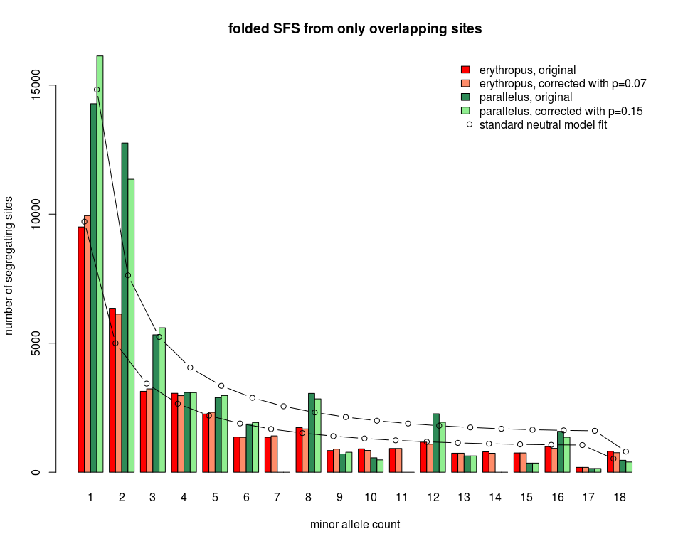

new 1D SFS
================
Claudius
19/08/2017

-   [Introduction](#introduction)
-   [Plot the data](#plot-the-data)
-   [Fit standard neutral model spectrum](#fit-standard-neutral-model-spectrum)
-   [Add bootstrap confidence intervals](#add-bootstrap-confidence-intervals)
-   [Calculate genetic diversity parameters](#calculate-genetic-diversity-parameters)
    -   [S and *π*](#s-and-pi)
    -   [Global Tajima's D](#global-tajimas-d)
    -   [Check including non-overlapping sites](#check-including-non-overlapping-sites)
    -   [apply Ludovic's correction](#apply-ludovics-correction)
    -   [comparison of results](#comparison-of-results)
-   [Conclusions](#conclusions)
-   [References](#references)

``` r
library(knitr)
opts_chunk$set(dev=c("png", "pdf"), eval=TRUE, fig.width=10, fig.height=8, warning = FALSE)
options(digits=10)
setwd("/data3/claudius/Big_Data/ANGSD/BOOTSTRAP_CONTIGS/minInd9_overlapping/SFS")
```

Introduction
============

This notebook analyses 1D site frequency spectra of ERY and PAR. There is a similar notebook in `/data3/claudius/Big_Data/ANGSD/SFS/SFS.Rmd`. The current notebook differs from this other notebook by:

1.  analysing spectra that have been estimated with a newer version of `angsd` and `realSFS` (0.917-142-ge3dbeaa (htslib: 1.4.1-33-g979571b) build(Jun 20 2017 11:03:58)), see `angsd` issue [\#97](https://github.com/ANGSD/angsd/issues/97).

2.  analysing spectra that have been estimated with a `sites` file only containing overlapping sites between ERY and PAR. An overlapping site needed to have read data for at least 9 individuals in *each* population. For the creation of the `sites` file, see line 2531 onwards in `assembly.sh`.

3.  analysing only spectra that have been estimated with exhaustive search parameters to guarantee convergence: `-maxIter 50000 -tole 1e-6 -m 0` (see line 2611 onwards and 2692 onwards in `assembly.sh`)

``` r
# read in folded spectra from only overlapping sites

ery.sfs = scan("original/ERY/ERY.unfolded.sfs.folded")
par.sfs = scan("original/PAR/PAR.unfolded.sfs.folded")
```

``` r
# get total number of sites in the spectra (including monomorphic sites)

sum(ery.sfs)
```

    ## [1] 1130775

``` r
sum(par.sfs)
```

    ## [1] 1130775

As expected, both spectra are based on the same number of sites.

``` r
# get total number of *segregating* sites in the spectra

sum(ery.sfs[-1])
```

    ## [1] 36850.66312

``` r
sum(par.sfs[-1])
```

    ## [1] 49967.99911

Plot the data
=============

``` r
barplot(rbind(ery.sfs[-1], par.sfs[-1]), 
        names.arg=1:length(ery.sfs[-1]),
        beside=TRUE,
        xlab="minor allele count",
        ylab="number of sites",
        main="ML folded site frequency spectrum"
        )
legend("topright",
        legend=c("erythropus", "parallelus"),
        fill=c(gray(.3), gray(.7))
        )
```


Fit standard neutral model spectrum
===================================

I am trying to fit eq. 4.21 of Wakeley (2009) to the oberseved 1D folded spectra:

$$
E\[\\eta\_i\] = \\theta \\frac{\\frac{1}{i} + \\frac{1}{n-i}}{1+\\delta\_{i,n-i}} \\qquad 1 \\le i \\le \\big\[n/2\\big\]
$$
 This formula gives the neutral expectation of counts in each frequency class (*i*) in a folded spectrum. The count in each frequency class, *η*<sub>*i*</sub>, provides an estimate of *θ*. However, I would like to find the value of *θ* that minimizes the deviation of the above equation from all observed counts *η*<sub>*i*</sub>.

``` r
# define function to optimise

f = function (theta, eta, n){ 
  #
  # theta: parameter to optimize
  # eta: will get the observed SFS
  # n: number of gene copies sampled per diploid locus
  #
  # returns sum of squared deviations (residuals) between observed counts
  # and a candidate model
  #
  sumofsq = numeric(length(ery.sfs))
  i = seq(1, length(eta))
  delta = ifelse(i == n-i, 1, 0)
  expected = theta * (1/i + 1/(n-i)) / (1 + delta)
  sumofsq = sum( (expected - eta)^2 )
  return(sumofsq)
}
```

``` r
# fit optimizal theta to ery and par SFS

ery_thetaOpt = optimize(f, interval=c(0, sum(ery.sfs[-1])),  eta=ery.sfs[-1], n=36, maximum=FALSE, tol=0.001)
par_thetaOpt = optimize(f, interval=c(0, sum(par.sfs[-1])),  eta=par.sfs[-1], n=36, maximum=FALSE, tol=0.001)
```

The optimal *θ* for the spectrum of *ery* is 9,443. The optimal *θ* for the spectrum of *par* is 14,414.

``` r
# define a function that returns expected counts given a theta under the assumption of
# the standard neutral model

snm = function(theta, len=0, n=36){
  #
  # theta: should be optimized theta
  # len: should be the length of the folded SFS, i. e. highest freq. class
  # n: should be number of gene copies sampled per locus, i. e. 2*N for diploid loci
  #
  # returns expected SFS
  #
  i = seq(1, len)
  delta = ifelse(i == n-i, 1, 0)
  expected = theta * (1/i + 1/(n-i)) / (1 + delta)
  return(expected)
}
```

``` r
# plot observed spectra and expected neutral fit for ery and par

par(mfrow=c(2,1))
# standard neutral model expectation:
snm_ery = snm(ery_thetaOpt$min, len=length(ery.sfs[-1]), n=36)
snm_par = snm(par_thetaOpt$min, len=length(par.sfs[-1]), n=36)

y_max = max(par.sfs[-1], snm_par, ery.sfs[-1], snm_ery)
plot(snm_ery, 
     xlab="minor allele count", 
     ylab="number of sites",
     ylim=c(0, y_max),
     pch=18, col="black", type="b",
     main="folded SFS of ery",
     xaxp=c(1, length(ery.sfs[-1]), length(ery.sfs[-1])-1)
)
abline(h=seq(0,y_max,2000), lty="dashed", col="lightgrey")
# observed:
lines(ery.sfs[-1], pch=20, col="red", type="b")
legend("topright", legend=c("ery", "standard neutral model fit"), pch=c(20, 18), col=c("red", "black"), bty="n")

# get lower and upper 95% Poisson quantiles for SNM:
low = qpois(p=0.025, lambda=snm_ery)
high = qpois(p=0.975, lambda=snm_ery)
# add 95% CI bars:
arrows(1:length(snm_ery), snm_ery, 
       1:length(snm_ery), high,
       angle=90,
       length=.05
       )
arrows(1:length(snm_ery), snm_ery, 
       1:length(snm_ery), low,
       angle=90,
       length=.05
       )
#
plot(snm_par, 
     xlab="minor allele count", 
     ylab="number of sites",
     ylim=c(0, y_max),
     pch=18, col="black", type="b",
     main="folded SFS of par",
     xaxp=c(1, length(par.sfs[-1]), length(par.sfs[-1])-1)
     )
abline(h=seq(0,y_max,2000), lty="dashed", col="lightgrey")
# observed:
lines(par.sfs[-1], pch=20, col="green", type="b")
legend("topright", legend=c("par", "standard neutral model fit"), pch=c(20, 18), col=c("green", "black"), bty="n")
# get lower and upper 95% Poisson quantiles for SNM:
low = qpois(p=0.025, lambda=snm_par)
high = qpois(p=0.975, lambda=snm_par)
# add 95% CI bars:
arrows(1:length(snm_par), snm_par, 
       1:length(snm_par), high,
       angle=90,
       length=.05
       )
arrows(1:length(snm_par), snm_par, 
       1:length(snm_par), low,
       angle=90,
       length=.05
       )
```


Add bootstrap confidence intervals
==================================

I have bootstrapped the (ANGSD) *regions* file and estimated SAF's and SFS' from it (see line 2715 onwards in `assembly.sh`). These are therefore bootstraps over contigs, not over sites as done by the `bootstrap` function of `realSFS`.

``` r
pp = pipe("cat bootstrap/ERY/*.unfolded.sfs.folded", "r")
ery.sfs.boot = read.table(pp, header=FALSE)
close(pp)

pp = pipe("cat bootstrap/PAR/*.unfolded.sfs.folded", "r")
par.sfs.boot = read.table(pp, header=FALSE)
close(pp)
```

``` r
dim(ery.sfs.boot)
```

    ## [1] 200  19

``` r
dim(par.sfs.boot)
```

    ## [1] 200  19

``` r
# get total number of sites in bootstrap replicate SFS's

rowSums(ery.sfs.boot)
```

    ##   [1] 1125480 1133068 1133529 1123684 1130166 1130643 1138171 1131097
    ##   [9] 1132541 1133263 1128377 1133385 1129979 1128465 1129154 1126576
    ##  [17] 1127222 1129440 1127937 1128481 1132191 1128474 1131456 1127980
    ##  [25] 1142100 1130516 1132704 1124313 1135754 1132606 1134846 1134104
    ##  [33] 1131265 1122024 1128759 1128972 1132740 1132584 1132577 1128566
    ##  [41] 1124135 1133107 1133089 1130008 1137740 1132020 1129638 1123806
    ##  [49] 1130633 1129275 1132658 1131469 1130732 1132664 1138253 1130200
    ##  [57] 1129730 1140226 1137612 1131352 1130648 1133244 1131866 1126309
    ##  [65] 1125654 1131014 1132972 1129676 1128156 1131225 1134062 1136981
    ##  [73] 1129737 1129086 1129033 1129014 1135263 1131901 1131923 1126286
    ##  [81] 1131832 1136747 1129718 1128205 1133305 1136823 1129864 1132273
    ##  [89] 1127559 1127400 1131106 1129143 1130208 1134422 1127703 1132207
    ##  [97] 1136578 1130296 1134913 1127905 1130603 1128602 1135537 1134808
    ## [105] 1128174 1130525 1127327 1128558 1136489 1127802 1136384 1133667
    ## [113] 1128649 1128379 1125657 1135225 1133012 1131940 1133574 1135561
    ## [121] 1132973 1138981 1132188 1125308 1133335 1121438 1133112 1129421
    ## [129] 1134873 1126065 1128630 1127730 1132703 1132423 1134594 1125748
    ## [137] 1132951 1127975 1138682 1124195 1128605 1129801 1131624 1128560
    ## [145] 1136729 1131974 1132031 1128737 1136389 1129923 1134616 1129372
    ## [153] 1141659 1135279 1131091 1131173 1127343 1128887 1138862 1126491
    ## [161] 1137258 1130393 1126167 1127488 1136159 1127415 1132970 1131320
    ## [169] 1125861 1129829 1128870 1131155 1128897 1131982 1130001 1140591
    ## [177] 1129591 1131907 1123815 1135074 1125452 1131644 1129632 1129948
    ## [185] 1131167 1131376 1130840 1133280 1136812 1126252 1128008 1132940
    ## [193] 1131747 1134787 1124988 1129230 1127028 1131132 1130043 1131736

``` r
rowSums(par.sfs.boot)
```

    ##   [1] 1125480 1133068 1133529 1123684 1130166 1130643 1138171 1131097
    ##   [9] 1132541 1133263 1128377 1133385 1129979 1128465 1129154 1126576
    ##  [17] 1127222 1129440 1127937 1128481 1132191 1128474 1131456 1127980
    ##  [25] 1142100 1130516 1132704 1124313 1135754 1132606 1134846 1134104
    ##  [33] 1131265 1122024 1128759 1128972 1132740 1132584 1132577 1128566
    ##  [41] 1124135 1133107 1133089 1130008 1137740 1132020 1129638 1123806
    ##  [49] 1130633 1129275 1132658 1131469 1130732 1132664 1138253 1130200
    ##  [57] 1129730 1140226 1137612 1131352 1130648 1133244 1131866 1126309
    ##  [65] 1125654 1131014 1132972 1129676 1128156 1131225 1134062 1136981
    ##  [73] 1129737 1129086 1129033 1129014 1135263 1131901 1131923 1126286
    ##  [81] 1131832 1136747 1129718 1128205 1133305 1136823 1129864 1132273
    ##  [89] 1127559 1127400 1131106 1129143 1130208 1134422 1127703 1132207
    ##  [97] 1136578 1130296 1134913 1127905 1130603 1128602 1135537 1134808
    ## [105] 1128174 1130525 1127327 1128558 1136489 1127802 1136384 1133667
    ## [113] 1128649 1128379 1125657 1135225 1133012 1131940 1133574 1135561
    ## [121] 1132973 1138981 1132188 1125308 1133335 1121438 1133112 1129421
    ## [129] 1134873 1126065 1128630 1127730 1132703 1132423 1134594 1125748
    ## [137] 1132951 1127975 1138682 1124195 1128605 1129801 1131624 1128560
    ## [145] 1136729 1131974 1132031 1128737 1136389 1129923 1134616 1129372
    ## [153] 1141659 1135279 1131091 1131173 1127343 1128887 1138862 1126491
    ## [161] 1137258 1130393 1126167 1127488 1136159 1127415 1132970 1131320
    ## [169] 1125861 1129829 1128870 1131155 1128897 1131982 1130001 1140591
    ## [177] 1129591 1131907 1123815 1135074 1125452 1131644 1129632 1129948
    ## [185] 1131167 1131376 1130840 1133280 1136812 1126252 1128008 1132940
    ## [193] 1131747 1134787 1124988 1129230 1127028 1131132 1130043 1131736

``` r
# discard count of monomorphic sites

ery.sfs.boot = ery.sfs.boot[,-1]
par.sfs.boot = par.sfs.boot[,-1]
```

``` r
dim(ery.sfs.boot)
```

    ## [1] 200  18

``` r
dim(par.sfs.boot)
```

    ## [1] 200  18

``` r
# get 95% bootstrap confidence intervals

ery.sfs.CI95 = data.frame(
  low=vector("double", ncol(ery.sfs.boot)), 
  med=vector("double", ncol(ery.sfs.boot)), 
  high=vector("double", ncol(ery.sfs.boot))
  )
#
for(i in 1:ncol(ery.sfs.boot)){
  ery.sfs.CI95[i,] = quantile(ery.sfs.boot[,i], probs=c(0.025, 0.5, 0.975))
}


par.sfs.CI95 = data.frame(
  low=vector("double", ncol(par.sfs.boot)), 
  med=vector("double", ncol(par.sfs.boot)), 
  high=vector("double", ncol(par.sfs.boot))
  )
#
for(i in 1:ncol(par.sfs.boot)){
  par.sfs.CI95[i,] = quantile(par.sfs.boot[,i], probs=c(0.025, 0.5, 0.975))
}
```

``` r
# plot ERY spectrum with bootstrap CI95

y_max = max(ery.sfs.CI95, par.sfs.CI95)
plot(1:nrow(ery.sfs.CI95), ery.sfs.CI95$med, 
     ylim=c(0, y_max),
     pch=20,
     xlab="minor allele count",
     ylab="number of sites",
     main="global folded SFS of ERY",
     xaxp=c(1, length(ery.sfs[-1]), length(ery.sfs[-1])-1)
     )
abline(h=seq(0, y_max, 2000), lty="dashed", col="lightgrey")
arrows(1:nrow(ery.sfs.CI95), ery.sfs.CI95$med, 
       1:nrow(ery.sfs.CI95), ery.sfs.CI95$high,
       angle=90,
       length=.05
       )
arrows(1:nrow(ery.sfs.CI95), ery.sfs.CI95$med, 
       1:nrow(ery.sfs.CI95), ery.sfs.CI95$low,
       angle=90,
       length=.05
       )
points(1:18, ery.sfs[-1], pch=4, cex=1, col="red", type="b", lwd=2)
legend("topright", legend="original SFS", bty="n", col="red", pch=4, lwd=2, cex=.9)
#
points(12, 7600, pch=20)
arrows(12, 7600, 
       12, 7900,
       angle=90,
       length=.05
       )
arrows(12, 7600, 
       12, 7300,
       angle=90,
       length=.05
       )
#
text(12.3, 7400, 
     labels="median and 95% CI limits\nfrom 200 bootstrap resamples\nof contigs", 
     cex=.9, pos=4)
```


``` r
# plot PAR spectrum with bootstrap CI95

y_max = max(ery.sfs.CI95, par.sfs.CI95)
plot(1:nrow(par.sfs.CI95), par.sfs.CI95$med, 
     ylim=c(0, max(par.sfs.CI95)),
     pch=20,
     xlab="minor allele count",
     ylab="number of sites",
     main="global folded SFS of PAR",
     xaxp=c(1, length(par.sfs[-1]), length(par.sfs[-1])-1)
     )
abline(h=seq(0, y_max, 2000), lty="dashed", col="lightgrey")
arrows(1:nrow(par.sfs.CI95), par.sfs.CI95$med, 
       1:nrow(par.sfs.CI95), par.sfs.CI95$high,
       angle=90,
       length=.05
       )
arrows(1:nrow(par.sfs.CI95), par.sfs.CI95$med, 
       1:nrow(par.sfs.CI95), par.sfs.CI95$low,
       angle=90,
       length=.05
       )
points(1:18, par.sfs[-1], pch=4, cex=1, col="green", type="b", lwd=2)
legend("topright", legend="original SFS", bty="n", col="green", pch=4, lwd=2, cex=.9)
#
points(12, 7600, pch=20)
arrows(12, 7600, 
       12, 7900,
       angle=90,
       length=.05
       )
arrows(12, 7600, 
       12, 7300,
       angle=90,
       length=.05
       )
#
text(12.3, 7400, 
     labels="median and 95% CI limits\nfrom 200 bootstrap resamples\nof contigs", 
     cex=.9, pos=4)
```


Calculate genetic diversity parameters
======================================

### S and *π*

``` r
# define function to calculate average number of pairwise differences
# from a folded SFS

PI = function(sfs){
  # takes folded SFS
  n.half = length(sfs)
  n = 2*n.half
  # equation 1.4 in Wakeley2009:
  1/(n*(n-1)/2) * sum( sapply(1:n.half, function(i) i*(n-i)*sfs[i]) )
}
```

``` r
# get S and pi from observed spectra

ery.sfs = scan("original/ERY/ERY.unfolded.sfs.folded")
ery.nSites = sum(ery.sfs)
S.ery = sum(ery.sfs[-1])
(S_prop.ery = S.ery/ery.nSites) # number of segregating sites
```

    ## [1] 0.03258885554

``` r
pi.ery = PI( ery.sfs[-1] )
(pi_sites.ery = pi.ery/ery.nSites) # pi per site
```

    ## [1] 0.007148491393

``` r
#
par.sfs = scan("original/PAR/PAR.unfolded.sfs.folded")
par.nSites = sum(par.sfs)
S.par = sum(par.sfs[-1])
(S_prop.par = S.par/par.nSites)
```

    ## [1] 0.04418916151

``` r
pi.par = PI( par.sfs[-1] )
(pi_sites.par = pi.par/par.nSites)
```

    ## [1] 0.008045367247

PAR has 13,117 more SNP's than ERY (from exactly the same sites).

``` r
# read in bootstrap replicates again

pp = pipe("cat bootstrap/ERY/*.unfolded.sfs.folded", "r")
ery.sfs.boot = read.table(pp, header=FALSE)
close(pp)

pp = pipe("cat bootstrap/PAR/*.unfolded.sfs.folded", "r")
par.sfs.boot = read.table(pp, header=FALSE)
close(pp)
```

``` r
# number of segregating sites in bootstrap replicates

S.ery.boot = rowSums(ery.sfs.boot[,-1])
S_prop.ery.boot = S.ery.boot/rowSums(ery.sfs.boot)
quantile(S_prop.ery.boot, probs=c(.025, 0.5, .975))
```

    ##          2.5%           50%         97.5% 
    ## 0.03202579488 0.03255620853 0.03310056560

``` r
S.par.boot = rowSums(par.sfs.boot[,-1])
S_prop.par.boot = S.par.boot/rowSums(par.sfs.boot)
quantile(S_prop.par.boot, probs=c(.025, 0.5, .975))
```

    ##          2.5%           50%         97.5% 
    ## 0.04347110052 0.04417184123 0.04498956651

``` r
# pi from bootstrap replicates

pi.ery.boot = apply( ery.sfs.boot, 1, function(sfs) PI( sfs[-1] ) )
pi_sites.ery.boot = pi.ery.boot/rowSums(ery.sfs.boot)
quantile(pi_sites.ery.boot, probs=c(.025, 0.5, .975))
```

    ##           2.5%            50%          97.5% 
    ## 0.007041008806 0.007139987670 0.007260563414

``` r
pi.par.boot = apply( par.sfs.boot, 1, function(sfs) PI( sfs[-1] ) )
pi_sites.par.boot = pi.par.boot/rowSums(par.sfs.boot)
quantile(pi_sites.par.boot, probs=c(.025, 0.5, .975))
```

    ##           2.5%            50%          97.5% 
    ## 0.007939990697 0.008050101852 0.008151101191

``` r
plot(density(S_prop.ery.boot),
     xlab=expression(S[prop]),
     xlim=range(S_prop.ery.boot, S_prop.par.boot),
     main="Proportion of segregating sites")
lines(density(S_prop.par.boot), lty=2, lwd=1.5)
points(c(S_prop.ery, S_prop.par), c(0, 0), pch=3)
legend("topright", legend=c("erythropus", "parallelus", "real sample"), 
       lty=c(1, 2, NA), lwd=c(1, 1.5, NA), pch=c(NA, NA, 3), bty="n")
```


``` r
plot(density(pi_sites.ery.boot),
     xlim=range(c(pi_sites.ery.boot, pi_sites.par.boot)),
     xlab=expression(pi[site]),
     main="Average number of pairwise differences"
     )
lines(density(pi_sites.par.boot), lty=2, lwd=1.5)
points(c(pi_sites.ery, pi_sites.par), c(0, 0), pch=3)
legend("topright", legend=c("erythropus", "parallelus", "real sample"), lty=c(1, 2, NA), 
       lwd=c(1, 1.5, NA), pch=c(NA, NA, 3), bty="n")
```


Note that these diversity parameters are much higher than estimated previously with an older version of `angsd` (version 0.915-5-ge6e63e5, Nov 17, 2016) and from also non-overlapping sites (see `/data3/claudius/Big_Data/ANGSD/SFS/SFS.Rmd`). I could estimate SFS with the new version of `angsd` from also non-overlapping sites in order to see whether including non-overlapping sites changes diversity parameters significantly.

As with the previous version of `angsd`, both *S*<sub>*s**i**t**e*</sub> and *π*<sub>*s**i**t**e*</sub> are considerably higher in *parallelus* than in *erythropus*. If *parallelus* is derived from a Balkan refuge, I would expect it to have undergone a series of founder events. These should have reduced diversity, at least *π*, in *parallelus* more than in *erythropus* that comparatively would have had only a short distance to migrate from its glacial refuge. Subsequent population expansion would have allowed *S* to recover quickly.

### Global Tajima's D

``` r
# 1. calculate constant (see p. 45 in Gillespie)
# ery
n = 36
a1 = sum(sapply(1:(n-1), function(x) x^(-1)))
a1
```

    ## [1] 4.146781419

``` r
a2 = sum(sapply(1:(n-1), function(x) x^(-2)))
b1 = (n+1)/(3*(n-1))
b2 = 2*(n^2+n+3)/(9*n*(n-1))
c1 = b1 - (1/a1)
c2 = b2 - (n+2)/(a1*n)+a2/a1^2
C = sqrt( c1/a1*S.ery + (c2/(a1^2+a2))*S.ery*(S.ery-1) )
C
```

    ## [1] 2325.742581

``` r
( ery.TajimasD.global = (pi.ery - S.ery/a1)/C )
```

    ## [1] -0.3453669358

``` r
# 1. calculate constant (see p. 45 in Gillespie)
# par
n = 36
a1 = sum(sapply(1:(n-1), function(x) x^(-1)))
a2 = sum(sapply(1:(n-1), function(x) x^(-2)))
b1 = (n+1)/(3*(n-1))
b2 = 2*(n^2+n+3)/(9*n*(n-1))
c1 = b1 - (1/a1)
c2 = b2 - (n+2)/(a1*n)+a2/a1^2
C = sqrt( c1/a1*S.par + (c2/(a1^2+a2))*S.par*(S.par-1) )
( par.TajimasD.global = (pi.par - S.par/a1)/C )
```

    ## [1] -0.9361922141

``` r
# get bootstrap confidence intervals of global Tajima's D

# ery
C.boot = sqrt( c1/a1*S.ery.boot + (c2/(a1^2+a2))*S.ery.boot*(S.ery.boot-1) )
ery.TajimasD.global.boot = (pi.ery.boot - S.ery.boot/a1)/C.boot
quantile(ery.TajimasD.global.boot, probs=c(0.025, 0.5, 0.975))
```

    ##          2.5%           50%         97.5% 
    ## -0.3864126203 -0.3421272564 -0.3077289157

``` r
# par
C.boot = sqrt( c1/a1*S.par.boot + (c2/(a1^2+a2))*S.par.boot*(S.par.boot-1) )
par.TajimasD.global.boot = (pi.par.boot - S.par.boot/a1)/C.boot
quantile(par.TajimasD.global.boot, probs=c(0.025, 0.5, 0.975))
```

    ##          2.5%           50%         97.5% 
    ## -0.9647860911 -0.9341981922 -0.9077309367

Both global Tajima's D values are significantly different from 0 and negative. I think this means that there is an excess of low frequency variants, which might be an expansion signal, i. e. many variable sites are recent. This interpretation, however, contradicts with the results from `stairway-plot`, which unambiguously infers a recent population decline for both ERY and PAR.

### Check including non-overlapping sites

I have calculated SAF files with the new version of `angsd` and also non-overlapping sites (see line 2638 onwards in `assembly.sh`). I have then estimated 1D SFS from these SAF files with exhaustive search parameters (see line 2674 onwards in `assembly.sh`).

``` r
# read in 1D SFS from also non-overlapping sites

ery.sfs.nonO = scan("/data3/claudius/Big_Data/ANGSD/SFS/with_ANGSD-0.917-142-ge3dbeaa/ERY/ERY.unfolded.sfs.folded")
par.sfs.nonO = scan("/data3/claudius/Big_Data/ANGSD/SFS/with_ANGSD-0.917-142-ge3dbeaa/PAR/PAR.unfolded.sfs.folded")
```

``` r
sum(ery.sfs.nonO)
```

    ## [1] 1639873

``` r
sum(par.sfs.nonO)
```

    ## [1] 1217242

When including also non-overlapping sites, the SFS of ERY is based on many more sites than the SFS of PAR. This is due to the higher coverage for ERY as compared to PAR.

``` r
mp = barplot(rbind(ery.sfs[-1], ery.sfs.nonO[-1], par.sfs[-1], par.sfs.nonO[-1])/c(sum(ery.sfs[-1]), sum(ery.sfs.nonO[-1]), sum(par.sfs[-1]), sum(par.sfs.nonO[-1])), 
        names.arg=1:length(ery.sfs[-1]),
        beside=TRUE,
        col=c("red", "salmon1", "seagreen", "palegreen2"),
        xlab="minor allele count",
        ylab="proportion of segregating sites",
        main="ML folded site frequency spectrum"
        )
SNM = snm(1, 18, 36)
lines(colMeans(mp), SNM/sum(SNM), pch=21, col="black", type="b")
legend("topright",
        legend=c("erythropus, only overlapping", "erythropus, including non-overlapping", "parallelus, only overlapping", "parallelus, including non-overlapping", "standard neutral model"),
        fill=c("red", "salmon1", "seagreen", "palegreen2", NA),
       border = c("black", "black", "black", "black", NA),
       pch = c(NA, NA, NA, NA, 21),
       bty = "n"
        )
```


There is apparently not a big difference between spectra estimated from only overlapping sites and spectra including non-overlapping sites.

``` r
# get S and pi from observed spectra

# ery
ery.nSites.nonO = sum(ery.sfs.nonO)
S.ery.nonO = sum(ery.sfs.nonO[-1])
(S_prop.ery.nonO = S.ery.nonO/ery.nSites.nonO) # number of segregating sites
```

    ## [1] 0.03253359392

``` r
pi.ery.nonO = PI( ery.sfs.nonO[-1] )
(pi_sites.ery.nonO = pi.ery.nonO/ery.nSites.nonO) # pi per site
```

    ## [1] 0.007348646983

``` r
# par
par.nSites.nonO = sum(par.sfs.nonO)
S.par.nonO = sum(par.sfs.nonO[-1])
(S_prop.par.nonO = S.par.nonO/par.nSites.nonO)
```

    ## [1] 0.04510234005

``` r
pi.par.nonO = PI( par.sfs.nonO[-1] )
(pi_sites.par.nonO = pi.par.nonO/par.nSites.nonO)
```

    ## [1] 0.008323631766

These values are slightly *higher* than those estimated from only overlapping sites (above). So, the overlapping sites have a slightly lower genetic diversity, which makes sense since loci with greater polymorphism should have a higher chance of allele-drop-out due to polymorphisms in the restriction site and therefore also a lower chance of overlapping between the two populations (i. e. having 9 individuals with read data in each population). With the previous version of `angsd` I got *π*<sub>*s**i**t**e*</sub> values of around 0.0065 and 0.0073 for ERY and PAR, respectively. So, the new version of `angsd` does "call" higher sample allele frequencies.

``` r
# 1. calculate constant (see p. 45 in Gillespie)
# ery
n = 36
a1 = sum(sapply(1:(n-1), function(x) x^(-1)))
a2 = sum(sapply(1:(n-1), function(x) x^(-2)))
b1 = (n+1)/(3*(n-1))
b2 = 2*(n^2+n+3)/(9*n*(n-1))
c1 = b1 - (1/a1)
c2 = b2 - (n+2)/(a1*n)+a2/a1^2
C = sqrt( c1/a1*S.ery.nonO + (c2/(a1^2+a2))*S.ery.nonO*(S.ery.nonO-1) )
( ery.TajimasD.global.nonO = (pi.ery.nonO - S.ery.nonO/a1)/C )
```

    ## [1] -0.2419882514

``` r
# 1. calculate constant (see p. 45 in Gillespie)
# par
n = 36
a1 = sum(sapply(1:(n-1), function(x) x^(-1)))
a2 = sum(sapply(1:(n-1), function(x) x^(-2)))
b1 = (n+1)/(3*(n-1))
b2 = 2*(n^2+n+3)/(9*n*(n-1))
c1 = b1 - (1/a1)
c2 = b2 - (n+2)/(a1*n)+a2/a1^2
C = sqrt( c1/a1*S.par.nonO + (c2/(a1^2+a2))*S.par.nonO*(S.par.nonO-1) )
( par.TajimasD.global.nonO = (pi.par.nonO - S.par.nonO/a1)/C )
```

    ## [1] -0.8968479985

The Tajima's D values including all sites that have at least 9 individuals with read data are slightly less negative than those calculated from only overlapping sites. According to the 95% bootstrap CI's, the difference in Tajima's D is clearly significant for ERY and marginally significant for PAR.

#### get bootstrap replicates

``` r
# read in bootstrap replicates again

pp = pipe("cat /data3/claudius/Big_Data/ANGSD/BOOTSTRAP_CONTIGS/including_non-overlapping/SFS/bootstrap/ERY/*.unfolded.sfs.folded", "r")
ery.sfs.boot.nonO = read.table(pp, header=FALSE)
close(pp)

pp = pipe("cat /data3/claudius/Big_Data/ANGSD/BOOTSTRAP_CONTIGS/including_non-overlapping/SFS/bootstrap/PAR/*.unfolded.sfs.folded", "r")
par.sfs.boot.nonO = read.table(pp, header=FALSE)
close(pp)
```

``` r
# number of segregating sites in bootstrap replicates

S.ery.boot.nonO = rowSums(ery.sfs.boot.nonO[,-1])
S_prop.ery.boot.nonO = S.ery.boot.nonO/rowSums(ery.sfs.boot.nonO)
quantile(S_prop.ery.boot.nonO, probs=c(.025, 0.5, .975))
```

    ##          2.5%           50%         97.5% 
    ## 0.03208853565 0.03253796276 0.03300922593

``` r
S.par.boot.nonO = rowSums(par.sfs.boot.nonO[,-1])
S_prop.par.boot.nonO = S.par.boot.nonO/rowSums(par.sfs.boot.nonO)
quantile(S_prop.par.boot.nonO, probs=c(.025, 0.5, .975))
```

    ##          2.5%           50%         97.5% 
    ## 0.04447472860 0.04513213608 0.04569914313

``` r
# pi from bootstrap replicates

pi.ery.boot.nonO = apply( ery.sfs.boot.nonO, 1, function(sfs) PI( sfs[-1] ) )
pi_sites.ery.boot.nonO = pi.ery.boot.nonO/rowSums(ery.sfs.boot.nonO)
quantile(pi_sites.ery.boot.nonO, probs=c(.025, 0.5, .975))
```

    ##           2.5%            50%          97.5% 
    ## 0.007264041704 0.007351853154 0.007445766927

``` r
pi.par.boot.nonO = apply( par.sfs.boot.nonO, 1, function(sfs) PI( sfs[-1] ) )
pi_sites.par.boot.nonO = pi.par.boot.nonO/rowSums(par.sfs.boot.nonO)
quantile(pi_sites.par.boot.nonO, probs=c(.025, 0.5, .975))
```

    ##           2.5%            50%          97.5% 
    ## 0.008201363591 0.008322097762 0.008451801149

``` r
# get bootstrap confidence intervals of global Tajima's D

# ery
C.boot.nonO = sqrt( c1/a1*S.ery.boot.nonO + (c2/(a1^2+a2))*S.ery.boot.nonO*(S.ery.boot.nonO-1) )
ery.TajimasD.global.boot.nonO = (pi.ery.boot.nonO - S.ery.boot.nonO/a1)/C.boot.nonO
quantile(ery.TajimasD.global.boot.nonO, probs=c(0.025, 0.5, 0.975))
```

    ##          2.5%           50%         97.5% 
    ## -0.2817950296 -0.2417360912 -0.2095790483

``` r
# par
C.boot.nonO = sqrt( c1/a1*S.par.boot.nonO + (c2/(a1^2+a2))*S.par.boot.nonO*(S.par.boot.nonO-1) )
par.TajimasD.global.boot.nonO = (pi.par.boot.nonO - S.par.boot.nonO/a1)/C.boot.nonO
quantile(par.TajimasD.global.boot.nonO, probs=c(0.025, 0.5, 0.975))
```

    ##          2.5%           50%         97.5% 
    ## -0.9274296491 -0.8983831969 -0.8681061499

### apply Ludovic's correction

I have put the code from the IPython notebook `Ludovics_correction.ipynb` into a separate script that can be used on the command line and easily be applied to hundreds of unfolded 1D spectra in dadi format. I have put the script `Ludovics_correction_1D.py` in /data3/claudius/Big\_Data/ANGSD/BOOTSTRAP\_CONTIGS/minInd9\_overlapping/SFS. I have applied Ludovic's correction to the 1D spectra including only overlapping sites as well as to their bootstrap replicates. I have also applied Ludovic's correction to the 1D spectra including non-overlapping sites.

#### only overlapping sites

``` r
# read in 1D SFS from only overlapping sites and with Ludovic's correction applied

pp = pipe("tail -n 2 original/ERY/ERY.unfolded.sfs.dadi.corr | head -n 1 | sed -r 's/\\s+/\t/g' | cut -f 1-19", "r")
ery.sfs.corr = scan(pp)
close(pp)

pp = pipe("tail -n 2 original/PAR/PAR.unfolded.sfs.dadi.corr | head -n 1 | sed -r 's/\\s+/\t/g' | cut -f 1-19", "r")
par.sfs.corr = scan(pp)
close(pp)
```

``` r
mp = barplot(rbind(ery.sfs[-1], ery.sfs.corr[-1], par.sfs[-1], par.sfs.corr[-1]), 
        names.arg=1:length(ery.sfs[-1]),
        beside=TRUE,
        col=c("red", "salmon1", "seagreen", "palegreen2"),
        xlab="minor allele count",
        ylab="number of segregating sites",
        main="folded SFS from only overlapping sites"
        )
lines(colMeans(mp[1:2,]), snm_ery, pch=21, col="black", type="b")
lines(colMeans(mp[3:4,]), snm_par, pch=21, col="black", type="b")
#
legend("topright",
        legend=c("erythropus, original", "erythropus, corrected with p=0.07", "parallelus, original", "parallelus, corrected with p=0.15", "standard neutral model fit"),
        fill = c("red", "salmon1", "seagreen", "palegreen2", NA),
       pch = c(NA, NA, NA, NA, 21),
       border = c("black", "black", "black", "black", NA),
       bty = "n"
        )
```



Note, that the standard neutral models used to find the optimal degree of correction, *p*, are slightly different from the SNM as plotted here and fit as shown above. Compare with `check_effect_of_Ludovics_correction.ipynb`. That is because the SNM used for correction are derived by `dadi` which scales a probability distribution of allele frequencies under a standard neutral model to fit an observed SFS by dividing the sum of the observed spectrum by the sum of the model spectrum. The scaling factor is an estimate of *θ* under the assumption of a standard neutral model. This leads to a less than optimal fit.

``` r
# get S and pi from corrected spectra

# ery
ery.nSites.corr = sum(ery.sfs.corr)
S.ery.corr = sum(ery.sfs.corr[-1])
(S_prop.ery.corr = S.ery.corr/ery.nSites.corr) # number of segregating sites, this should be the same as with uncorrected spectra
```

    ## [1] 0.03258885554

``` r
pi.ery.corr = PI( ery.sfs.corr[-1] )
(pi_sites.ery.corr = pi.ery.corr/ery.nSites.corr) # pi per site
```

    ## [1] 0.007038778428

``` r
# par
par.nSites.corr = sum(par.sfs.corr)
S.par.corr = sum(par.sfs.corr[-1])
(S_prop.par = S.par.corr/par.nSites.corr ) 
```

    ## [1] 0.04418916151

``` r
pi.par.corr = PI( par.sfs.corr[-1] )
(pi_sites.par.corr = pi.par.corr/par.nSites.corr)
```

    ## [1] 0.007730714545

Applying Ludovic's correction reduces *π*<sub>*s**i**t**e*</sub> slightly. As expected from the greater degree of correction, the reduction is larger for PAR than for ERY.

``` r
# get Tajima's D from corrected spectra

# ery
n = 36
a1 = sum(sapply(1:(n-1), function(x) x^(-1)))
a2 = sum(sapply(1:(n-1), function(x) x^(-2)))
b1 = (n+1)/(3*(n-1))
b2 = 2*(n^2+n+3)/(9*n*(n-1))
c1 = b1 - (1/a1)
c2 = b2 - (n+2)/(a1*n)+a2/a1^2
C = sqrt( c1/a1*S.ery.corr + (c2/(a1^2+a2))*S.ery.corr*(S.ery.corr-1) )
( ery.TajimasD.global.corr = (pi.ery.corr - S.ery.corr/a1)/C )
```

    ## [1] -0.3987093299

``` r
# par
n = 36
a1 = sum(sapply(1:(n-1), function(x) x^(-1)))
a2 = sum(sapply(1:(n-1), function(x) x^(-2)))
b1 = (n+1)/(3*(n-1))
b2 = 2*(n^2+n+3)/(9*n*(n-1))
c1 = b1 - (1/a1)
c2 = b2 - (n+2)/(a1*n)+a2/a1^2
C = sqrt( c1/a1*S.par.corr + (c2/(a1^2+a2))*S.par.corr*(S.par.corr-1) )
( par.TajimasD.global.corr = (pi.par.corr - S.par.corr/a1)/C )
```

    ## [1] -1.049017967

Also as expected, due to the lower *π*, Tajima's D from the corrected spectra is more negative than with uncorrected spectra.

``` r
# read in bootstrap replicates with Ludovic's correction applied

pp = pipe("cat bootstrap/ERY/*corr | grep \"^[0-9]\" | grep -v \"folded\" | grep [2-9] | cut -d\" \" -f 1-19", "r")
ery.sfs.boot.corr = read.table(pp, header=FALSE)
close(pp)

pp = pipe("cat bootstrap/PAR/*corr | grep \"^[0-9]\" | grep -v \"folded\" | grep [2-9] | cut -d\" \" -f 1-19", "r")
par.sfs.boot.corr = read.table(pp, header=FALSE)
close(pp)
```

``` r
# number of segregating sites in bootstrap replicates
# should be the same as without correction

S.ery.boot.corr = rowSums(ery.sfs.boot.corr[,-1])
S_prop.ery.boot.corr = S.ery.boot.corr/rowSums(ery.sfs.boot.corr)
quantile(S_prop.ery.boot.corr, probs=c(.025, 0.5, .975))
```

    ##          2.5%           50%         97.5% 
    ## 0.03202579488 0.03255620853 0.03310056560

``` r
S.par.boot.corr = rowSums(par.sfs.boot.corr[,-1])
S_prop.par.boot.corr = S.par.boot.corr/rowSums(par.sfs.boot.corr)
quantile(S_prop.par.boot.corr, probs=c(.025, 0.5, .975))
```

    ##          2.5%           50%         97.5% 
    ## 0.04347110052 0.04417184123 0.04498956651

``` r
# pi from bootstrap replicates

pi.ery.boot.corr = apply( ery.sfs.boot.corr, 1, function(sfs) PI( sfs[-1] ) )
pi_sites.ery.boot.corr = pi.ery.boot.corr/rowSums(ery.sfs.boot.corr)
quantile(pi_sites.ery.boot.corr, probs=c(.025, 0.5, .975))
```

    ##           2.5%            50%          97.5% 
    ## 0.006893302579 0.007021502957 0.007169140186

``` r
pi.par.boot.corr = apply( par.sfs.boot.corr, 1, function(sfs) PI( sfs[-1] ) )
pi_sites.par.boot.corr = pi.par.boot.corr/rowSums(par.sfs.boot.corr)
quantile(pi_sites.par.boot.corr, probs=c(.025, 0.5, .975))
```

    ##           2.5%            50%          97.5% 
    ## 0.007601598036 0.007755911077 0.007917437125

``` r
# get bootstrap confidence intervals of global Tajima's D

# ery
C.boot.corr = sqrt( c1/a1*S.ery.boot.corr + (c2/(a1^2+a2))*S.ery.boot.corr*(S.ery.boot.corr-1) )
ery.TajimasD.global.boot.corr = (pi.ery.boot.corr - S.ery.boot.corr/a1)/C.boot.corr
quantile(ery.TajimasD.global.boot.corr, probs=c(0.025, 0.5, 0.975))
```

    ##          2.5%           50%         97.5% 
    ## -0.4459739730 -0.3998626022 -0.3528714383

``` r
# par
C.boot.corr = sqrt( c1/a1*S.par.boot.corr + (c2/(a1^2+a2))*S.par.boot.corr*(S.par.boot.corr-1) )
par.TajimasD.global.boot.corr = (pi.par.boot.corr - S.par.boot.corr/a1)/C.boot.corr
quantile(par.TajimasD.global.boot.corr, probs=c(0.025, 0.5, 0.975))
```

    ##          2.5%           50%         97.5% 
    ## -1.0800172738 -1.0421913855 -0.9973749856

#### including non-overlapping sites

``` r
# read in 1D SFS from also non-overlapping sites

pp = pipe("tail -n 2 /data3/claudius/Big_Data/ANGSD/SFS/with_ANGSD-0.917-142-ge3dbeaa/ERY/ERY.unfolded.sfs.dadi.corr | head -n 1 | cut -d\" \" -f 1-19", "r")
ery.sfs.nonO.corr = scan(pp)
close(pp)

pp = pipe("tail -n 2 /data3/claudius/Big_Data/ANGSD/SFS/with_ANGSD-0.917-142-ge3dbeaa/PAR/PAR.unfolded.sfs.dadi.corr | head -n 1 | cut -d\" \" -f 1-19", "r")
par.sfs.nonO.corr = scan(pp)
close(pp)
```

``` r
# get S and pi from observed spectra

# ery
ery.nSites.nonO.corr = sum(ery.sfs.nonO.corr)
S.ery.nonO.corr = sum(ery.sfs.nonO.corr[-1])
(S_prop.ery.nonO.corr = S.ery.nonO.corr/ery.nSites.nonO.corr)
```

    ## [1] 0.03253359392

``` r
pi.ery.nonO.corr = PI( ery.sfs.nonO.corr[-1] )
(p_sites.ery.nonO.corr = pi.ery.nonO.corr/ery.nSites.nonO.corr) # pi per site
```

    ## [1] 0.00716014787

``` r
# par
par.nSites.nonO.corr = sum(par.sfs.nonO.corr)
S.par.nonO.corr = sum(par.sfs.nonO.corr[-1])
(S_prop.par.nonO.corr = S.par.nonO.corr/par.nSites.nonO.corr)
```

    ## [1] 0.04510234005

``` r
pi.par.nonO.corr = PI( par.sfs.nonO.corr[-1] )
(pi_sites.par.nonO.corr = pi.par.nonO.corr/par.nSites.nonO.corr)
```

    ## [1] 0.007972996184

``` r
# 1. calculate constant (see p. 45 in Gillespie)
# ery
n = 36
a1 = sum(sapply(1:(n-1), function(x) x^(-1)))
a2 = sum(sapply(1:(n-1), function(x) x^(-2)))
b1 = (n+1)/(3*(n-1))
b2 = 2*(n^2+n+3)/(9*n*(n-1))
c1 = b1 - (1/a1)
c2 = b2 - (n+2)/(a1*n)+a2/a1^2
C = sqrt( c1/a1*S.ery.nonO.corr + (c2/(a1^2+a2))*S.ery.nonO.corr*(S.ery.nonO.corr-1) )
( ery.TajimasD.global.nonO.corr = (pi.ery.nonO.corr - S.ery.nonO.corr/a1)/C )
```

    ## [1] -0.3337943183

``` r
# 1. calculate constant (see p. 45 in Gillespie)
# par
n = 36
a1 = sum(sapply(1:(n-1), function(x) x^(-1)))
a2 = sum(sapply(1:(n-1), function(x) x^(-2)))
b1 = (n+1)/(3*(n-1))
b2 = 2*(n^2+n+3)/(9*n*(n-1))
c1 = b1 - (1/a1)
c2 = b2 - (n+2)/(a1*n)+a2/a1^2
C = sqrt( c1/a1*S.par.nonO.corr + (c2/(a1^2+a2))*S.par.nonO.corr*(S.par.nonO.corr-1) )
( par.TajimasD.global.nonO.corr = (pi.par.nonO.corr - S.par.nonO.corr/a1)/C )
```

    ## [1] -1.020031255

### comparison of results

ERY, uncorrected:

|                               | only overlapping sites     | including non-overlapping sites |
|-------------------------------|----------------------------|---------------------------------|
| *S*<sub>*p**r**o**p*</sub>    | 0.0326 (0.0320, 0.0331)    | 0.0325 (0.0321, 0.0330)         |
| *π*<sub>*s**i**t**e**s*</sub> | 0.00715 (0.00704, 0.00726) | 0.00735 (0.00726, 0.00745)      |
| Tajima's D                    | -0.345 (-0.386, -0.308)    | -0.242 (-0.282, -0.210)         |

PAR, uncorrected:

|                               | only overlapping sites     | including non-overlapping sites |
|-------------------------------|----------------------------|---------------------------------|
| *S*<sub>*p**r**o**p*</sub>    | 0.0442 (0.0435, 0.0450)    | 0.0451 (0.0445, 0.0457)         |
| *π*<sub>*s**i**t**e**s*</sub> | 0.00804 (0.00794, 0.00815) | 0.00832 (0.00820, 0.00845)      |
| Tajima's D                    | -0.936 (-0.965, -0.908)    | -0.897 (-0.927, -0.868)         |

ERY, corrected:

|                               | only overlapping sites     | including non-overlapping sites |
|-------------------------------|----------------------------|---------------------------------|
| *S*<sub>*p**r**o**p*</sub>    | 0.0326 (0.0320, 0.0331)    |                                 |
| *π*<sub>*s**i**t**e**s*</sub> | 0.00704 (0.00689, 0.00717) |                                 |
| Tajima's D                    | -0.399 (-0.446, -0.353)    |                                 |

PAR, corrected:

|                               | only overlapping sites     | including non-overlapping sites |
|-------------------------------|----------------------------|---------------------------------|
| *S*<sub>*p**r**o**p*</sub>    | 0.0442 (0.0435, 0.0450)    |                                 |
| *π*<sub>*s**i**t**e**s*</sub> | 0.00773 (0.00760, 0.00792) |                                 |
| Tajima's D                    | -1.049 (-1.080, -0.997)    |                                 |

Conclusions
===========

Including overlapping sites leads to a greater estimate of *π* and therefore also a less negative Tajima's D. Applying Ludovic's correction leads to a reduction in *π*[1] and therefore also to a more a more negative Tajima's D. Despite these differences and despite the open question which of these values are closer to the true values, two observations remain stable:

-   PAR has a greater genetic diversity than ERY

-   both Tajima's D values are significantly negative, the value of PAR being highly negative

A negative *D*<sub>*T*</sub> could either be due to population expansion or linked selection (positive or negative). Unless selection is more widespread in the genome than I thought or these RAD markers are biased towards expressed sequences (restriction enzyme SbfI: CCTGCAGG), I would favour the first explanation.

References
==========

Wakeley, John. 2009. *Coalescent Theory*. Roberts & Company Publishers.

[1] since the correction only transfers counts from higher to lower count classes, this is expected
