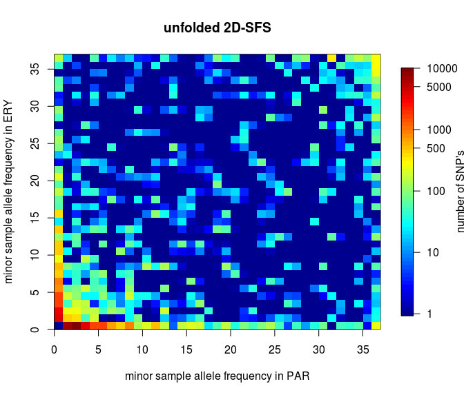
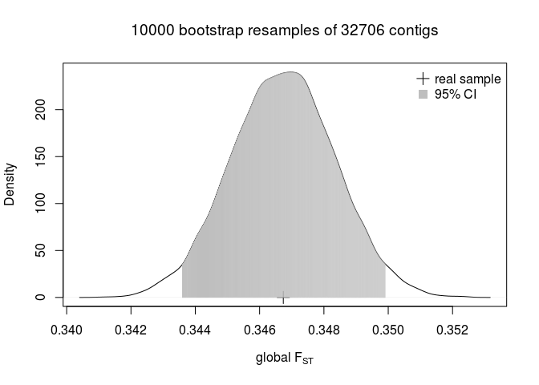

Fst
================
Claudius
17/12/2016

-   [Unfolded SAF's](#unfolded-safs)
    -   [Global average *F*<sub>*S**T*</sub> between ERY and PAR](#global-average-f_st-between-ery-and-par)
    -   [*F*<sub>*S**T*</sub> by contig](#f_st-by-contig)
        -   [Bhatia](#bhatia)
        -   [Reynolds](#reynolds)
        -   [2D-SFS](#d-sfs)
    -   [Permutation test of global *F*<sub>*S**T*</sub>](#permutation-test-of-global-f_st)
    -   [Jackknife correction of *F*<sub>*S**T*</sub>](#jackknife-correction-of-f_st)
    -   [*F*<sub>*S**T*</sub> by ascertainment class](#f_st-by-ascertainment-class)
        -   [Ascertainment in PAR](#ascertainment-in-par)
        -   [Ascertainment in ERY](#ascertainment-in-ery)
    -   [*F*<sub>*S**T*</sub> distributions](#f_st-distributions)
        -   [Ascertained in *erythropus*](#ascertained-in-erythropus)
        -   [Ascertained in *parallelus*](#ascertained-in-parallelus)
-   [Folded SAF's](#folded-safs)
    -   [Reynolds](#reynolds-1)
    -   [2D-SFS](#d-sfs-1)
-   [References](#references)

Unfolded SAF's
==============

I have created unfolded SAF's and used an unfolded 2D-SFS to calculate posterior expectations of per-site *F*<sub>*S**T*</sub>. `realSFS` allows the calculation from two different formula's. One according to Reynolds (Fumagalli et al. 2013) and the other accroding to Hudson/Bhatia (Bhatia et al. 2013).

``` r
if(!file.exists("bhatia.RData")){
  bhatia = read.delim("EryPar.Bhatia.fst.tab", header=F)
  names(bhatia) = c("contig", "pos", "Hb.minus.Hw", "Hb") 
  #nrow(bhatia)
  #str(bhatia)
  save(bhatia, file="bhatia.RData")
}else{
  load("bhatia.RData")
}
#
if(!file.exists("reynolds.RData")){
  reynolds = read.delim("EryPar.Reynolds.fst.tab", header=F)
  names(reynolds) = c("contig", "pos", "a", "a.plus.b")
  #head(reynolds)
  save(reynolds, file="reynolds.RData")
}else{
  load("reynolds.RData")
}
```

``` r
head(bhatia)
```

    ##         contig pos Hb.minus.Hw    Hb
    ## 1 Contig_10001   8           0 4e-06
    ## 2 Contig_10001   9           0 4e-06
    ## 3 Contig_10001  10           0 4e-06
    ## 4 Contig_10001  11           0 6e-06
    ## 5 Contig_10001  12           0 4e-06
    ## 6 Contig_10001  13           0 4e-06

``` r
head(reynolds)
```

    ##         contig pos a a.plus.b
    ## 1 Contig_10001   8 0    4e-06
    ## 2 Contig_10001   9 0    4e-06
    ## 3 Contig_10001  10 0    4e-06
    ## 4 Contig_10001  11 0    6e-06
    ## 5 Contig_10001  12 0    4e-06
    ## 6 Contig_10001  13 0    4e-06

Global average *F*<sub>*S**T*</sub> between ERY and PAR
-------------------------------------------------------

From the per-site denominators and numerators of the two formulas, which are reported in columns 3 and 4 respectively, I want to calculate the global average *F*<sub>*S**T*</sub> by taking the "ratio of averages" as suggested by (Bhatia et al. 2013) (instead of the average of per-site *F*<sub>*S**T*</sub> estimates).

``` r
( Fst.bhatia.global = sum(bhatia[["Hb.minus.Hw"]])/sum(bhatia[["Hb"]]) )
```

    ## [1] 0.2982697

``` r
nrow(bhatia)
```

    ## [1] 1629161

``` r
( Fst.reynolds.global = sum(reynolds$a)/sum(reynolds[["a.plus.b"]]) )
```

    ## [1] 0.3081538

``` r
nrow(reynolds)
```

    ## [1] 1629161

Both formulas provide very similar estimates. The estimates are taken over 1629161 sites. Reynolds *F*<sub>*S**T*</sub> is weighting by sample size, which I think is an undesirable property (i. e. a change in sample size, that does not change the estimate of sample allele frequencies can change the estimate of *F*<sub>*S**T*</sub>).

*F*<sub>*S**T*</sub> by contig
------------------------------

In the following, I want to collapse the data set, by keeping only the average *F*<sub>*S**T*</sub> per contig.

### Bhatia

``` r
Fst.by.contig = aggregate(cbind(Hb.minus.Hw, Hb) ~ contig, 
                          data=bhatia, 
                          sum
                            )
Fst.by.contig = cbind(Fst.by.contig, FST=Fst.by.contig[,2]/Fst.by.contig[,3])
#
contig.lengths = tapply(bhatia$contig, bhatia$contig, length)
head(names(contig.lengths))
```

    ## [1] "Contig_10001"  "Contig_100013" "Contig_100028" "Contig_10006" 
    ## [5] "Contig_100060" "Contig_100072"

``` r
head(Fst.by.contig)
```

    ##          contig Hb.minus.Hw       Hb         FST
    ## 1  Contig_10001   -0.002809 0.245646 -0.01143515
    ## 2 Contig_100013   -0.002809 0.245646 -0.01143515
    ## 3 Contig_100028    0.096076 1.035791  0.09275616
    ## 4  Contig_10006    0.203802 0.721350  0.28252859
    ## 5 Contig_100060    0.020828 0.281761  0.07392081
    ## 6 Contig_100072    0.001328 0.056703  0.02342028

``` r
tail(names(contig.lengths))
```

    ## [1] "Contig_99953" "Contig_99958" "Contig_99972" "Contig_99976"
    ## [5] "Contig_99988" "Contig_99997"

``` r
tail(Fst.by.contig)
```

    ##             contig Hb.minus.Hw       Hb        FST
    ## 32701 Contig_99953    0.072278 0.398611 0.18132465
    ## 32702 Contig_99958    1.321885 1.638132 0.80694657
    ## 32703 Contig_99972    0.000469 0.016771 0.02796494
    ## 32704 Contig_99976    0.065525 0.903353 0.07253532
    ## 32705 Contig_99988    0.746464 0.874866 0.85323238
    ## 32706 Contig_99997    0.034389 0.797525 0.04311965

``` r
Fst.by.contig = cbind(Fst.by.contig, length=contig.lengths)
head(Fst.by.contig)
```

    ##                      contig Hb.minus.Hw       Hb         FST length
    ## Contig_10001   Contig_10001   -0.002809 0.245646 -0.01143515    132
    ## Contig_100013 Contig_100013   -0.002809 0.245646 -0.01143515    132
    ## Contig_100028 Contig_100028    0.096076 1.035791  0.09275616     72
    ## Contig_10006   Contig_10006    0.203802 0.721350  0.28252859     39
    ## Contig_100060 Contig_100060    0.020828 0.281761  0.07392081     67
    ## Contig_100072 Contig_100072    0.001328 0.056703  0.02342028     36

``` r
save(Fst.by.contig, file="Fst.by.contig.bhatia.RData")
#
( sum(Fst.by.contig$Hb.minus.Hw)/sum(Fst.by.contig$Hb) )
```

    ## [1] 0.2982697

I have now average *F*<sub>*S**T*</sub> estimates for 32706 contigs.

``` r
hist(Fst.by.contig$FST, xlab=expression(paste("average Bhatia's ", F[ST])), 
     breaks=seq(-0.05, 1, 0.01), # note, there are also some slightly negative Fst estimates
     main=bquote(paste(F[ST], "'s from ", .(nrow(Fst.by.contig)), " contigs")),
     col="black",
     # xlim=c(0, .3),
     border="black"
     )
```


``` r
# proportion of loci with Fst greater than average Fst:
gtAvgFst = sum(Fst.by.contig$FST > Fst.bhatia.global)/length(Fst.by.contig$FST)
```

As expected, the majority of the contigs are very little differentiated between the two populations, but 20% of loci have *F*<sub>*S**T*</sub> greater than the global average. Please read (Whitlock and Lotterhos 2015)! It would be interesting to simulate neutral distributions of *F*<sub>*S**T*</sub> under different demographic scenarios. The distribution might be overdispersed due to allele drop out (Gautier et al. 2012).

#### Bootstrap

It would be nice to get an estimate of uncertainty in the estimate of the global *F*<sub>*S**T*</sub>. There are two major sources of variation that influence this estimate:

1.  sampling variation of individuals from populations
2.  sampling variation of loci from the genome

In order to approximate the first source of variation, I could bootstrap resample individuals', but that requires many re-estimations of SAF's which will be quite compute and data intensive. I am therefore only going to approximate the second source of variation for the moment.

``` r
# only needs to be run once

library(dplyr) # for 'sample_n'
library(parallel) # for 'mclapply'
#
boot = function(x){
  # creates bootstrap resamples of the rows in Fst.by.contig
  # and returns the global Fst from that
  rs = sample_n(Fst.by.contig, size=nrow(Fst.by.contig), replace=TRUE)
  sum(rs$Hb.minus.Hw)/sum(rs$Hb)
  }
#
# serial:
#boot.resample.Fst.by.contig = replicate(10000, boot())
# parallel:
startTime = proc.time()
boot.resample.Fst.by.contig = vector("double", length=10000)
boot.resample.Fst.by.contig = simplify2array(
  mclapply(1:length(boot.resample.Fst.by.contig),
          FUN=boot,
          mc.cores=20
           )
  )
stopTime = proc.time()
elapsedTime = stopTime - startTime
show(elapsedTime)
# save bootstrap resample for later:
save(boot.resample.Fst.by.contig, file="Bootstrap/boot.resample.Fst.by.contig.RData")
```

``` r
load("Bootstrap/boot.resample.Fst.by.contig.RData")
#
d = density(boot.resample.Fst.by.contig)
plot(d,
     xlab=expression(paste("global ", F[ST])),
     main=bquote(paste(.(length(boot.resample.Fst.by.contig)), 
                       " bootstrap resamples of ", .(nrow(Fst.by.contig)), 
                       " contigs"
                       )
                 )
     )
points(c(Fst.bhatia.global), c(0), pch=3, cex=1.5)
CI95 = quantile(boot.resample.Fst.by.contig, probs=c(.025, .975))
lines(d$x[d$x>CI95[1] & d$x<CI95[2]], 
      d$y[d$x>CI95[1] & d$x<CI95[2]], 
      type="h",
      col="grey")
legend("topright", legend=c("real sample", "95% CI"), pch=c(3,15), pt.cex=1.5, col=c("black", "grey"), bty="n")
```


### Reynolds

``` r
Fst.reynolds.by.contig = aggregate(cbind(a, a.plus.b) ~ contig, 
                          data=reynolds, 
                          sum
                            )
Fst.reynolds.by.contig = cbind(Fst.reynolds.by.contig, FST=Fst.reynolds.by.contig[,2]/Fst.reynolds.by.contig[,3])
head(Fst.reynolds.by.contig)
```

    ##          contig        a a.plus.b         FST
    ## 1  Contig_10001 0.000684 0.245646 0.002784495
    ## 2 Contig_100013 0.000684 0.245646 0.002784495
    ## 3 Contig_100028 0.109325 1.035791 0.105547355
    ## 4  Contig_10006 0.211104 0.721350 0.292651279
    ## 5 Contig_100060 0.024513 0.281761 0.086999265
    ## 6 Contig_100072 0.002116 0.056703 0.037317250

``` r
( sum(Fst.reynolds.by.contig$a)/sum(Fst.reynolds.by.contig$a.plus.b) )
```

    ## [1] 0.3081538

``` r
hist(Fst.reynolds.by.contig$FST, xlab=expression(paste("Reynolds ", F[ST])), 
     main=bquote(paste(F[ST], " over ", .(nrow(Fst.reynolds.by.contig)), " contigs")),
     col="grey"
     )
```


``` r
boxplot(data.frame(Bhatia=Fst.by.contig$FST, Reynolds=Fst.reynolds.by.contig$FST), outline=FALSE, ylab=expression(F[ST]))
```


Reynolds' formula produces slightly higher *F*<sub>*S**T*</sub> values.

### 2D-SFS

``` r
sfs2d = scan("/data3/claudius/Big_Data/ANGSD/FST/EryPar.unfolded.2dsfs")
sfs2d = matrix(sfs2d, nrow=37, ncol=37) # rows should be PAR, columns should be ERY
sfs2d[1,1]
```

    ## [1] 1069914

``` r
dim(sfs2d)
```

    ## [1] 37 37

``` r
par_marginal_sfs = rowSums(sfs2d)
ery_marginal_sfs = colSums(sfs2d)
plot(1:(length(par_marginal_sfs)-1), par_marginal_sfs[2:length(par_marginal_sfs)], type="l")
```


``` r
sum(par_marginal_sfs)
```

    ## [1] 1130775

``` r
# note, that the 'matrix is filled column-wise
sfs2d[1,1] = 0
# number of fixed differences:
fixed.diff = sfs2d[1,37] + sfs2d[37,1]
# proportion of fixed differences among polymorphic sites:
fixed.diff/sum(sfs2d)
```

    ## [1] 0.006866635

``` r
library(fields)
ticks = c(1, 10, 100, 500, 1000, 5000, 10000)
# rows in the matrix are on the x-axis, columns are on the y-axis:
image.plot(0:37, 0:37, log10(sfs2d+1), xlab="minor sample allele frequency in PAR", ylab="minor sample allele frequency in ERY", main="unfolded 2D-SFS",
           axis.args = list(at=log10(ticks), labels=ticks), legend.lab="number of SNP's",
           legend.line = 3
           )
```



Permutation test of global *F*<sub>*S**T*</sub>
-----------------------------------------------

I have randomly permutated the 36 individuals into a population 1 and population 2. I have then estimated SAF's, 2D-SFS's and *F*<sub>*S**T*</sub> for each permutation.

``` r
# only needs to be run once:
fst.tabs = list.files("Bootstrap/", "*tab")
perm = function(x){
  bhatia = read.delim(fst.tabs[x], header=F)
  return( sum(bhatia[,3])/sum(bhatia[,4]) )
}
startTime = proc.time()
perm.fst = vector("double", len=length(fst.tabs))
perm.fst = simplify2array(
  mclapply(1:length(perm.fst),
          FUN=perm,
          mc.cores=20
           )
  )
stopTime = proc.time()
elapsedTime = stopTime - startTime
show(elapsedTime)
save(perm.fst, file="Bootstrapperm.global.fst.RData")
```

``` r
load("Bootstrap/perm.global.fst.RData")
hist(boot.resample.Fst.by.contig, 
     border="navyblue", col="navyblue", 
     freq=FALSE, 
     xlim=c(0,.4),
     main="global average Fst\npermutation of individuals and bootstrapping of contigs",
     xlab=expression(paste("global Bhatia's ", F[ST]))
     )
hist(perm.fst, breaks=20, border="springgreen", col="springgreen", 
     add=TRUE,
     freq=FALSE
     )
legend("topleft", 
       legend=c("100 permutations of population label", 
                paste("10,000 bootstrap resamples of ", nrow(Fst.by.contig), " contigs")),
       col=c("springgreen", "navyblue"),
       cex=.7,
       fill=c("springgreen", "navyblue")
      )
```


Jackknife correction of *F*<sub>*S**T*</sub>
--------------------------------------------

The distribution of *F*<sub>*S**T*</sub> from permutation of population labels has shown that there is a positive bias in the global *F*<sub>*S**T*</sub> estimate of about 0.025. (Weir and Cockerham 1984), page 1366, propose a bias correction based on jackknife resampling loci.

``` r
# only needs to be run once

library(parallel) # for 'mclapply'
#
jack = function(x){
  # creates delete-1 jackknife resample of the rows in Fst.by.contig
  # and returns the global Fst from that
  rs = Fst.by.contig[-x,]
  sum(rs$Hb.minus.Hw)/sum(rs$Hb)
  }
#
# serial:
#boot.resample.Fst.by.contig = replicate(10000, boot())
# parallel:
startTime = proc.time()
jack.resample.Fst.by.contig = vector("double", length=nrow(Fst.by.contig))
jack.resample.Fst.by.contig = simplify2array(
  mclapply(1:length(jack.resample.Fst.by.contig),
          FUN=jack,
          mc.cores=20
           )
  )
stopTime = proc.time()
elapsedTime = stopTime - startTime
show(elapsedTime)

# save jackknife resample for later:
save(jack.resample.Fst.by.contig, file="Bootstrap/jack.resample.Fst.by.contig.RData")
```

``` r
load("Bootstrap/jack.resample.Fst.by.contig.RData")

# get bias corrected Fst:
n = nrow(Fst.by.contig)
( Fst.bhatia.global.bias.corrected = n*Fst.bhatia.global - (n-1)/n * sum(jack.resample.Fst.by.contig) )
```

    ## [1] 0.2982732

``` r
Fst.bhatia.global - Fst.bhatia.global.bias.corrected
```

    ## [1] -3.530952e-06

The jackknife applies only a negligible bias correction.

*F*<sub>*S**T*</sub> by ascertainment class
-------------------------------------------

I have calculated ML estimates of minor allele frequencies for each population, ERY and PAR. I have then created joint tables of each MAF file with `/data3/claudius/Big_Data/ANGSD/FST/EryPar.Bhatia.fst.tab`. I have now MAF's and *F*<sub>*S**T*</sub> for 1,513,856 sites in ERY and 1,496,271 sites in PAR.

### Ascertainment in PAR

``` r
pp = pipe("cut -f1,2,7,8,11,12 /data3/claudius/Big_Data/ANGSD/FST/MAFs/PAR/PAR.mafs.withFST", open="r")
par.mafs.withFST = read.delim(pp, header=F)
close(pp)
names(par.mafs.withFST) = c("contig", "pos", "MAF", "nind", "Hb.minus.Hw", "Hb")
head(par.mafs.withFST)
```

    ##      contig pos MAF nind Hb.minus.Hw       Hb
    ## 1 Contig_16   8   0    4     2.0e-06 0.000120
    ## 2 Contig_16   9   0    4     2.0e-06 0.000120
    ## 3 Contig_16  10   0    4     2.0e-06 0.000120
    ## 4 Contig_16  11   0    4     1.4e-05 0.000526
    ## 5 Contig_16  12   0    4     1.0e-05 0.000353
    ## 6 Contig_16  13   0    4     2.0e-06 0.000120

``` r
n = 18 # 18 individuals
global.fst.by.PAR.ascert = vector("double", n-1)
j = 0
for(i in 1:(n-1)){
  #print(i)
  j = j+1
  tab = par.mafs.withFST[par.mafs.withFST$MAF > i/(2*n) & par.mafs.withFST$MAF < (i+1)/(2*n),]
  global.fst.by.PAR.ascert[j] = sum(tab["Hb.minus.Hw"])/sum(tab["Hb"])
}
save(global.fst.by.PAR.ascert, file="global.fst.by.PAR.ascert.RData")
```

### Ascertainment in ERY

``` r
pp = pipe("cut -f1,2,7,8,11,12 /data3/claudius/Big_Data/ANGSD/FST/MAFs/ERY/ERY.mafs.withFST", open="r")
ery.mafs.withFST = read.delim(pp, header=F)
close(pp)
names(ery.mafs.withFST) = c("contig", "pos", "MAF", "nind", "Hb.minus.Hw", "Hb")
head(ery.mafs.withFST)
```

    ##      contig pos MAF nind Hb.minus.Hw       Hb
    ## 1 Contig_16   8   0   16     2.0e-06 0.000120
    ## 2 Contig_16   9   0   16     2.0e-06 0.000120
    ## 3 Contig_16  10   0   16     2.0e-06 0.000120
    ## 4 Contig_16  11   0   16     1.4e-05 0.000526
    ## 5 Contig_16  12   0   16     1.0e-05 0.000353
    ## 6 Contig_16  13   0   16     2.0e-06 0.000120

``` r
n = 18 # 18 individuals
global.fst.by.ERY.ascert = vector("double", n-1)
j = 0
for(i in 1:(n-1)){
  #print(i)
  j = j+1
  tab = ery.mafs.withFST[ery.mafs.withFST$MAF > i/(2*n) & ery.mafs.withFST$MAF < (i+1)/(2*n),]
  global.fst.by.ERY.ascert[j] = sum(tab["Hb.minus.Hw"])/sum(tab["Hb"])
}
save(global.fst.by.ERY.ascert, file="global.fst.by.ERY.ascert.RData")
```

I am trying to produce a plot analogous to figure 1 in (Bhatia et al. 2013).

``` r
plot(1:(n-1)/(2*n), global.fst.by.PAR.ascert, 
     ylim=c(0,.4), ylab=expression(paste("average Bhatia's ", F[ST])),
     xlab="minor allele frequency",
     pch=16, col="green",
     type="b",
     main="Allele frequency dependence of FST"
     )
lines(1:(n-1)/(2*n), global.fst.by.ERY.ascert, 
     ylim=c(0,1), ylab=expression(paste("average Bhatia's ", F[ST])),
     xlab="minor allele frequency",
     pch=16, col="red",
     type="b"
     )
legend("topright", 
       legend=c("ascertainment in PAR", "ascertainment in ERY", "without ascertainment"),
       col=c("green", "red", "grey"),
       fill=c("green", "red", "grey"),
       bty="n"
       )
abline(h=Fst.bhatia.global, lwd=2)
```


*F*<sub>*S**T*</sub> distributions
----------------------------------

``` r
# ascertaining by ML estimate of minor allele frequency:
ery.snps = ery.mafs.withFST[ery.mafs.withFST$MAF>1/(2*n),]
par.snps = par.mafs.withFST[par.mafs.withFST$MAF>1/(2*n),] # not edible
nrow(ery.snps)
```

    ## [1] 44573

``` r
nrow(par.snps)
```

    ## [1] 49976

``` r
head(ery.snps, n=20)
```

    ##         contig pos      MAF nind Hb.minus.Hw       Hb
    ## 24   Contig_16  31 0.027793   16    0.000002 0.000120
    ## 94   Contig_40  21 0.140206   14    0.005965 0.159682
    ## 96   Contig_40  23 0.094817   14    0.000711 0.085768
    ## 100  Contig_40  27 0.140242   14    0.715508 0.846163
    ## 115  Contig_40  42 0.139507   14    0.017263 0.136076
    ## 127  Contig_46  14 0.219184   13    0.000002 0.000117
    ## 147  Contig_46  34 0.035605   13    0.000002 0.000117
    ## 148  Contig_46  35 0.466938   13    0.000002 0.000117
    ## 199  Contig_99   8 0.077599   13    0.000001 0.000072
    ## 212  Contig_99  21 0.041869   13    0.000000 0.000046
    ## 333 Contig_186  25 0.427314   15    0.000003 0.000171
    ## 334 Contig_186  26 0.427225   15    0.000003 0.000171
    ## 415 Contig_219  27 0.029496   17    0.000082 0.030115
    ## 537 Contig_270  29 0.052673   11    0.000012 0.000393
    ## 604 Contig_299  16 0.052086   15    0.000000 0.000028
    ## 611 Contig_299  23 0.146128   15    0.000000 0.000036
    ## 614 Contig_299  26 0.199966   15    0.000000 0.000028
    ## 655 Contig_302  27 0.163362   12    0.002195 0.323024
    ## 679 Contig_308  11 0.171932   15    0.018640 0.133295
    ## 686 Contig_308  18 0.040460   15    0.000044 0.017899

Parallelus seems to have more SNP's than erythropus.

### Ascertained in *erythropus*

``` r
plot(-1*(ery.snps$Hb.minus.Hw-ery.snps$Hb), ery.snps$Hb.minus.Hw/ery.snps$Hb,
     xlab=expression(H[w]),
     ylab=expression(1-H[w]/H[b]),
     pch=16,
     col=gray(level=0, alpha=.3),
     main=expression(paste("Hudson/Bhatia's ", F[ST]))
    )
text(x=.15, y=.9, labels=paste(nrow(ery.snps), " SNP's ascertained in erythropus"), pos=4)
```


``` r
plot(ery.snps$Hb, ery.snps$Hb.minus.Hw/ery.snps$Hb,
     xlab=expression(H[b]),
     ylab=expression(1-H[w]/H[b]),
     pch=16,
     col=gray(level=0, alpha=.3),
     main=expression(paste("Hudson/Bhatia's ", F[ST]))
    )
text(x=.05, y=.9, labels=paste(nrow(ery.snps), " SNP's ascertained in erythropus"), pos=4)
```


``` r
jpeg("fst-dist-ascert-in-ery-MAF1-9-Hb.jpg", width=1000, height=1000, quality=100)
par(mfrow=c(3,3))
for(i in 1:9){
# ascertainment in ery, no singletons
ery.snps = ery.mafs.withFST[ery.mafs.withFST$MAF>i/(2*n),]
nrow(ery.snps)
#
plot(ery.snps$Hb, ery.snps$Hb.minus.Hw/ery.snps$Hb,
     xlab=expression(H[b]),
     ylab=expression(1-H[w]/H[b]),
     pch=16,
     col=gray(level=0, alpha=.3),
     main=paste("MAF > ", i)
    )
text(x=.05, y=.9, labels=paste(nrow(ery.snps), " SNP's ascertained in erythropus"), pos=4)
}
dev.off()
```

    ## pdf 
    ##   2

### Ascertained in *parallelus*

``` r
plot(-1*(par.snps$Hb.minus.Hw-par.snps$Hb), par.snps$Hb.minus.Hw/par.snps$Hb,
     xlab=expression(H[w]),
     ylab=expression(1-H[w]/H[b]),
     pch=16,
     col=gray(level=0, alpha=.3),
     main=expression(paste("Hudson/Bhatia's ", F[ST]))
    )
text(x=.15, y=.9, labels=paste(nrow(par.snps), " SNP's ascertained in parallelus"), pos=4)
```


``` r
plot(par.snps$Hb, par.snps$Hb.minus.Hw/par.snps$Hb,
     xlab=expression(H[b]),
     ylab=expression(1-H[w]/H[b]),
     pch=16,
     col=gray(level=0, alpha=.3),
     main=expression(paste("Hudson/Bhatia's ", F[ST]))
    )
text(x=.05, y=.9, labels=paste(nrow(par.snps), " SNP's ascertained in parallelus"), pos=4)
```


Not sure what to make of these.

Folded SAF's
============

see this [ngsTools thread](https://groups.google.com/d/topic/ngstools-user/9Z4viLJ7NJA/discussion)

I have also estimated *folded* SAF's and a folded 2D-SFS and estimated per-site *F*<sub>*S**T*</sub> from that.

``` r
bhatia = read.delim("EryPar.FOLDED.Bhatia.fst.tab", header=F)
names(bhatia) = c("contig", "pos", "Hb.minus.Hw", "Hb") 
reynolds = read.delim("EryPar.FOLDED.Reynolds.fst.tab", header=F)
names(reynolds) = c("contig", "pos", "a", "a.plus.b")
```

``` r
( Fst.bhatia.global = sum(bhatia[["Hb.minus.Hw"]])/sum(bhatia[["Hb"]]) )
```

    ## [1] 0.346737

``` r
nrow(bhatia)
```

    ## [1] 1629161

``` r
( Fst.reynolds.global = sum(reynolds$a)/sum(reynolds[["a.plus.b"]]) )
```

    ## [1] 0.3654018

``` r
nrow(reynolds)
```

    ## [1] 1629161

``` r
Fst.by.contig = aggregate(cbind(Hb.minus.Hw, Hb) ~ contig, 
                          data=bhatia, 
                          sum
                            )
Fst.by.contig = cbind(Fst.by.contig, FST=Fst.by.contig[,2]/Fst.by.contig[,3])
head(Fst.by.contig)
```

    ##          contig Hb.minus.Hw       Hb         FST
    ## 1  Contig_10001   -0.007615 0.433124 -0.01758157
    ## 2 Contig_100013   -0.007615 0.433124 -0.01758157
    ## 3 Contig_100028    0.249546 1.201124  0.20776040
    ## 4  Contig_10006    0.834187 1.435808  0.58098785
    ## 5 Contig_100060    0.083417 0.543252  0.15355121
    ## 6 Contig_100072    0.006157 0.116979  0.05263338

``` r
( sum(Fst.by.contig$Hb.minus.Hw)/sum(Fst.by.contig$Hb) )
```

    ## [1] 0.346737

``` r
hist(Fst.by.contig$FST, xlab=expression(paste("average Bhatia's ", F[ST])), 
     main=bquote(paste(F[ST], "'s from ", .(nrow(Fst.by.contig)), " contigs")),
     col="grey"
     )
```


``` r
# proportion of loci with Fst greater than average Fst:
gtAvgFst = sum(Fst.by.contig$FST > Fst.bhatia.global)/length(Fst.by.contig$FST)
```

``` r
library(dplyr) # for 'sample_n'
library(parallel) # for 'mclapply'
#
boot = function(x){
  # creates bootstrap resamples of the rows in Fst.by.contig
  # and returns the global Fst from that
  rs = sample_n(Fst.by.contig, size=nrow(Fst.by.contig), replace=TRUE)
  sum(rs$Hb.minus.Hw)/sum(rs$Hb)
  }
#
# serial:
#boot.resample.Fst.by.contig = replicate(10000, boot())
# parallel:
startTime = proc.time()
boot.resample.Fst.by.contig = vector("double", length=10000)
boot.resample.Fst.by.contig= simplify2array(
  mclapply(1:length(boot.resample.Fst.by.contig),
          FUN=boot,
          mc.cores=20
           )
  )
stopTime = proc.time()
elapsedTime = stopTime - startTime
show(elapsedTime)
```

    ##    user  system elapsed 
    ## 423.384   6.443  25.085

``` r
#
d = density(boot.resample.Fst.by.contig)
plot(d,
     xlab=expression(paste("global ", F[ST])),
     main=bquote(paste(.(length(boot.resample.Fst.by.contig)), 
                       " bootstrap resamples of ", .(nrow(Fst.by.contig)), 
                       " contigs"
                       )
                 )
     )
points(c(Fst.bhatia.global), c(0), pch=3, cex=1.5)
CI95 = quantile(boot.resample.Fst.by.contig, probs=c(.025, .975))
lines(d$x[d$x>CI95[1] & d$x<CI95[2]], 
      d$y[d$x>CI95[1] & d$x<CI95[2]], 
      type="h",
      col="grey")
legend("topright", legend=c("real sample", "95% CI"), pch=c(3,15), pt.cex=1.5, col=c("black", "grey"), bty="n")
```



### Reynolds

``` r
Fst.reynolds.by.contig = aggregate(cbind(a, a.plus.b) ~ contig, 
                          data=reynolds, 
                          sum
                            )
Fst.reynolds.by.contig = cbind(Fst.reynolds.by.contig, FST=Fst.reynolds.by.contig[,2]/Fst.reynolds.by.contig[,3])
head(Fst.reynolds.by.contig)
```

    ##          contig        a a.plus.b        FST
    ## 1  Contig_10001 0.004987 0.433124 0.01151402
    ## 2 Contig_100013 0.004987 0.433124 0.01151402
    ## 3 Contig_100028 0.276728 1.201124 0.23039087
    ## 4  Contig_10006 0.851349 1.435808 0.59294070
    ## 5 Contig_100060 0.096562 0.543252 0.17774808
    ## 6 Contig_100072 0.009324 0.116979 0.07970661

``` r
( sum(Fst.reynolds.by.contig$a)/sum(Fst.reynolds.by.contig$a.plus.b) )
```

    ## [1] 0.3654018

``` r
hist(Fst.reynolds.by.contig$FST, xlab=expression(paste("Reynolds ", F[ST])), 
     main=bquote(paste(F[ST], " over ", .(nrow(Fst.reynolds.by.contig)), " contigs")),
     col="grey"
     )
```


### 2D-SFS

``` r
sfs2d = scan("/data3/claudius/Big_Data/ANGSD/FST/EryPar.FOLDED.2dsfs")
sfs2d = matrix(sfs2d, nrow=19, ncol=19) # rows should be PAR, columns should be ERY
sfs2d[1,1] = 0
```

``` r
library(fields)
# rows in the matrix are on the x-axis, columns are on the y-axis:
image.plot(0:19, 0:19, sfs2d, xlab="PAR", ylab="ERY", main="FOLDED 2D-SFS")
```


References
==========

Bhatia, Gaurav, Nick Patterson, Sriram Sankararaman, and Alkes L. Price. 2013. “Estimating and Interpreting Fst: The Impact of Rare Variants.” *Genome Research* 23 (9): 1514–21. doi:[10.1101/gr.154831.113](https://doi.org/10.1101/gr.154831.113).

Fumagalli, Matteo, Filipe G. Vieira, Thorfinn Sand Korneliussen, Tyler Linderoth, Emilia Huerta-Sánchez, Anders Albrechtsen, and Rasmus Nielsen. 2013. “Quantifying Population Genetic Differentiation from Next-Generation Sequencing Data.” *Genetics* 195 (3). Department of Integrative Biology, University of California, Berkeley, California 94720.: 979–92. doi:[10.1534/genetics.113.154740](https://doi.org/10.1534/genetics.113.154740).

Gautier, Mathieu, Karim Gharbi, Timothee Cezard, Julien Foucaud, Carole Kerdelhué, Pierre Pudlo, Jean-Marie Cornuet, and Arnaud Estoup. 2012. “The Effect of Rad Allele Dropout on the Estimation of Genetic Variation Within and Between Populations.” *Mol Ecol*, October. Inra, UMR CBGP (INRA - IRD - Cirad - Montpellier SupAgro), Campus international de Baillarguet, CS 30016, F-34988, Montferrier-sur-Lez, France. doi:[10.1111/mec.12089](https://doi.org/10.1111/mec.12089).

Weir, Bruce S, and C Clark Cockerham. 1984. “Estimating F-Statistics for the Analysis of Population Structure.” *Evolution*. JSTOR, 1358–70.

Whitlock, Michael C., and Katie E. Lotterhos. 2015. “Reliable Detection of Loci Responsible for Local Adaptation: Inference of a Null Model Through Trimming the Distribution of F(ST).” *Am Nat* 186 Suppl 1 (October). Department of Zoology, University of British Columbia, Vancouver, British Columbia V6T 1Z4, Canada.: S24–S36. doi:[10.1086/682949](https://doi.org/10.1086/682949).
