SFS
================
Claudius
21/12/2016

-   [Variability in the ML estimate of folded SFS](#variability-in-the-ml-estimate-of-folded-sfs)
-   [Bootstrapping the ML estimate of SFS](#bootstrapping-the-ml-estimate-of-sfs)
-   [Bootstraps with exhaustive ML search](#bootstraps-with-exhaustive-ml-search)
-   [Fitting an expected neutral SFS](#fitting-an-expected-neutral-sfs)
-   [Diversity Estimates](#diversity-estimates)
    -   [S and *π*](#s-and-pi)
    -   [Global Tajima's D](#global-tajimas-d)
    -   [Tajima's D per contig](#tajimas-d-per-contig)
-   [References](#references)

``` r
library(knitr)
opts_chunk$set(dev=c("png", "pdf"), eval=TRUE, fig.width=10, fig.height=8)
options(digits=10)
setwd("/data3/claudius/Big_Data/ANGSD/SFS")
```

------------------------------------------------------------------------

------------------------------------------------------------------------

I have run `realSFS` with a *tolerance* (`-tole`) of 1e-6, which means that the EM iteration is stopped if the likelihoods of the last two iterations differed by less than 1e-6. I specified a maximum number of EM iterations of 50000 (`-maxIter`) after examining the speed at which both ERY and PAR reach the *tolerance* stopping criterium. I have also turned off the accelerated EM algorithm with `-m 0`. This guarantees that a good ML estimate of the SFS is found, but much more slowly. The ML estimate of the folded SFS in ERY is found within 8 minutes, the one of PAR within 26 minutes.

``` r
ery.sfs = scan("ERY/ERY.FOLDED.sfs")
par.sfs = scan("PAR/PAR.FOLDED.sfs")
ery.sfs = ery.sfs[-1]
par.sfs = par.sfs[-1]
```

------------------------------------------------------------------------

I am trying to fit eq. 4.21 of Wakeley (2009) to the oberseved 1D folded spectra:

$$
E\[\\eta\_i\] = \\theta \\frac{\\frac{1}{i} + \\frac{1}{n-i}}{1+\\delta\_{i,n-i}} \\qquad 1 \\le i \\le \\big\[n/2\\big\]
$$

This formula gives the neutral expectation of counts in each frequency class (*i*) in a folded spectrum. The count in each frequency class, *η*<sub>*i*</sub>, provides an estimate of *θ*. However, I would like to find the value of *θ* that minimizes the deviation of the above equation from all observed counts *η*<sub>*i*</sub>.

``` r
# define function to optimise

f = function (theta, eta, n){ 
  #
  # theta: parameter to optimize
  # eta: will get the observed SFS
  # n: number of gene copies sampled per diploid locus
  #
  # returns sum of squared deviations (residuals) between observed counts
  # and a candidate model
  #
  sumofsq = numeric(length(ery.sfs))
  i = seq(1, length(eta))
  delta = ifelse(i == n-i, 1, 0)
  expected = theta * (1/i + 1/(n-i)) / (1 + delta)
  sumofsq = sum( (expected - eta)^2 )
  return(sumofsq)
}
```

``` r
# fit optimizal theta to ery and par SFS

ery_thetaOpt = optimize(f, interval=c(0, sum(ery.sfs)),  eta=ery.sfs, n=36, maximum=FALSE, tol=0.001)
par_thetaOpt = optimize(f, interval=c(0, sum(par.sfs)),  eta=par.sfs, n=36, maximum=FALSE, tol=0.001)
```

The optimal *θ* for the spectrum of *ery* is 9582.95. The optimal *θ* for the spectrum of *par* is 10965. These are almost exactly the same values I estimated with the `scipy.optimize` functions `curve_fit` and `minimize_scalar` in `First_Steps_with_dadi.ipynb`.

``` r
# define a function that returns expected counts given a theta under the assumption of
# the standard neutral model

snm = function(theta, len=0, n=36){
  #
  # theta: should be optimized theta
  # len: should be the length of the folded SFS, i. e. highest freq. class
  # n: should be number of gene copies sampled per locus, i. e. 2*N for diploid loci
  #
  # returns expected SFS
  #
  i = seq(1, len)
  delta = ifelse(i == n-i, 1, 0)
  expected = theta * (1/i + 1/(n-i)) / (1 + delta)
  return(expected)
}
```

``` r
# plot observed spectra and expected neutral fit for ery and par

par(mfrow=c(2,1))
# standard neutral model expectation:
snm_ery = snm(ery_thetaOpt$min, len=length(ery.sfs), n=36)
snm_par = snm(par_thetaOpt$min, len=length(par.sfs), n=36)

y_max = max(par.sfs, snm_par, ery.sfs, snm_ery)
plot(snm_ery, 
     xlab="minor allele count", 
     ylab="number of sites",
     ylim=c(0, y_max),
     pch=18, col="black", type="b",
     main="folded SFS of ery",
     xaxp=c(1, length(ery.sfs), length(ery.sfs)-1)
)
abline(h=seq(0,y_max,2000), lty="dashed", col="lightgrey")
# observed:
lines(ery.sfs, pch=20, col="red", type="b")
legend("topright", legend=c("ery", "neutral fit"), pch=c(20, 18), col=c("red", "black"), bty="n")
#
plot(snm_par, 
     xlab="minor allele count", 
     ylab="number of sites",
     ylim=c(0, y_max),
     pch=18, col="black", type="b",
     main="folded SFS of par",
     xaxp=c(1, length(par.sfs), length(par.sfs)-1)
     )
abline(h=seq(0,y_max,2000), lty="dashed", col="lightgrey")
# observed:
lines(par.sfs, pch=20, col="green", type="b")
legend("topright", legend=c("par", "neutral fit"), pch=c(20, 18), col=c("green", "black"), bty="n")
```

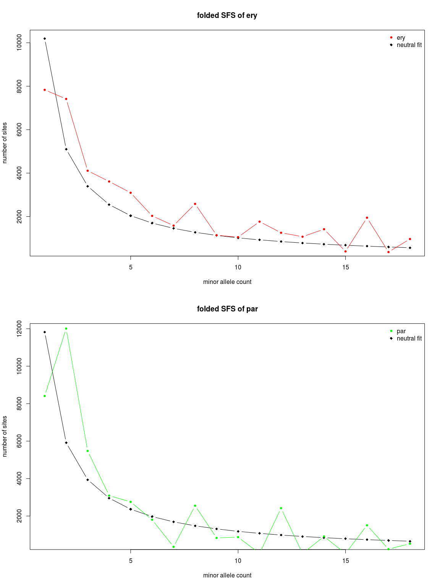

The deviation, especially in the first two count classes, is astonishing and certainly cannot be explained just by violations of assumptions of the standard neutral model.

Let's get confidence intervals for SNM expected counts. According to Fu (1995), p. 192, the counts in neutral spectra can be approximated by a Poisson distribution for large sample sizes (i. e. large *n*).

``` r
par(mfrow=c(1,1))
# get neutral model expectation
snm.expect = snm(ery_thetaOpt$min, len=length(ery.sfs), n=36)
# expected:
plot(snm.expect, 
     xlab="minor allele count", 
     ylab="number of sites",
     pch=18, col="black", type="b",
     main="folded SFS of ery")
# observed:
lines(ery.sfs, pch=20, col="red", type="b")
legend("topright", legend=c("ery", "neutral fit"), pch=c(20, 18), col=c("red", "black"), bty="n")
# get lower and upper 95% quantiles:
low = qpois(p=0.025, lambda=snm.expect)
high = qpois(p=0.975, lambda=snm.expect)
# add 95% CI bars:
arrows(1:length(snm.expect), snm.expect, 
       1:length(snm.expect), high,
       angle=90,
       length=.05
       )
arrows(1:length(snm.expect), snm.expect, 
       1:length(snm.expect), low,
       angle=90,
       length=.05
       )
```

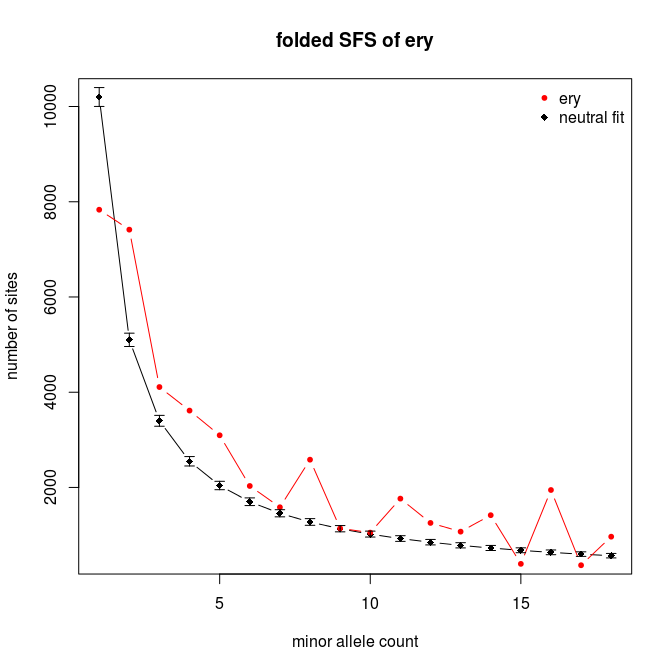

------------------------------------------------------------------------

``` r
barplot(rbind(ery.sfs, par.sfs), 
        names.arg=1:length(ery.sfs),
        beside=TRUE,
        xlab="minor allele count",
        ylab="number of sites",
        main="ML folded site frequency spectrum"
        )
legend("topright",
        legend=c("erythropus", "parallelus"),
        fill=c(gray(.3), gray(.7))
        )
```

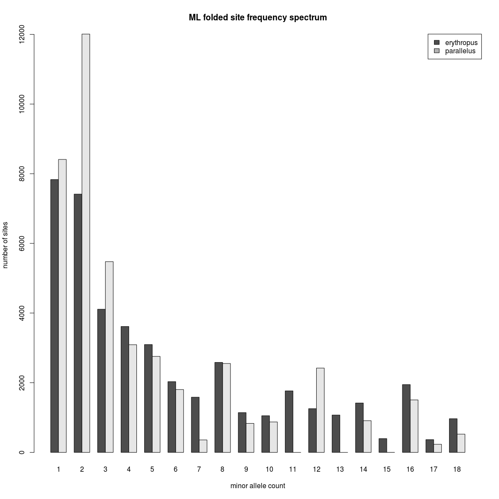

I have rerun the exhaustive ML search from above:

``` r
ery.sfs1 = scan("ERY/ERY.FOLDED.sfs1")
par.sfs1 = scan("PAR/PAR.FOLDED.sfs1")
ery.sfs1 = ery.sfs1[-1]
par.sfs1 = par.sfs1[-1]
```

Variability in the ML estimate of folded SFS
--------------------------------------------

I have repeated the ML estimation of per-population folded SFS with `realSFS` 100 times. Other than specifying the number of threads, I left all other parameters for `realSFS` at the default. These default values are not documented. With the accelerated EM algorithm (turned on by default), `realSFS` reaches a ML estimate very fast (&lt;1min).

``` r
ery.SFS.repeated = read.table("ERY/ERY.FOLDED.sfs.ml", header=F)
par.SFS.repeated = read.table("PAR/PAR.FOLDED.sfs.ml", header=F)
```

``` r
matplot(1:18, 
        t(ery.SFS.repeated[,2:length(ery.SFS.repeated)]), 
        #type="l",
        #lty=1,
        pch=16,
        col=gray(.1, alpha=.1),
        ylab="number of sites",
        xlab="minor allele count",
        main="variability in the ML estimate of the global folded SFS"
        )
# add the first exhaustive ML SFS:
points(1:18, ery.sfs, pch=4, cex=2, col="red", type="b")
# add the second exhaustive ML SFS:
points(1:18, ery.sfs1, pch=3, cex=2, col="blue", type="b")
#text(15, 6000, labels=paste(nrow(ery.SFS.repeated), " repetitions"))
text(9, max(ery.sfs), labels="ERY")
legend("right", legend=c("ERY.FOLDED.sfs", "ERY.FOLDED.sfs1"), title="exhaustive ML searches", pch=c(4,3), pt.cex=2, col=c("red", "blue"))
legend("topright", legend=paste(nrow(ery.SFS.repeated), " repetitions"), title="accelerated EM", pch=16, pt.cex=1.5, col=gray(.5))
```

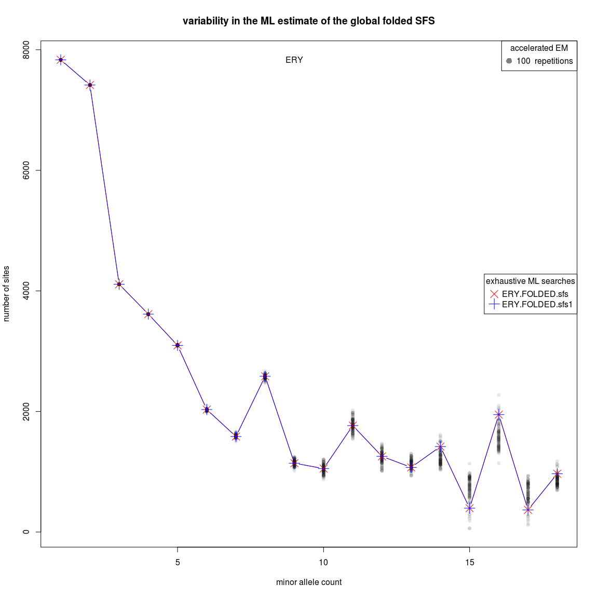

The EM algorithm doesn't seem to be converging well for the minor allele count categories 10 onwards. However, the two exhaustive EM searches are matching perfectly. So, I assume they have converged.

``` r
matplot(1:18, 
        t(par.SFS.repeated[,2:length(par.SFS.repeated)]), 
        #type="l",
        #lty=1,
        pch=16,
        col=gray(.1, alpha=.1),
        ylab="number of sites",
        xlab="minor allele count",
        main="variability in the ML estimate of the global folded SFS"
        )
points(1:18, par.sfs, pch=4, cex=2, col="green", type="b")
points(1:18, par.sfs1, pch=3, cex=2, col="orange", type="b")
#text(15, 10000, labels=paste(nrow(par.SFS.repeated), " repetitions"))
text(9, max(par.sfs), labels="PAR")
legend("topright", legend=paste(nrow(par.SFS.repeated), " repetitions"), pch=16, pt.cex=1.5, col=gray(.5), title="accelerated EM")
legend("right", legend=c("PAR.FOLDED.sfs", "PAR.FOLDED.sfs1"), pch=c(4, 3), pt.cex=2, col=c("green", "orange"), title="exhaustive ML searches")
```

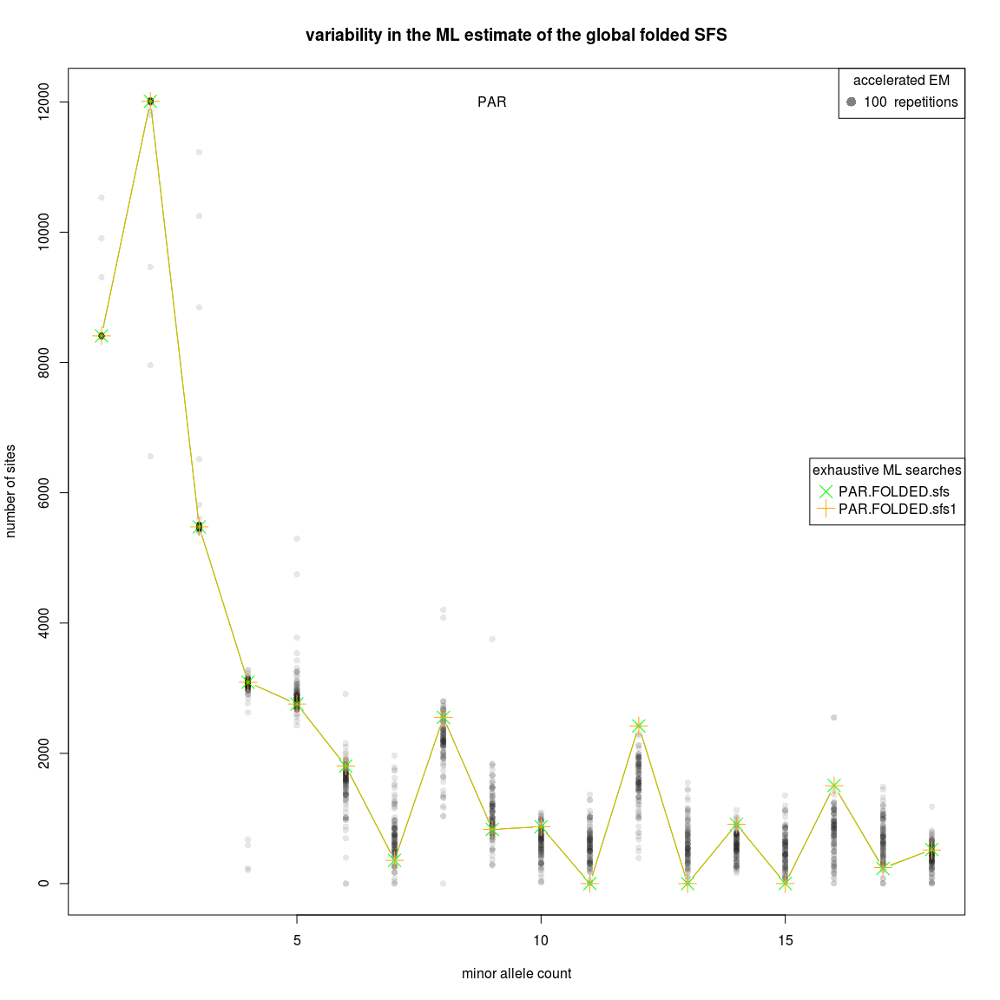

The EM algorithm doesn't seem to be able to resolve the *parallelus* SFS very well. There is a clear lack of convergence. However, the two exhaustive searches are matching perfectly. So I assume that they have converged.

Bootstrapping the ML estimate of SFS
------------------------------------

I have run 1000 bootstrap resamples of the ML SFS with `realSFS`. That should mean that sites are resampled with replacement. I have run `realSFS` with default parameters, i. e. accelerated EM algorithm and no specification of *tolerance*. That means that the bootstrap resampled SFS's also comprise the variability from the non-convergent EM algorithm.

``` r
ery.sfs.boot = read.table("ERY/ERY.FOLDED.sfs.boot", header=F)
dim(ery.sfs.boot)
```

    ## [1] 1000   19

``` r
head(ery.sfs.boot)
```

    ##            V1          V2          V3          V4          V5          V6
    ## 1 1594878.828 7903.242655 7234.054873 4136.505035 3838.377723 2707.878531
    ## 2 1594698.974 7909.674018 7529.946959 4081.697972 3620.873785 2879.184027
    ## 3 1595125.997 7946.673481 7129.572459 4188.538969 3744.499532 2948.530701
    ## 4 1594955.800 7741.280545 7550.142361 4031.950564 3595.504941 3404.369316
    ## 5 1594885.802 7837.500413 7406.484921 4404.701615 3017.601330 3632.463487
    ## 6 1595165.462 7515.667051 7709.521342 4031.581880 3478.765192 3275.149763
    ##            V7          V8          V9         V10         V11         V12
    ## 1 1992.624627 1697.600776 2478.381555 1271.847528 1385.311811 1176.088284
    ## 2 2246.443795 1313.428284 2790.335923 1132.064938 1289.260139 1610.352297
    ## 3 2303.540967 1012.977209 2742.192611 1331.570656  819.832922 2094.930145
    ## 4 1115.118097 1988.407958 2709.146303 1180.063592  844.009966 1880.200853
    ## 5 1848.844609 1230.987053 3115.726396 1085.532382  538.374551 2091.975152
    ## 6 1953.804110 1378.621579 2500.747398 1295.606850 1199.187996 1592.712858
    ##           V13         V14         V15         V16         V17         V18
    ## 1 1418.075418  976.720624 2114.652726    2.213088 1278.827721 1413.124947
    ## 2 1387.318159  962.596848 1297.967733  647.181814 1504.123842  459.459288
    ## 3  937.166707 1207.592220 1215.283432  590.165772 1841.344506  622.944255
    ## 4 1464.057670  932.983367 1093.367063  933.897642 1567.119641  249.518431
    ## 5 1450.348811 1316.775845   83.997718 2185.984806  756.355821  677.286274
    ## 6 1289.018970  973.888174 1207.276583  897.190543 1369.588828  940.185110
    ##           V19
    ## 1  563.643597
    ## 2 1107.115934
    ## 3  664.646756
    ## 4 1231.061635
    ## 5  901.256396
    ## 6  694.023333

``` r
ery.sfs.boot = ery.sfs.boot[,2:ncol(ery.sfs.boot)]
#
par.sfs.boot = read.table("PAR/PAR.FOLDED.sfs.boot", header=F)
dim(par.sfs.boot)
```

    ## [1] 1000   19

``` r
head(par.sfs.boot)
```

    ##            V1          V2          V3          V4          V5          V6
    ## 1 1171323.520 8201.845976 12025.73118 5661.359921 2925.309960 2752.701047
    ## 2 1171060.023 8336.055799 12414.55266 5003.499225 3387.870913 2683.957453
    ## 3 1170930.984 8206.609005 12389.24595 5031.971743 3411.986558 2538.000302
    ## 4 1171131.977 8815.808522 11682.66193 5726.325394 2832.267395 3063.914557
    ## 5 1171206.462 8576.130301 12062.32586 4758.589971 3345.752908 3169.881348
    ## 6 1171164.895 8389.585316 12018.78025 5417.129400 2616.547042 3514.318206
    ##            V7          V8          V9         V10         V11        V12
    ## 1 1535.023392 1352.454679 1305.307321 1681.065423  208.218128 321.304610
    ## 2 1402.626240  410.714481 3427.988743  273.658477  470.201026 385.080653
    ## 3 1988.840765 1063.938370 1875.075117  789.173566 1278.771409  64.450862
    ## 4 1620.234830  510.565086 2699.042577  277.948922  833.981955 637.386506
    ## 5 1015.629698 1201.516164 1794.597364 1721.890242  398.242511 361.786981
    ## 6 1081.156983 1441.598690 1047.644247 2123.524005  523.665646 211.295908
    ##           V13        V14        V15         V16         V17         V18
    ## 1 2640.092214 270.975453 154.867773  664.943711 1059.783632  289.417556
    ## 2 2225.302909 358.368965 505.617855 1151.982301  393.691573  300.191008
    ## 3 2037.173263 646.012430 399.917200  190.990669 1517.380991   25.557895
    ## 4 1704.830536 642.355834 144.800468 1031.285192   80.156523 1222.262078
    ## 5 1941.334832 352.498318 242.808147  847.715745 1357.598665  263.395498
    ## 6 2233.668850  12.445216 583.132532 1030.539853  157.618705  558.795132
    ##          V19
    ## 1 565.077957
    ## 2 747.616840
    ## 3 552.919406
    ## 4 281.195055
    ## 5 320.843780
    ## 6 812.659058

``` r
par.sfs.boot = par.sfs.boot[,2:ncol(par.sfs.boot)]
```

``` r
matplot(1:18, 
        t(ery.sfs.boot), 
        #type="l",
        #lty=1,
        pch=16,
        col=gray(0, alpha=.1),
        ylab="number of sites",
        xlab="minor allele count",
        main="global folded SFS of ERY"
        )
# adding the real sample ML estimate to the plot:
points(1:18, ery.sfs, pch=4, cex=2, col="red", type="b", lwd=2)
#text(15, 6000, labels=paste(nrow(ery.SFS.repeated), " repetitions"))
legend("topright", 
       legend=c("ERY.FOLDED.sfs", "1,000 bootstrap resamples"), 
       pch=c(4,16), 
       pt.cex=1, 
       col=c("red", gray(.2, alpha=1)),
       bty="n"
       )
```


``` r
matplot(1:18, 
        t(par.sfs.boot), 
        #type="l",
        #lty=1,
        pch=16,
        col=gray(0, alpha=.05),
        ylab="number of sites",
        xlab="minor allele count",
        main="global folded SFS of PAR"
        )
# adding the real sample ML estimate to the plot:
points(1:18, par.sfs, pch=4, cex=2, col="green", type="b", lwd=2)
#text(15, 6000, labels=paste(nrow(ery.SFS.repeated), " repetitions"))
legend("topright", 
       legend=c("PAR.FOLDED.sfs", "1,000 bootstrap resamples"), 
       pch=c(4,16),
       pt.cex=1, 
       col=c("green", gray(.2, alpha=1)),
       bty="n"
       )
```

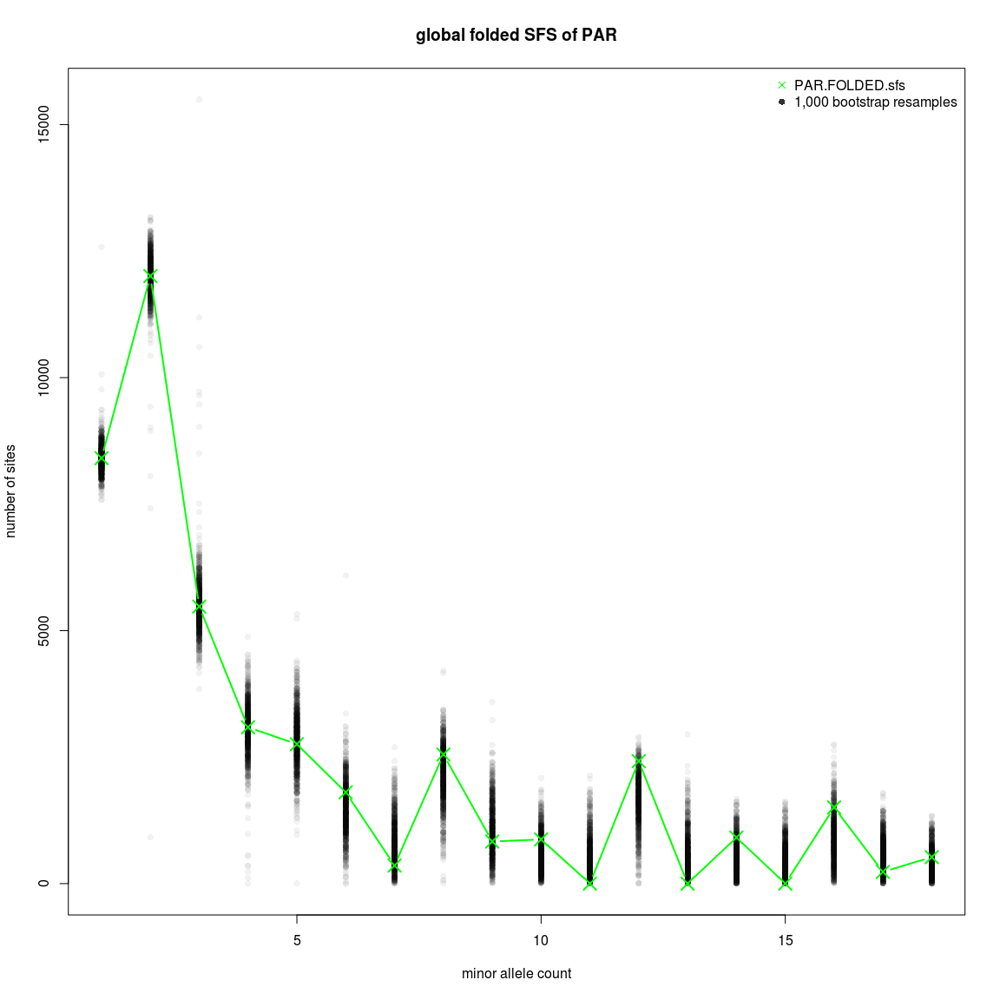

``` r
ery.sfs.CI95 = data.frame(
  low=vector("double", ncol(ery.sfs.boot)), 
  med=vector("double", ncol(ery.sfs.boot)), 
  high=vector("double", ncol(ery.sfs.boot))
  )
#
for(i in 1:ncol(ery.sfs.boot)){
  ery.sfs.CI95[i,] = quantile(ery.sfs.boot[,i], probs=c(0.25, 0.5, 0.975))
}
#
par.sfs.CI95 = data.frame(
  low=vector("double", ncol(par.sfs.boot)), 
  med=vector("double", ncol(par.sfs.boot)), 
  high=vector("double", ncol(par.sfs.boot))
  )
#
for(i in 1:ncol(par.sfs.boot)){
  par.sfs.CI95[i,] = quantile(par.sfs.boot[,i], probs=c(0.25, 0.5, 0.975))
}
```

``` r
plot(1:nrow(ery.sfs.CI95), ery.sfs.CI95$med, 
     ylim=c(0, max(ery.sfs.CI95)),
     pch=20,
     xlab="minor allele count",
     ylab="number of sites",
     main="global folded SFS of ERY"
     )
arrows(1:nrow(ery.sfs.CI95), ery.sfs.CI95$med, 
       1:nrow(ery.sfs.CI95), ery.sfs.CI95$high,
       angle=90,
       length=.05
       )
arrows(1:nrow(ery.sfs.CI95), ery.sfs.CI95$med, 
       1:nrow(ery.sfs.CI95), ery.sfs.CI95$low,
       angle=90,
       length=.05
       )
points(1:18, ery.sfs, pch=4, cex=1, col="red", type="b", lwd=2)
legend("topright", legend="exhaustive search ML SFS", bty="n", col="red", pch=4, lwd=2, cex=.9)
#
points(10.5, 7100, pch=20)
arrows(10.5, 7100, 
       10.5, 7400,
       angle=90,
       length=.05
       )
arrows(10.5, 7100, 
       10.5, 6800,
       angle=90,
       length=.05
       )
#
text(11, 7000, 
     labels="median and 95% CI limits\nof 1,000 bootstrap resamples", 
     cex=.9, pos=4)
```

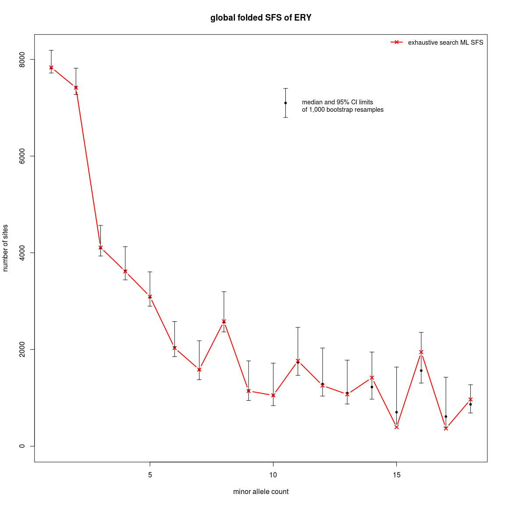

``` r
plot(1:nrow(par.sfs.CI95), par.sfs.CI95$med, 
     ylim=c(0, max(par.sfs.CI95)),
     pch=20,
     xlab="minor allele count",
     ylab="number of sites",
     main="global folded SFS of PAR"
     )
arrows(1:nrow(par.sfs.CI95), par.sfs.CI95$med, 
       1:nrow(par.sfs.CI95), par.sfs.CI95$high,
       angle=90,
       length=.05
       )
arrows(1:nrow(par.sfs.CI95), par.sfs.CI95$med, 
       1:nrow(par.sfs.CI95), par.sfs.CI95$low,
       angle=90,
       length=.05
       )
points(1:18, par.sfs, pch=4, cex=1, col="green", type="b", lwd=2)
legend("topright", legend="exhaustive search ML SFS", bty="n", col="green", pch=4, lwd=2, cex=.9)
#
points(10.5, 11100, pch=20)
arrows(10.5, 11100, 
       10.5, 11500,
       angle=90,
       length=.05
       )
arrows(10.5, 11100, 
       10.5, 10700,
       angle=90,
       length=.05
       )
#
text(11, 11000, 
     labels="median and 95% CI limits\nof 1,000 bootstrap resamples", 
     cex=.9, pos=4)
```

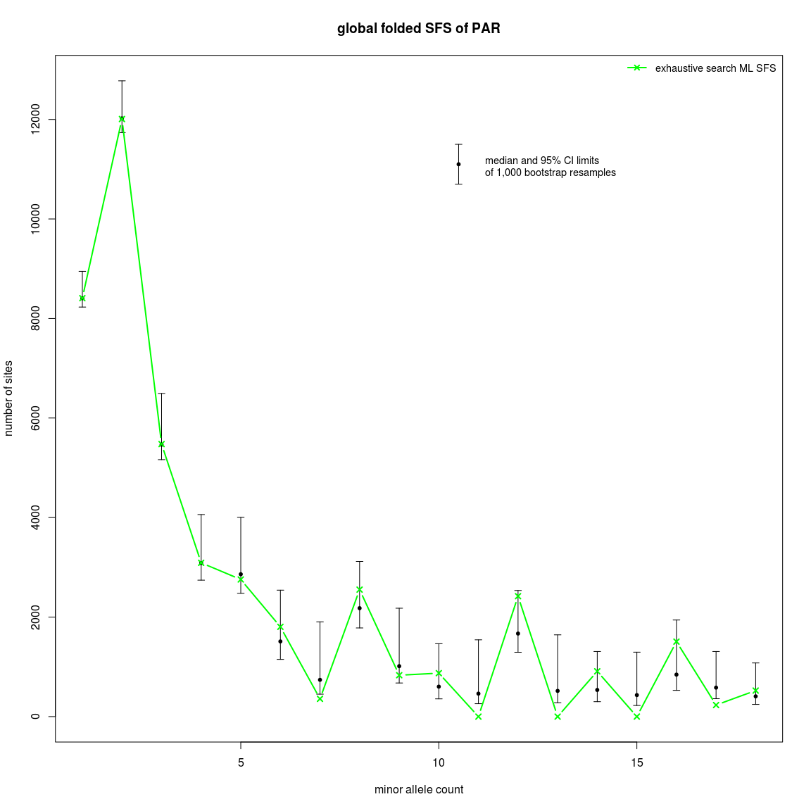

Several frequency classes (11, 13, 15) have exhaustive search ML estimates outside the 95% CI from the 1000 bootstrap resamples that were run with accelerated EM. I wonder whether the exhaustive search ML SFS is significant or whether it is maximising the likelihood of insignificant noise in the data due to a lack of information in the higher count classes.

Bootstraps with exhaustive ML search
------------------------------------

``` r
ery.sfs.boot.exh = read.table("ERY/ERY.FOLDED.sfs.boot.exh", header=F)
dim(ery.sfs.boot.exh)
```

    ## [1] 200  19

``` r
matplot(1:18, 
        t(ery.sfs.boot.exh[2:ncol(ery.sfs.boot.exh)]), 
        #type="l",
        #lty=1,
        pch=16,
        col=gray(0, alpha=.1),
        ylab="number of sites",
        xlab="minor allele count",
        main="global folded SFS of ERY\nexhaustive EM search"
        )
# adding the real sample ML estimate to the plot:
points(1:18, ery.sfs, pch=4, cex=2, col="red", type="b", lwd=2)
#text(15, 6000, labels=paste(nrow(ery.SFS.repeated), " repetitions"))
legend("topright", 
       legend=c("ERY.FOLDED.sfs", "200 bootstrap resamples"), 
       pch=c(4,16), 
       pt.cex=1, 
       col=c("red", gray(.2, alpha=1)),
       bty="n"
       )
```

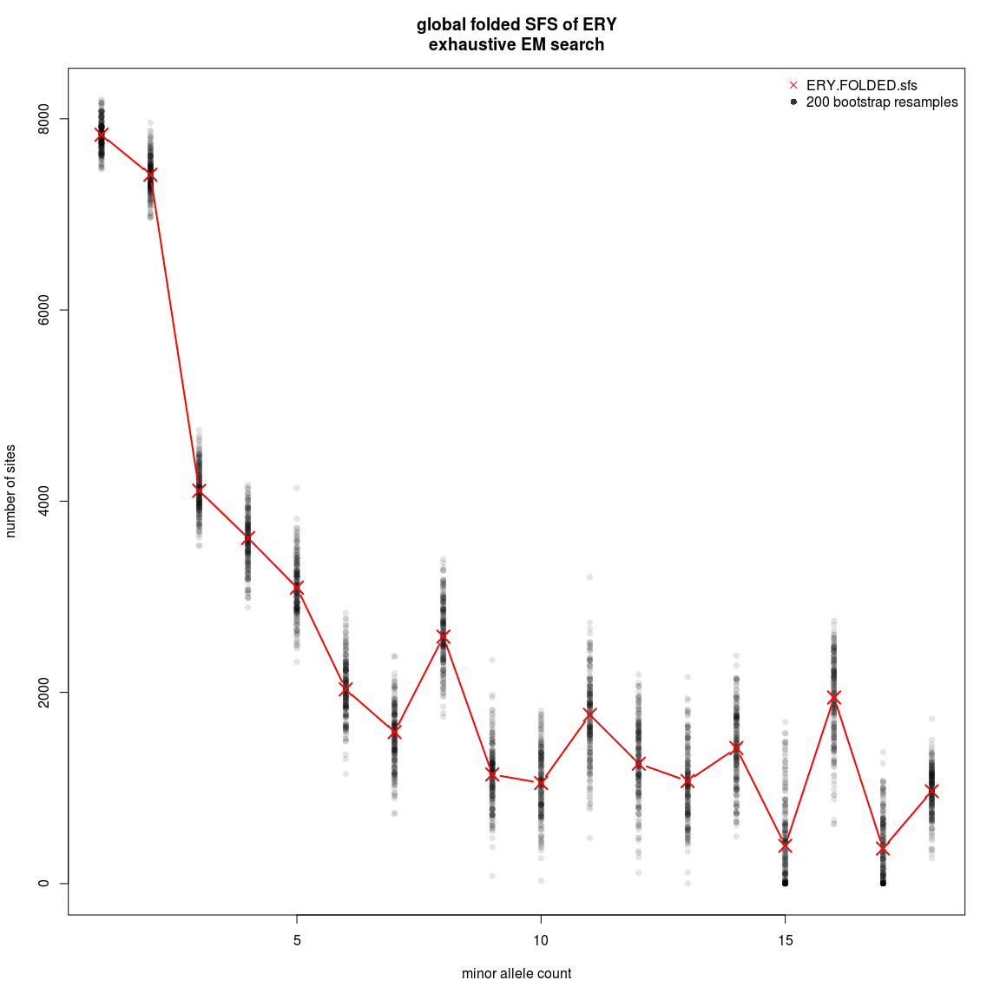

``` r
par.sfs.boot.exh = read.table("PAR/PAR.FOLDED.sfs.boot.exh", header=F)
dim(par.sfs.boot.exh)
```

    ## [1] 200  19

``` r
matplot(1:18, 
        t(par.sfs.boot.exh[2:ncol(par.sfs.boot.exh)]), 
        #type="l",
        #lty=1,
        pch=16,
        col=gray(0, alpha=.1),
        ylab="number of sites",
        xlab="minor allele count",
        main="global folded SFS of PAR\nexhaustive EM search"
        )
# adding the real sample ML estimate to the plot:
points(1:18, par.sfs, pch=4, cex=2, col="green", type="b", lwd=2)
#text(15, 6000, labels=paste(nrow(ery.SFS.repeated), " repetitions"))
legend("topright", 
       legend=c("PAR.FOLDED.sfs", "200 bootstrap resamples"), 
       pch=c(4,16), 
       pt.cex=1, 
       col=c("green", gray(.2, alpha=1)),
       bty="n"
       )
```

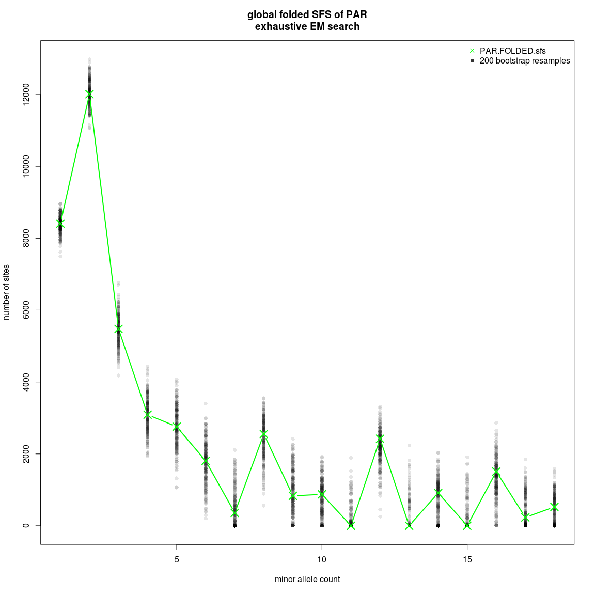

``` r
names(ery.sfs.boot.exh) = as.character(0:18)
ery.sfs.boot.exh.CI95 = as.data.frame(t( apply(ery.sfs.boot.exh, 2, quantile, probs=c(0.25, 0.5, 0.975)) ))
#
names(par.sfs.boot.exh) = as.character(0:18)
par.sfs.boot.exh.CI95 = as.data.frame(t( apply(par.sfs.boot.exh, 2, quantile, probs=c(0.25, 0.5, 0.975)) ))
```

``` r
plot_ery_boot = function(...){
  points(1:18, 
       ery.sfs.boot.exh.CI95[2:19,2], 
       ylim=c(0, max(ery.sfs.boot.exh.CI95[2:19,])),
       pch=20,
       xlab="minor allele count",
       ylab="number of sites",
       main="global folded SFS of ERY",
       ...
       )
  arrows(1:18, ery.sfs.boot.exh.CI95[2:19,2], 
         1:18, ery.sfs.boot.exh.CI95[2:19,3],
         angle=90,
         length=.05,
         ...
         )
  arrows(1:18, ery.sfs.boot.exh.CI95[2:19,2], 
         1:18, ery.sfs.boot.exh.CI95[2:19,1],
         angle=90,
         length=.05,
         ...
         )
  }
# set up plot device:
plot(1:18, 
     ery.sfs.boot.exh.CI95[2:19,2], 
     ylim=c(0, max(ery.sfs.boot.exh.CI95[2:19,])),
     pch=20,
     xlab="minor allele count",
     ylab="number of sites",
     main="global folded SFS of ERY",
     type="n"
     )
plot_ery_boot()
points(1:18, ery.sfs, pch=4, cex=1, col="red", type="b", lwd=2)
legend("topright", legend="real sample SFS from exhaustive EM search", bty="n", col="red", pch=4, lwd=2, cex=.9)
#
points(10.5, 7100, pch=20)
arrows(10.5, 7100, 
       10.5, 7400,
       angle=90,
       length=.05
       )
arrows(10.5, 7100, 
       10.5, 6800,
       angle=90,
       length=.05
       )
#
text(11, 7000, 
     labels="median and 95% CI limits\nof 200 bootstrap resamples", 
     cex=.9, pos=4)
```

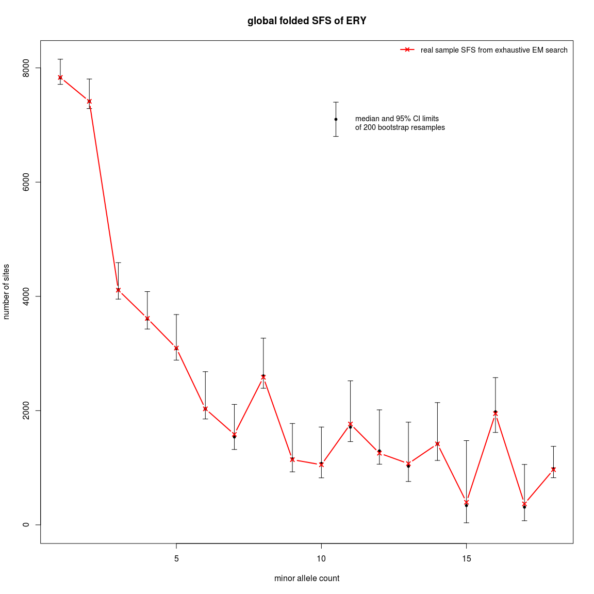

``` r
plot_par_boot = function(...){
  # plot medians of bootstrap samples:
  points(1:18, 
       par.sfs.boot.exh.CI95[2:19,2], 
       ylim=c(0, max(par.sfs.boot.exh.CI95[2:19,])),
       pch=20,
       xlab="minor allele count",
       ylab="number of sites",
       main="global folded SFS of PAR",
       ...
       )
  # plot CI bars:
  arrows(1:18, par.sfs.boot.exh.CI95[2:19,2], 
         1:18, par.sfs.boot.exh.CI95[2:19,3],
         angle=90,
         length=.05,
         ...
         )
  arrows(1:18, par.sfs.boot.exh.CI95[2:19,2], 
         1:18, par.sfs.boot.exh.CI95[2:19,1],
         angle=90,
         length=.05,
         ...
         )
  }
# set up plot device:
plot(1:18, 
     par.sfs.boot.exh.CI95[2:19,2], 
     ylim=c(0, max(par.sfs.boot.exh.CI95[2:19,])),
     pch=20,
     xlab="minor allele count",
     ylab="number of sites",
     main="global folded SFS of PAR",
     type="n"
     )
plot_par_boot()
points(1:18, par.sfs, pch=4, cex=1, col="green", type="b", lwd=2)
legend("topright", legend="real sample SFS from exhaustive EM search", bty="n", col="green", pch=4, lwd=2, cex=.9)
#
points(10.5, 11100, pch=20)
arrows(10.5, 11100, 
       10.5, 11500,
       angle=90,
       length=.05
       )
arrows(10.5, 11100, 
       10.5, 10700,
       angle=90,
       length=.05
       )
#
text(11, 11000, 
     labels="median and 95% CI limits\nof 200 bootstrap resamples", 
     cex=.9, pos=4)
```

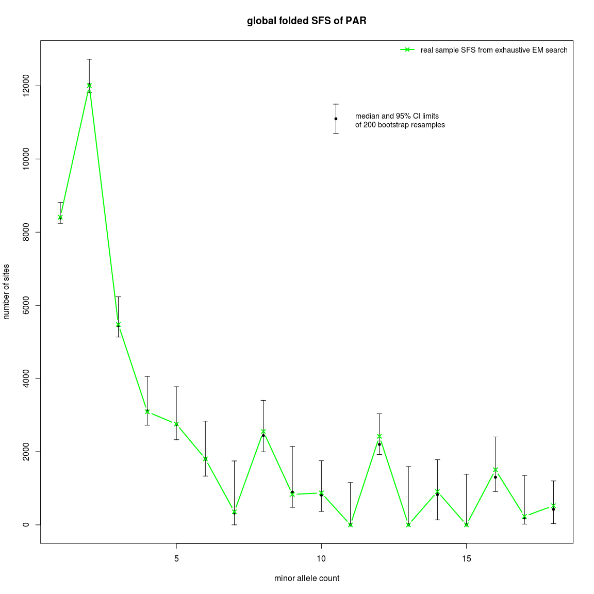

The SFS's estimated from the real samples (also with exhaustive EM search) match the medians of the frequency classes from bootstrap resampled sites very well for each population.

------------------------------------------------------------------------

Fitting an expected neutral SFS
-------------------------------

I have run `realSFS` with a *tolerance* (`-tole`) of 1e-6, which means that the EM iteration is stopped if the likelihoods of the last two iterations differed by less than 1e-6. I specified a maximum number of EM iterations of 50000 (`-maxIter`) after examining the speed at which both ERY and PAR reach the *tolerance* stopping criterium. I have also turned off the accelerated EM algorithm with `-m 0`. This guarantees that a good ML estimate of the SFS is found, but much more slowly. The ML estimate of the folded SFS in ERY is found within 8 minutes, the one of PAR within 26 minutes.

``` r
# read in the spectra again

ery.sfs = scan("ERY/ERY.FOLDED.sfs")
par.sfs = scan("PAR/PAR.FOLDED.sfs")
ery.sfs = ery.sfs[-1]
par.sfs = par.sfs[-1]
```

I am trying to fit eq. 4.21 of Wakeley (2009) to the oberseved 1D folded spectra:

$$
E\[\\eta\_i\] = \\theta \\frac{\\frac{1}{i} + \\frac{1}{n-i}}{1+\\delta\_{i,n-i}} \\qquad 1 \\le i \\le \\big\[n/2\\big\]
$$

This formula gives the neutral expectation of counts in each frequency class (*i*) in a folded spectrum. The count in each frequency class, *η*<sub>*i*</sub>, provides an estimate of *θ*. However, I would like to find the value of *θ* that minimizes the deviation of the above equation from all observed counts *η*<sub>*i*</sub>.

``` r
# define function to optimise

f = function (theta, eta, n){ 
  #
  # theta: parameter to optimize
  # eta: will get the observed SFS
  # n: number of gene copies sampled per diploid locus
  #
  # returns sum of squared deviations (residuals) between observed counts
  # and a candidate model
  #
  sumofsq = numeric(length(ery.sfs))
  i = seq(1, length(eta))
  delta = ifelse(i == n-i, 1, 0)
  expected = theta * (1/i + 1/(n-i)) / (1 + delta)
  sumofsq = sum( (expected - eta)^2 )
  return(sumofsq)
}
```

``` r
# fit optimizal theta to ery and par SFS

ery_thetaOpt = optimize(f, interval=c(0, sum(ery.sfs)),  eta=ery.sfs, n=36, maximum=FALSE, tol=0.001)
par_thetaOpt = optimize(f, interval=c(0, sum(par.sfs)),  eta=par.sfs, n=36, maximum=FALSE, tol=0.001)
```

The optimal *θ* for the spectrum of *ery* is 9582.95. The optimal *θ* for the spectrum of *par* is 10965. These are almost exactly the same values I estimated with the `scipy.optimize` functions `curve_fit` and `minimize_scalar` in `First_Steps_with_dadi.ipynb`.

``` r
# define a function that returns expected counts given a theta under the assumption of
# the standard neutral model

snm = function(theta, len=0, n=36){
  #
  # theta: should be optimized theta
  # len: should be the length of the folded SFS, i. e. highest freq. class
  # n: should be number of gene copies sampled per locus, i. e. 2*N for diploid loci
  #
  # returns expected SFS
  #
  i = seq(1, len)
  delta = ifelse(i == n-i, 1, 0)
  expected = theta * 1/i + 1/(n-i) / (1 + delta)
  return(expected)
}
```

``` r
# plot observed spectra and expected neutral fit for ery and par

par(mfrow=c(2,1))
# standard neutral model expectation:
ery_expected = snm(ery_thetaOpt$min, len=length(ery.sfs), n=36)
plot(ery_expected, 
     xlab="minor allele count", 
     ylab="number of sites",
     pch=18, col="black", type="b",
     main="folded SFS of ery")
# observed:
lines(ery.sfs, pch=20, col="red", type="b")
legend("topright", legend=c("ery", "neutral fit"), pch=c(20, 18), col=c("red", "black"), bty="n")
#
# standard neutral model expectation:
par_expected = snm(par_thetaOpt$min, len=length(par.sfs), n=36)
plot(par_expected, 
     xlab="minor allele count", 
     ylab="number of sites",
     ylim=c(0, max(par_expected)*1.1),
     pch=18, col="black", type="b",
     main="folded SFS of par")
# observed:
lines(par.sfs, pch=20, col="green", type="b")
legend("topright", legend=c("par", "neutral fit"), pch=c(20, 18), col=c("green", "black"), bty="n")
```

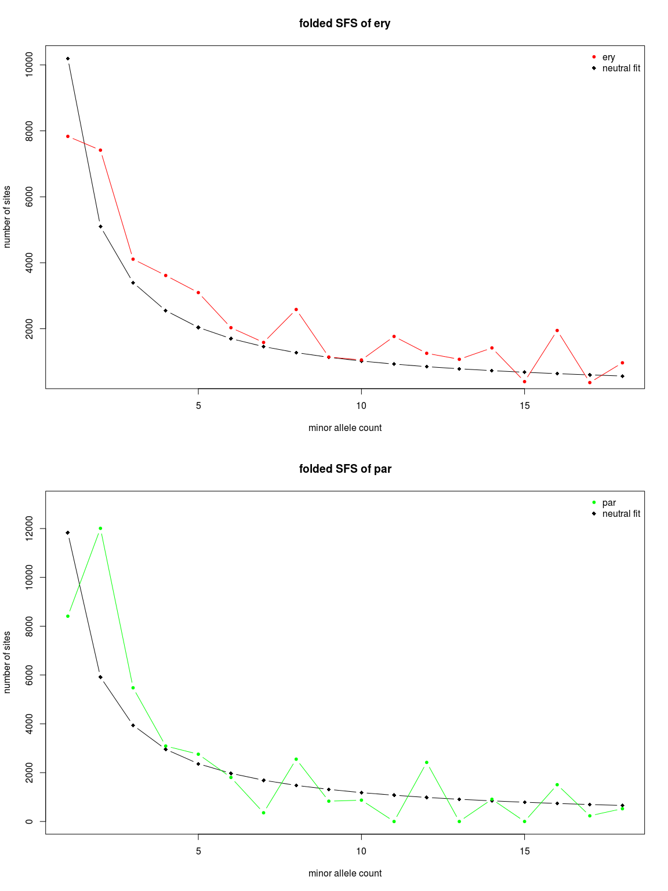

The deviation, especially in the first two count classes, is astonishing and certainly cannot be explained just by violations of assumptions of standard neutral model.

Let's get confidence intervals for SNM expected counts. According to Fu (1995), p. 192, the counts in neutral spectra can be approximated by a Poisson distribution for large sample sizes (i. e. large *n*).

``` r
par(mfrow=c(1,1))

plot_ery_snm = function(...){
  # get neutral model expectation
  snm.expect = snm(ery_thetaOpt$min, len=length(ery.sfs), n=36)
  # expected:
  points(snm.expect, 
       xlab="minor allele count", 
       ylab="number of sites",
       ylim=c(0, max(snm.expect)*1.1),
       pch=18, col="black", type="b",
       main="folded SFS of ery",
       ...
       )
  legend("topright", legend=c("ery", "neutral fit"), 
         pch=c(20, 18), col=c("red", "black"), bty="n")
  # get lower and upper 95% quantiles:
  low = qpois(p=0.025, lambda=snm.expect)
  high = qpois(p=0.975, lambda=snm.expect)
  # add 95% CI bars:
  arrows(1:length(snm.expect), snm.expect, 
         1:length(snm.expect), high,
         angle=90,
         length=.05,
         ...
         )
  arrows(1:length(snm.expect), snm.expect, 
         1:length(snm.expect), low,
         angle=90,
         length=.05,
         ...
         )
  }
# set up plot device (false design of R!):
plot(snm.expect, 
       xlab="minor allele count", 
       ylab="number of sites",
       ylim=c(0, max(snm.expect)*1.1),
       main="folded SFS of ery",
       type="n",
       )
plot_ery_snm()
# observed:
lines(ery.sfs, pch=20, col="red", type="b")
```

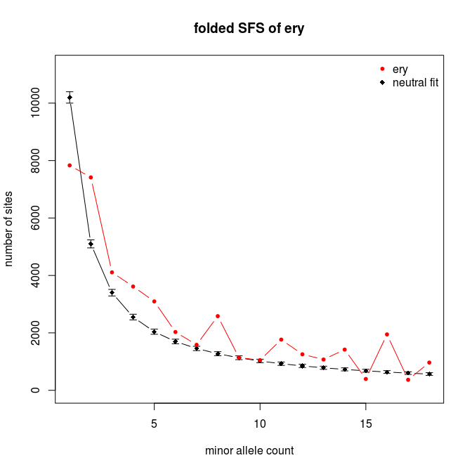

Now, let's combine the 95% CI from bootstraps over nucleotide sites with the 95% CI of the fitted neutral spectrum.

``` r
# set up plot device (false design of R!):
plot(snm.expect, 
       xlab="minor allele count", 
       ylab="number of sites",
       ylim=c(0, max(snm.expect)*1.1),
       main="folded SFS of ery",
       type="n",
       )
plot_ery_boot(col="red", type="b")
plot_ery_snm(new=FALSE)
```

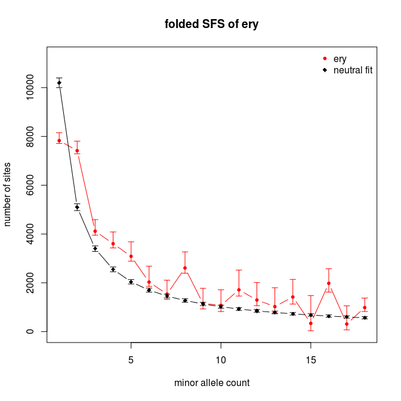

``` r
# set up plot device (false design of R!):
# set up plot device:
plot(1:18, 
     par.sfs.boot.exh.CI95[2:19,2], 
     ylim=c(0, max(par.sfs.boot.exh.CI95[2:19,])),
     pch=20,
     xlab="minor allele count",
     ylab="number of sites",
     main="global folded SFS of PAR",
     type="n"
     )
plot_par_boot(col="green", type="b")
plot_ery_snm(new=FALSE)
```

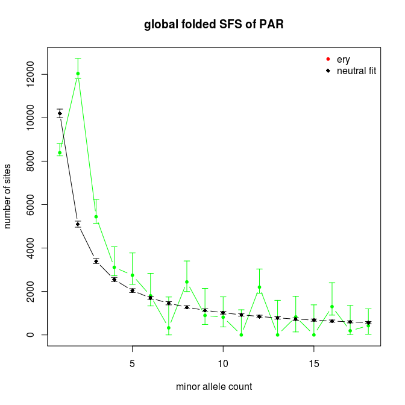

------------------------------------------------------------------------

Diversity Estimates
-------------------

### S and *π*

``` r
ery.sfs.boot = read.table("ERY/ERY.FOLDED.sfs.boot.exh", header=F)
dim(ery.sfs.boot)
```

    ## [1] 200  19

``` r
# number of segregating sites:
S.ery.boot = apply( ery.sfs.boot, c(1), function(x) sum(x[2:length(x)]) )
quantile(S.ery.boot, probs=c(.025, .975))
```

    ##        2.5%       97.5% 
    ## 43223.06184 44075.83650

``` r
# average number of pairwise differences:
PI = function(sfs){
  n.half = 18
  n = 36
  1/(n*(n-1)/2) * sum( sapply(1:n.half, function(i) i*(n-i)*sfs[i]) )
}
pi.ery.boot = apply( ery.sfs.boot, c(1), function(x) PI( x[2:length(x)] ) )
head(pi.ery.boot)
```

    ## [1] 10620.31997 10730.00624 10640.82990 10621.31690 10712.62251 10631.59798

``` r
quantile(pi.ery.boot, probs=c(.025, .975))
```

    ##        2.5%       97.5% 
    ## 10560.85170 10791.37979

``` r
par.sfs.boot = read.table("PAR/PAR.FOLDED.sfs.boot.exh", header=F)
# number of segregating sites:
S.par.boot = apply( par.sfs.boot, c(1), function(x) sum(x[2:length(x)]) )
quantile(S.par.boot, probs=c(.025, .975))
```

    ##        2.5%       97.5% 
    ## 43265.33888 44231.43501

``` r
# average number of pairwise differences:
pi.par.boot = apply( par.sfs.boot, c(1), function(x) PI( x[2:length(x)] ) )
head(pi.par.boot)
```

    ## [1] 8852.717614 8790.278074 8789.181607 8804.603501 8903.622889 8896.975645

``` r
quantile(pi.par.boot, probs=c(.025, .975))
```

    ##        2.5%       97.5% 
    ## 8759.914873 8953.467375

``` r
ery.sfs = read.table("ERY/ERY.FOLDED.sfs", header=F)
ery.nSites = sum(ery.sfs)
S.ery = apply( ery.sfs, c(1), function(x) sum(x[2:length(x)]) )
pi.ery = apply( ery.sfs, c(1), function(x) PI( x[2:length(x)] ) )
#
par.sfs = read.table("PAR/PAR.FOLDED.sfs", header=F)
par.nSites = sum(par.sfs)
S.par = apply( par.sfs, c(1), function(x) sum(x[2:length(x)]) )
pi.par = apply( par.sfs, c(1), function(x) PI( x[2:length(x)] ) )
```

``` r
plot(density(S.ery.boot/ery.nSites),
     xlab=expression(S[prop]),
     xlim=range(S.ery.boot/ery.nSites, S.par.boot/par.nSites),
     main="Proportion of segregating sites\nfrom 200 bootstraps of the SFS")
lines(density(S.par.boot/par.nSites), lty=2, lwd=1.5)
points(c(S.ery/ery.nSites, S.par/par.nSites), c(0, 0), pch=3)
legend("topright", legend=c("erythropus", "parallelus", "real sample"), 
       lty=c(1, 2, NA), lwd=c(1, 1.5, NA), pch=c(NA, NA, 3), bty="n")
```


``` r
plot(density(pi.ery.boot/ery.nSites),
     xlim=range(c(pi.ery.boot/ery.nSites, pi.par.boot/par.nSites)),
     xlab=expression(pi[site]),
     main="Average number of pairwise differences\nper nucleotide from 200 bootstraps of the SFS"
     )
lines(density(pi.par.boot/par.nSites), lty=2, lwd=1.5)
points(c(pi.ery/ery.nSites, pi.par/par.nSites), c(0, 0), pch=3)
legend("topright", legend=c("erythropus", "parallelus", "real sample"), lty=c(1, 2, NA), 
       lwd=c(1, 1.5, NA), pch=c(NA, NA, 3), bty="n")
```


Both *S*<sub>*s**i**t**e*</sub> and *π*<sub>*s**i**t**e*</sub> are considerably higher in *parallelus* than in *erythropus*. If *parallelus* is derived from a Balkan refuge, I would expect it to have undergone a series of founder events. These should have reduced diversity, at least *π*, in *parallelus* more than in *erythropus* that comparitively would have had only a short distance to migrate from its glacial refuge. Subsequent population expansion would have allowed *S* to recover quickly.

### Global Tajima's D

``` r
# 1. calculate constant (see p. 45 in Gillespie)
# ery
n = 36
a1 = sum(sapply(1:(n-1), function(x) x^(-1)))
a1
```

    ## [1] 4.146781419

``` r
a2 = sum(sapply(1:(n-1), function(x) x^(-2)))
b1 = (n+1)/(3*(n-1))
b2 = 2*(n^2+n+3)/(9*n*(n-1))
c1 = b1 - (1/a1)
c2 = b2 - (n+2)/(a1*n)+a2/a1^2
C = sqrt( c1/a1*S.ery + (c2/(a1^2+a2))*S.ery*(S.ery-1) )
C
```

    ## [1] 2754.819269

``` r
( ery.TajimasD.global = (pi.ery - S.ery/a1)/C )
```

    ## [1] 0.0561254976

``` r
# 1. calculate constant (see p. 45 in Gillespie)
# par
n = 36
a1 = sum(sapply(1:(n-1), function(x) x^(-1)))
a2 = sum(sapply(1:(n-1), function(x) x^(-2)))
b1 = (n+1)/(3*(n-1))
b2 = 2*(n^2+n+3)/(9*n*(n-1))
c1 = b1 - (1/a1)
c2 = b2 - (n+2)/(a1*n)+a2/a1^2
C = sqrt( c1/a1*S.par + (c2/(a1^2+a2))*S.par*(S.par-1) )
( par.TajimasD.global = (pi.par - S.par/a1)/C )
```

    ## [1] -0.6142268481

Both global Tajima's D values are significantly different from 0 and negative. I think this means that there is an excess of low frequency variants, which might be an expansion signal, i. e. many variable sites are recent. However, the magnitude of Tajima's D seems supicious to me.

``` r
C.boot = sqrt( c1/a1*S.ery.boot + (c2/(a1^2+a2))*S.ery.boot*(S.ery.boot-1) )
ery.TajimasD.global.boot = (pi.ery.boot - S.ery.boot/a1)/C.boot
#
C.boot = sqrt( c1/a1*S.par.boot + (c2/(a1^2+a2))*S.par.boot*(S.par.boot-1) )
par.TajimasD.global.boot = (pi.par.boot - S.par.boot/a1)/C.boot
#
plot(density(ery.TajimasD.global.boot),
     xlim=range(ery.TajimasD.global.boot, par.TajimasD.global.boot),
     type="l",
     xlab="Tajima's D",
     main="global Tajima's D\nfrom 200 bootstraps of SFS"
     )
lines(density(par.TajimasD.global.boot), lty=2, lwd=1.5)
points(c(ery.TajimasD.global, par.TajimasD.global), c(0, 0), pch=3)
legend("top", legend=c("erythropus", "parallelus", "real sample"), lty=c(1, 2, NA), 
       lwd=c(1, 1.5, NA), pch=c(NA, NA, 3), bty="n")
```


### Tajima's D per contig

I have estimated per-contig Tajima's D values with the empirical Bayes method described in Korneliussen2013. This uses the ML global SFS as prior for posterior SAF's that are summed across sites to get the SFS for a region/contig. From this local SFS, local *S*, *π* and Tajima's D can be derived.

``` r
pp = pipe("cut -f 2,4,5,9,14 /data3/claudius/Big_Data/ANGSD/THETASTAT/ERY/ERY.thetas.gz.pestPG", 
          open="r"
          )
thetas.ery = read.table(pp, header=TRUE)
close(pp)
head(thetas.ery)
```

    ##         Chr       tW       tP    Tajima nSites
    ## 1 Contig_16 0.016324 0.004369 -0.361801     39
    ## 2 Contig_17 0.013699 0.003794 -0.327604     39
    ## 3 Contig_40 0.747833 0.698273 -0.175456     39
    ## 4 Contig_46 0.739295 1.049866  1.108267     39
    ## 5 Contig_53 0.017697 0.005133 -0.364992     39
    ## 6 Contig_99 0.273420 0.152248 -0.814871     35

``` r
nrow(thetas.ery)
```

    ## [1] 32706

``` r
#
pp = pipe("cut -f 2,4,5,9,14 /data3/claudius/Big_Data/ANGSD/THETASTAT/PAR/PAR.thetas.gz.pestPG", 
          open="r"
          )
thetas.par = read.table(pp, header=TRUE)
close(pp)
head(thetas.par)
```

    ##          Chr       tW       tP    Tajima nSites
    ## 1  Contig_40 0.726954 0.247784 -1.729843     39
    ## 2  Contig_53 0.509242 0.617952  0.497656     39
    ## 3 Contig_179 0.470037 0.309372 -0.774425     43
    ## 4 Contig_181 0.321413 0.229371 -0.561896     36
    ## 5 Contig_195 0.749432 0.427895 -1.136666     39
    ## 6 Contig_219 0.944613 0.380629 -1.693624     39

``` r
nrow(thetas.par)
```

    ## [1] 24336

``` r
save(thetas.ery, thetas.par, file="thetas.RData")
```

``` r
par(mfrow=c(2,1))
hist(thetas.ery$Tajima, breaks=40, 
     main=paste("Distributions of Tajima's D over ", nrow(thetas.ery), " contigs"),
     xlab="Tajima's D"
     )
legend("topright", legend=c("erythropus"), bty="n")
hist(thetas.par$Tajima, breaks=40,
     main=paste("Distributions of Tajima's D over ", nrow(thetas.par), " contigs"),
     xlab="Tajima's D"
     )
legend("topright", legend=c("parallelus"), bty="n")
```


Why are the per-contig Tajima's D estimates so much higher than the global estimate?

References
----------

Fu, Y.X. 1995. “Statistical Properties of Segregating Sites.” *Theoretical Population Biology* 48 (2): 172–97. doi:[http://dx.doi.org/10.1006/tpbi.1995.1025](https://doi.org/http://dx.doi.org/10.1006/tpbi.1995.1025).

Wakeley, John. 2009. *Coalescent Theory*. Roberts & Company Publishers.
