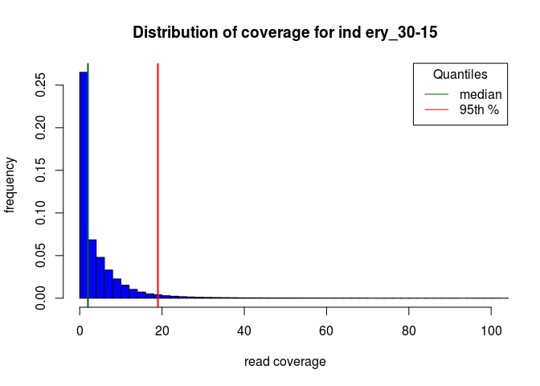
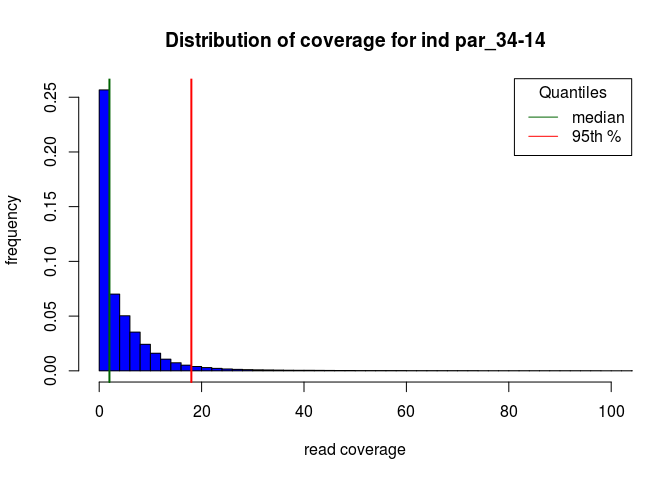
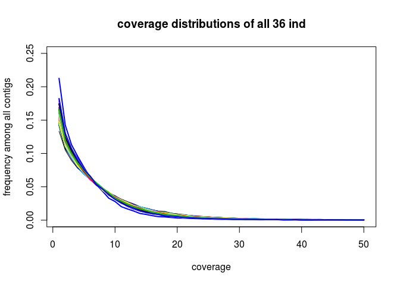
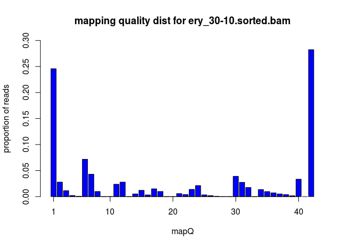

Big\_Data
================
Claudius
01/11/2016

-   [Depth distribution over SE RAD tags](#depth-distribution-over-se-rad-tags)
-   [Mapping quality distribution](#mapping-quality-distribution)
-   [Contig length distribution](#contig-length-distribution)

I have created two coverage files with `bamtools coverage` from the BAM files of two individuals that shall represent their respective population:

``` r
infiles = Sys.glob("*cov.gz")
```

``` r
ery = as.numeric( scan(pipe(paste("gzip -dc", infiles[1], "| cut -f 3"), open="r")) )
ery[1:10]
```

    ##  [1] 349 349 349 349 349 349 349 349 349 349

``` r
max(ery)
```

    ## [1] 10525

``` r
min(ery)
```

    ## [1] 0

``` r
length(ery)
```

    ## [1] 23261159

``` r
par = as.numeric( scan(pipe(paste("gzip -dc", infiles[2], "| cut -f 3"), open="r")) )
par[1:10]
```

    ##  [1] 386 386 386 386 386 386 386 386 386 386

``` r
max(par)
```

    ## [1] 9007

``` r
min(par)
```

    ## [1] 0

``` r
length(par)
```

    ## [1] 18012613

I have coverage information from 23261159 sites for the individual ery\_30-15 and 18012613 for individual par\_34-14.

``` r
hist(ery,
     breaks=max(ery)/2,
     xlab="read coverage",
     ylab="frequency",
     freq=FALSE,
     xlim=c(0,100),
     main="Distribution of coverage for ind ery_30-15",
     col="blue"
     )

( Q = quantile(ery, probs=c(0.25, 0.5, 0.75, 0.95, 0.99, 0.999)) )
```

    ##   25%   50%   75%   95%   99% 99.9% 
    ##     0     2     6    19    61   335

``` r
abline(v=Q["50%"], col="darkgreen", lty="solid", lwd=2)
abline(v=Q["95%"], col="red", lty="solid", lwd=2)

legend("topright",
       legend=c("median", "95th %"),
       title="Quantiles",
       col=c("darkgreen", "red"),
       lty="solid"
       )
```



``` r
avg_cov = mean(ery)
avg_cov + 4*sqrt(avg_cov)
```

    ## [1] 16.21566

    ##   25%   50%   75%   95%   99% 99.9% 
    ##     0     2     6    18    57   293



Depth distribution over SE RAD tags
-----------------------------------

I have created coverage count files from SE reads mapping to the 2nd position in the contigs (see assembly.sh).

``` r
infiles = list.files(getwd(), pattern=".*SE_depths")
depths = list()
for (i in 1:length(infiles)){
  cat( infiles[i], "\n" )
  depths[[i]] = scan(pipe(paste("cut -f 2", infiles[i]), open="r"))
}
```

    ## ery_30-10.sorted.SE_depths 
    ## ery_30-11.sorted.SE_depths 
    ## ery_30-12.sorted.SE_depths 
    ## ery_30-13.sorted.SE_depths 
    ## ery_30-14.sorted.SE_depths 
    ## ery_30-15.sorted.SE_depths 
    ## ery_30-16.sorted.SE_depths 
    ## ery_30-17.sorted.SE_depths 
    ## ery_30-18.sorted.SE_depths 
    ## ery_30-1.sorted.SE_depths 
    ## ery_30-2.sorted.SE_depths 
    ## ery_30-3.sorted.SE_depths 
    ## ery_30-4.sorted.SE_depths 
    ## ery_30-5.sorted.SE_depths 
    ## ery_30-6.sorted.SE_depths 
    ## ery_30-7.sorted.SE_depths 
    ## ery_30-8.sorted.SE_depths 
    ## ery_30-9.sorted.SE_depths 
    ## par_34-10.sorted.SE_depths 
    ## par_34-11.sorted.SE_depths 
    ## par_34-12.sorted.SE_depths 
    ## par_34-13.sorted.SE_depths 
    ## par_34-14.sorted.SE_depths 
    ## par_34-15.sorted.SE_depths 
    ## par_34-16.sorted.SE_depths 
    ## par_34-17.sorted.SE_depths 
    ## par_34-18.sorted.SE_depths 
    ## par_34-1.sorted.SE_depths 
    ## par_34-2.sorted.SE_depths 
    ## par_34-3.sorted.SE_depths 
    ## par_34-4.sorted.SE_depths 
    ## par_34-5.sorted.SE_depths 
    ## par_34-6.sorted.SE_depths 
    ## par_34-7.sorted.SE_depths 
    ## par_34-8.sorted.SE_depths 
    ## par_34-9.sorted.SE_depths

``` r
x = depths[[1]]
plot(table(x)[1:50]/length(x), 
     ylim=c(0,0.25), 
     type="l",
     xlab="coverage",
     ylab="frequency among all contigs",
     main="coverage distributions of all 36 ind")
for(i in 2:length(depths)){
  x = depths[[i]]
  lines(1:50, table(x)[1:50]/length(x), type="l", col=i, lwd=2)
}
```



``` r
Q99 = numeric(length(depths))
Q95 = numeric(length(depths))
for(i in 1:length(depths)){
  cat(infiles[i], "\t")
  Q99[i] = quantile(depths[[i]], probs=0.99)
  Q95[i] = quantile(depths[[i]], probs=0.95)
  cat(Q95[i], "\t", Q99[i], "\n")
}
```

    ## ery_30-10.sorted.SE_depths   30   134 
    ## ery_30-11.sorted.SE_depths   28   120.8 
    ## ery_30-12.sorted.SE_depths   25   103 
    ## ery_30-13.sorted.SE_depths   24   99 
    ## ery_30-14.sorted.SE_depths   25   102 
    ## ery_30-15.sorted.SE_depths   28   121 
    ## ery_30-16.sorted.SE_depths   25   103 
    ## ery_30-17.sorted.SE_depths   25   106 
    ## ery_30-18.sorted.SE_depths   28   123 
    ## ery_30-1.sorted.SE_depths    25   102 
    ## ery_30-2.sorted.SE_depths    28   120 
    ## ery_30-3.sorted.SE_depths    29   124 
    ## ery_30-4.sorted.SE_depths    29   125 
    ## ery_30-5.sorted.SE_depths    27   115 
    ## ery_30-6.sorted.SE_depths    28   116 
    ## ery_30-7.sorted.SE_depths    26   108 
    ## ery_30-8.sorted.SE_depths    26   110 
    ## ery_30-9.sorted.SE_depths    26   111 
    ## par_34-10.sorted.SE_depths   23   90 
    ## par_34-11.sorted.SE_depths   22   84 
    ## par_34-12.sorted.SE_depths   23   87 
    ## par_34-13.sorted.SE_depths   22   83 
    ## par_34-14.sorted.SE_depths   26   103 
    ## par_34-15.sorted.SE_depths   23   89 
    ## par_34-16.sorted.SE_depths   24   93 
    ## par_34-17.sorted.SE_depths   22   88 
    ## par_34-18.sorted.SE_depths   23   89 
    ## par_34-1.sorted.SE_depths    18   55 
    ## par_34-2.sorted.SE_depths    24   100 
    ## par_34-3.sorted.SE_depths    23   90 
    ## par_34-4.sorted.SE_depths    22   80 
    ## par_34-5.sorted.SE_depths    26   107 
    ## par_34-6.sorted.SE_depths    23   88 
    ## par_34-7.sorted.SE_depths    25   98 
    ## par_34-8.sorted.SE_depths    24   96 
    ## par_34-9.sorted.SE_depths    21   84

``` r
summary(Q95)
```

    ##    Min. 1st Qu.  Median    Mean 3rd Qu.    Max. 
    ##   18.00   23.00   25.00   24.89   26.25   30.00

``` r
summary(Q99)
```

    ##    Min. 1st Qu.  Median    Mean 3rd Qu.    Max. 
    ##    55.0    89.0   102.0   101.3   112.0   134.0

``` r
# number and proportion of discarded contigs with maxDepth 25x:
sum(depths[[1]] > 25)
```

    ## [1] 9589

``` r
sum(depths[[1]] > 25)/length(depths[[1]])
```

    ## [1] 0.06777349

``` r
# number and proportion of discarded contigs with maxDepth 101x:
sum(depths[[1]] > 101)
```

    ## [1] 1847

``` r
sum(depths[[1]] > 101)/length(depths[[1]])
```

    ## [1] 0.0130543

Mapping quality distribution
----------------------------

Note, after bowtie2 mapping, I discarded all mappings with quality 0.

``` r
infiles = list.files(getwd(), pattern="*sorted.bam$")
infiles
```

    ##  [1] "ery_30-10.sorted.bam" "ery_30-11.sorted.bam" "ery_30-12.sorted.bam"
    ##  [4] "ery_30-13.sorted.bam" "ery_30-14.sorted.bam" "ery_30-15.sorted.bam"
    ##  [7] "ery_30-16.sorted.bam" "ery_30-17.sorted.bam" "ery_30-18.sorted.bam"
    ## [10] "ery_30-1.sorted.bam"  "ery_30-2.sorted.bam"  "ery_30-3.sorted.bam" 
    ## [13] "ery_30-4.sorted.bam"  "ery_30-5.sorted.bam"  "ery_30-6.sorted.bam" 
    ## [16] "ery_30-7.sorted.bam"  "ery_30-8.sorted.bam"  "ery_30-9.sorted.bam" 
    ## [19] "par_34-10.sorted.bam" "par_34-11.sorted.bam" "par_34-12.sorted.bam"
    ## [22] "par_34-13.sorted.bam" "par_34-14.sorted.bam" "par_34-15.sorted.bam"
    ## [25] "par_34-16.sorted.bam" "par_34-17.sorted.bam" "par_34-18.sorted.bam"
    ## [28] "par_34-1.sorted.bam"  "par_34-2.sorted.bam"  "par_34-3.sorted.bam" 
    ## [31] "par_34-4.sorted.bam"  "par_34-5.sorted.bam"  "par_34-6.sorted.bam" 
    ## [34] "par_34-7.sorted.bam"  "par_34-8.sorted.bam"  "par_34-9.sorted.bam"

``` r
mq = scan(pipe(paste("samtools view", infiles[1], "| cut -f 5"), open="r"))
# hist(mq, breaks=max(mq), col="blue", xlim=c(0,45)) # produces rubbish, for unknown reason
c = tabulate(mq)
cbind(1:length(c), c, c/length(mq))
```

    ##               c             
    ##  [1,]  1 848541 2.456923e-01
    ##  [2,]  2  96122 2.783182e-02
    ##  [3,]  3  39304 1.138035e-02
    ##  [4,]  4   7282 2.108480e-03
    ##  [5,]  5   2399 6.946228e-04
    ##  [6,]  6 247774 7.174217e-02
    ##  [7,]  7 148452 4.298380e-02
    ##  [8,]  8  34049 9.858779e-03
    ##  [9,]  9      0 0.000000e+00
    ## [10,] 10      0 0.000000e+00
    ## [11,] 11  81940 2.372547e-02
    ## [12,] 12  96088 2.782197e-02
    ## [13,] 13      0 0.000000e+00
    ## [14,] 14  17665 5.114844e-03
    ## [15,] 15  41685 1.206976e-02
    ## [16,] 16  10888 3.152586e-03
    ## [17,] 17  51499 1.491137e-02
    ## [18,] 18  34053 9.859938e-03
    ## [19,] 19      0 0.000000e+00
    ## [20,] 20      0 0.000000e+00
    ## [21,] 21  20054 5.806572e-03
    ## [22,] 22  13732 3.976057e-03
    ## [23,] 23  47907 1.387132e-02
    ## [24,] 24  72992 2.113460e-02
    ## [25,] 25  11375 3.293595e-03
    ## [26,] 26   6722 1.946334e-03
    ## [27,] 27   2156 6.242629e-04
    ## [28,] 28      0 0.000000e+00
    ## [29,] 29      0 0.000000e+00
    ## [30,] 30 134655 3.898893e-02
    ## [31,] 31  94595 2.738968e-02
    ## [32,] 32  60552 1.753264e-02
    ## [33,] 33     61 1.766236e-05
    ## [34,] 34  46660 1.351025e-02
    ## [35,] 35  33222 9.619324e-03
    ## [36,] 36  24549 7.108085e-03
    ## [37,] 37  17238 4.991208e-03
    ## [38,] 38  13528 3.916989e-03
    ## [39,] 39   5406 1.565290e-03
    ## [40,] 40 115415 3.341805e-02
    ## [41,] 41      0 0.000000e+00
    ## [42,] 42 975113 2.823409e-01

``` r
mp = barplot(c/length(mq),
        ylim=c(0,.3), 
        col=c("blue"),
        xlab="mapQ",
        ylab="proportion of reads",
        main=paste("mapping quality dist for", infiles[1])
        )
axis(side=1, 
     at=mp[c(1, 10, 20, 30, 40)], 
     labels=as.character(c(1, 10, 20, 30, 40))
     )
```



``` r
sum(mq < 10)/length(mq)
```

    ## [1] 0.4122924

About 40% of reads have a mapping quality below 10.

I would like to get the distribution of mapping qualities of all mapped reads before any filtering, for ERY and PAR separately. Then I would like to get the distribution of mapping qualities of all mapped reads after applying all filters (i. e. from those reads that overlap with keep.sites), for ERY and PAR separately.

``` r
# get get mapQ dist before filtering
# PAR
setwd("/data3/claudius/Big_Data/ANGSD/Data")
pp = pipe("for BAM in par*sorted.bam; do samtools view $BAM | cut -f 5; done", open="r")
mq.par = tabulate(scan(pp))
close(pp)

save(mq.par, file = "/data3/claudius/Big_Data/ANGSD/Data/mapQ_PAR.RData")
```

``` r
# get get mapQ dist before filtering
# ERY
pp = pipe("for BAM in ery*sorted.bam; do samtools view $BAM | cut -f 5; done", open="r")
mq.ery = tabulate(scan(pp))
close(pp)

save(mq.ery, file = "/data3/claudius/Big_Data/ANGSD/Data/mapQ_ERY.RData")
```

``` r
opts_chunk$set(root.dir="/data3/claudius/Big_Data/ANGSD/Data")
```

``` r
load("/data3/claudius/Big_Data/ANGSD/Data/mapQ_PAR.RData")
cbind(1:length(mq.par), mq.par, mq.par/sum(mq.par))
```

    ##           mq.par             
    ##  [1,]  1 7366463 2.492307e-01
    ##  [2,]  2  901937 3.051538e-02
    ##  [3,]  3  420186 1.421622e-02
    ##  [4,]  4   68293 2.310568e-03
    ##  [5,]  5   23436 7.929140e-04
    ##  [6,]  6 2036391 6.889755e-02
    ##  [7,]  7 1355190 4.585036e-02
    ##  [8,]  8  386954 1.309188e-02
    ##  [9,]  9       0 0.000000e+00
    ## [10,] 10       0 0.000000e+00
    ## [11,] 11  777826 2.631631e-02
    ## [12,] 12  877132 2.967615e-02
    ## [13,] 13       0 0.000000e+00
    ## [14,] 14  176893 5.984850e-03
    ## [15,] 15  392896 1.329291e-02
    ## [16,] 16  107420 3.634358e-03
    ## [17,] 17  482473 1.632359e-02
    ## [18,] 18  295653 1.000288e-02
    ## [19,] 19       0 0.000000e+00
    ## [20,] 20       0 0.000000e+00
    ## [21,] 21  177254 5.997063e-03
    ## [22,] 22  131711 4.456200e-03
    ## [23,] 23  569474 1.926711e-02
    ## [24,] 24  839346 2.839773e-02
    ## [25,] 25   98772 3.341769e-03
    ## [26,] 26   64631 2.186671e-03
    ## [27,] 27   18636 6.305148e-04
    ## [28,] 28       0 0.000000e+00
    ## [29,] 29       0 0.000000e+00
    ## [30,] 30 1110516 3.757227e-02
    ## [31,] 31  812039 2.747385e-02
    ## [32,] 32  475244 1.607901e-02
    ## [33,] 33     342 1.157094e-05
    ## [34,] 34  363505 1.229852e-02
    ## [35,] 35  250699 8.481940e-03
    ## [36,] 36  184752 6.250744e-03
    ## [37,] 37  126797 4.289943e-03
    ## [38,] 38   97740 3.306853e-03
    ## [39,] 39   39436 1.334245e-03
    ## [40,] 40 1305847 4.418093e-02
    ## [41,] 41       0 0.000000e+00
    ## [42,] 42 7220916 2.443064e-01

``` r
mp = barplot(mq.par/sum(mq.par),
        ylim=c(0,.3), 
        col=c("blue"),
        xlab="mapping quality score",
        ylab="proportion of reads",
        main="mapping quality distribution for mapped reads of PAR"
        )
axis(side=1, 
     at=mp[c(1, 10, 20, 30, 40)], 
     labels=as.character(c(1, 10, 20, 30, 40))
     )
```


``` r
load("/data3/claudius/Big_Data/ANGSD/Data/mapQ_ERY.RData")
mp = barplot(mq.ery/sum(mq.ery),
        ylim=c(0,.3), 
        col=c("blue"),
        xlab="mapping quality score",
        ylab="proportion of reads",
        main="mapping quality distribution for mapped reads of ERY"
        )
axis(side=1, 
     at=mp[c(1, 10, 20, 30, 40)], 
     labels=as.character(c(1, 10, 20, 30, 40))
     )
```


The file `ParEry.noSEgt2.nogtQ99Cov.noDUST.3.15.noTGCAGG.ANGSD_combinedNegFisFiltered.noGtQ99GlobalCov.sorted.sites` lists all sites in the Big Data reference that have passed my filters (see line 1308 onwards in `assembly.sh`). With my script `sites2bed.pl` I have turned this file into bed format. I have created a symbolic link to this file with the name `keep.bed`.

``` r
setwd("/data3/claudius/Big_Data/ANGSD/Data")
# get get mapQ dist after filtering
# PAR
pp = pipe("for BAM in par*sorted.bam; do samtools view -L keep.bed $BAM | cut -f 5; done", open="r")
mq.after.par = tabulate(scan(pp))
close(pp)
save(mq.after.par, file = "/data3/claudius/Big_Data/ANGSD/Data/mapQ_PAR_afterFiltering.RData")

# get get mapQ dist after filtering
# ERY
pp = pipe("for BAM in ery*sorted.bam; do samtools view -L keep.bed $BAM | cut -f 5; done", open="r")
mq.after.ery = tabulate(scan(pp))
close(pp)
save(mq.after.ery, file = "/data3/claudius/Big_Data/ANGSD/Data/mapQ_ERY_afterFiltering.RData")
```

``` r
load("/data3/claudius/Big_Data/ANGSD/Data/mapQ_PAR_afterFiltering.RData")
# PAR
par.mq = as.matrix(rbind(mq.par/sum(mq.par), mq.after.par/sum(mq.after.par)))
rownames(par.mq) = c("before filtering", "after filtering")

mp = barplot(par.mq,
        ylim=c(0,.3), 
        xlab="mapping quality score",
        ylab="proportion of reads",
        main="mapping quality distribution for PAR",
        col=c("orange", "blue"), 
        beside=TRUE,
        legend=T,
        args.legend = list(x = "top")
        )
axis(side=1, 
     at=mp[c(1, 10, 20, 30, 40)*2]-mp[1]/2, 
     labels=as.character(c(1, 10, 20, 30, 40))
     )
```


``` r
load("/data3/claudius/Big_Data/ANGSD/Data/mapQ_ERY_afterFiltering.RData")
# ERY
ery.mq = as.matrix(rbind(mq.ery/sum(mq.ery), mq.after.ery/sum(mq.after.ery)))
rownames(ery.mq) = c("before filtering", "after filtering")

mp = barplot(ery.mq,
        ylim=c(0,.3), 
        xlab="mapping quality score",
        ylab="proportion of reads",
        main="mapping quality distribution for ERY",
        col=c("orange", "blue"), 
        beside=TRUE,
        legend=T,
        args.legend = list(x="top")
        )
axis(side=1, 
     at=mp[c(1, 10, 20, 30, 40)*2]-mp[1]/2, 
     labels=as.character(c(1, 10, 20, 30, 40))
     )
```


Filtering the reference sequence has selected for contigs with more unique sequences as shown by the great reduction in the proportion of reads with a mapping quality of 1 that map to the filtered reference as compared to the unfiltered reference sequence. Only reads with mapQ ≥ 5 have been used for downstream analyses.

Contig length distribution
--------------------------

I would like to see the distribution of contig lengths before and after filtering. For commands on how I extracted the contig lengths, see `assembly.sh` line 2865.

``` r
# get contig lengths before filtering
setwd("/data3/claudius/Big_Data/ANGSD/Data")
before = read.delim("Big_Data_ref_contig_lengths", header=F)
names(before) = list("contig", "length")
head(before)
```

    ##          contig length
    ## 1      Contig_1    236
    ## 2     Contig_10    198
    ## 3   Contig_1000    249
    ## 4 Contig_100000    215
    ## 5 Contig_100001    146
    ## 6 Contig_100004    204

``` r
# contig lengths after filtering
setwd("/data3/claudius/Big_Data/ANGSD/Data")
after = read.delim("keep.contig_lengths", header=F, sep=" ")
names(after) = list("contig", "length")
head(after)
```

    ##          contig length
    ## 1  Contig_10001    372
    ## 2 Contig_100013    163
    ## 3 Contig_100028    581
    ## 4  Contig_10006    322
    ## 5 Contig_100060    166
    ## 6 Contig_100072    263

``` r
par(mfrow=c(2,1))
#hist(before$length)
#hist(after$length)
plot(tabulate(before$length), type="l", ylab="contig count", xlab="contig length", xaxt="n")
axis(1, at=seq(0, 800, 100), label=seq(0, 800, 100))
plot(tabulate(after$length), type="l", ylab="contig count", xlab="contig length", xaxt="n")
axis(1, at=seq(0, 800, 100), label=seq(0, 800, 100))
```


