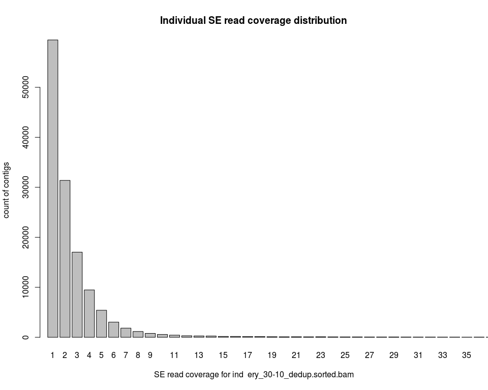
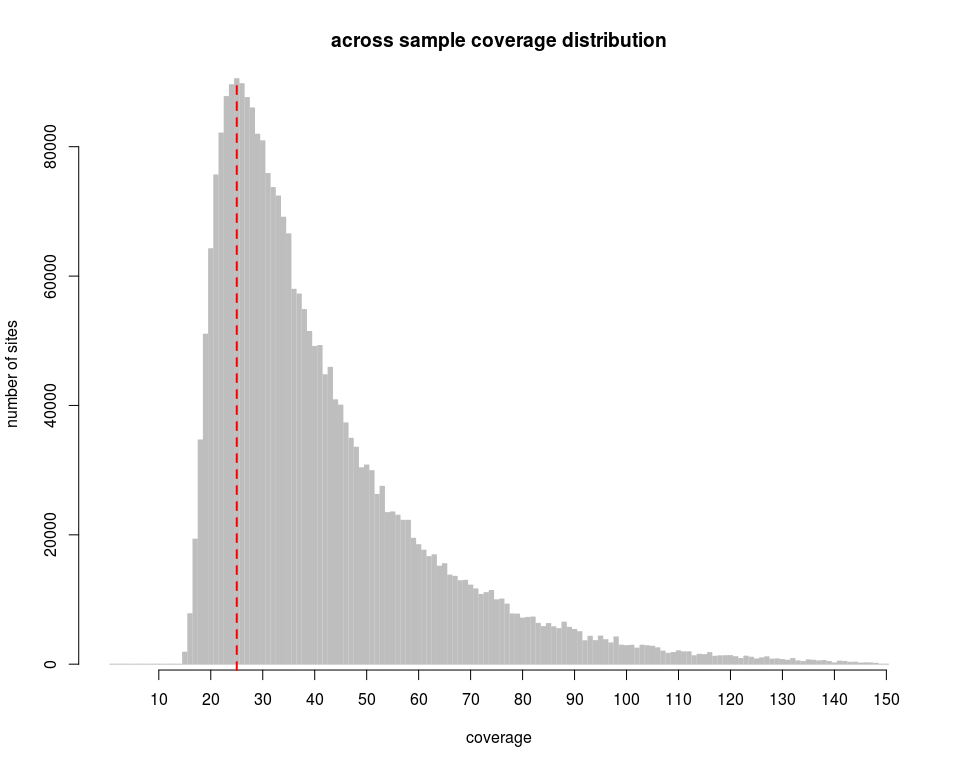
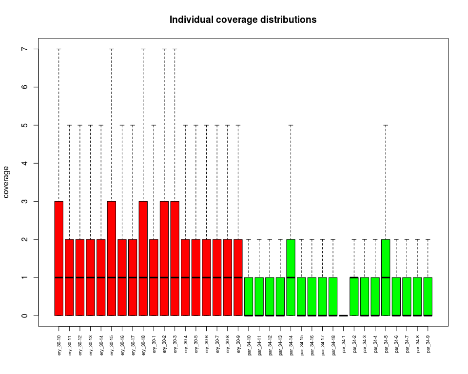

DEDUP
================
Claudius
05/05/2017

-   [SE read coverage distribution before coverage filtering](#se-read-coverage-distribution-before-coverage-filtering)
-   [Global coverage distribution after coverage filtering](#global-coverage-distribution-after-coverage-filtering)
-   [Average per-site, per-individual coverage](#average-per-site-per-individual-coverage)
-   [Individual coverage distributions](#individual-coverage-distributions)

This notebook documents the analysis the *Big Data* set after removing PCR duplicates with `starcode`.

SE read coverage distribution before coverage filtering
-------------------------------------------------------

``` r
# get BAM file names in current directory
bamfiles = grep("sorted.bam", dir(), value=TRUE)

# create example command line that get's SE read coverage for one ind
cmd = paste("samtools view -f 64 ", bamfiles[1], " | cut -f 3 | uniq -c | gawk '{print $1}'")
```

``` r
# open pipe connection to cmd
pp = pipe(cmd, open="r")

# read SE read depths from command line
depths = scan(pp)
```

``` r
# tabulate returns a count for each depth from 1 till max coverage:
depth.dist = tabulate(depths)

# the max depth is:
length(depth.dist)
```

    ## [1] 3449

``` r
# the 99th percentile of the depth distribution is:
quantile(depths, probs=c(0.99))
```

    ## 99% 
    ##  32

``` r
# depth.dist is a vector that contains counts of contigs 
# with certain SE read coverage 
# (from 1 till max coverage, including coverages with 0 contigs)
depth.dist[1:10]
```

    ##  [1] 59473 31383 17029  9469  5406  3035  1830  1159   785   567

``` r
# total number of contigs
total_cnt = sum(depth.dist)
total_cnt
```

    ## [1] 134504

``` r
# how many are 99% of all contigs? 
percentile = sum(depth.dist) * 0.99
percentile
```

    ## [1] 133158.96

``` r
# get 99th percentile of coverage distribution
sum( cumsum(depth.dist) <= percentile )
```

    ## [1] 31

``` r
# add names (1..max[cov]) to depth count vector
names(depth.dist) = as.character(1:length(depth.dist))
```

``` r
# analogous algorithm for percentile determination
# as `compute_percentile_from_dict` function in coverage_filter.py:
percentile = 99
perc = vector(mode="numeric", length=1)
cum_cnt = vector(mode="numeric", length=1)

for(i in length(depth.dist):1){ 
  cum_cnt = cum_cnt + depth.dist[i]
  perc = cum_cnt / total_cnt * 100
  if(perc < (100 - percentile)){
    next
  }else{
    cat( names(depth.dist[i]) )
    break
  }
}
```

    ## 32

``` r
# plot the new individual's SE read coverage distribution per contig
par(mfrow=c(1,1))
barplot(depth.dist[1:40], xlab=paste("SE read coverage for ind " , bamfiles[1]), ylab="count of contigs", main="Individual SE read coverage distribution", xlim=c(1,40))
```



Unsurprisingly, the SE read coverage is generally very low with PCR deduplicated reads. Note, that this distribution does not include the count category 0. I am generally ignoring that category, also for coverage filtering.

Global coverage distribution after coverage filtering
-----------------------------------------------------

Filtering against excess coverage above the 99th percentile with `excess_coverage_filter.py` and minimum coverage for 1x in 15 ind.'s with `minimum_coverage_filter.py` has produced a new depth file (`samtools depth` format): `ParEry.noSEgt2.noDUST.COVfiltered.noTGCAGG.1.15.depth.gz`. The excess coverage filtering was based on SE read coverage only. Minimum coverage filtering was based on all reads. Note that this is before HWE filtering.

``` r
# get connection to gzipped file
depth_file = gzfile("ParEry.noSEgt2.noDUST.COVfiltered.noTGCAGG.1.15.depth.gz")

# read depth table
filt_depth_tab = read.delim(depth_file, header=FALSE)

# save depth table as R object
save(filt_depth_tab, file="filt_depth_tab.RData", compress=TRUE)
```

``` r
load("filt_depth_tab.RData")

# peek at table
filt_depth_tab[1:10,1:5]
```

    ##              V1 V2 V3 V4 V5
    ## 1  Contig_41949  8  1  3  0
    ## 2  Contig_41949  9  1  3  0
    ## 3  Contig_41949 10  1  3  0
    ## 4  Contig_41949 11  1  3  0
    ## 5  Contig_41949 12  1  3  0
    ## 6  Contig_41949 13  1  3  0
    ## 7  Contig_41949 14  1  3  0
    ## 8  Contig_41949 15  1  3  0
    ## 9  Contig_41949 16  1  3  0
    ## 10 Contig_41949 17  1  3  0

``` r
setwd("/data3/claudius/Big_Data/BOWTIE2/BAM_dedup")
names(filt_depth_tab)[1:2] = c("contig_ID", "position")
filenames = dir(pattern = "*dedup.bam")
names(filt_depth_tab)[3:ncol(filt_depth_tab)] = gsub("_dedup.bam*", "", filenames)
names(filt_depth_tab)
```

    ##  [1] "contig_ID" "position"  "ery_30-10" "ery_30-11" "ery_30-12"
    ##  [6] "ery_30-13" "ery_30-14" "ery_30-15" "ery_30-16" "ery_30-17"
    ## [11] "ery_30-18" "ery_30-1"  "ery_30-2"  "ery_30-3"  "ery_30-4" 
    ## [16] "ery_30-5"  "ery_30-6"  "ery_30-7"  "ery_30-8"  "ery_30-9" 
    ## [21] "par_34-10" "par_34-11" "par_34-12" "par_34-13" "par_34-14"
    ## [26] "par_34-15" "par_34-16" "par_34-17" "par_34-18" "par_34-1" 
    ## [31] "par_34-2"  "par_34-3"  "par_34-4"  "par_34-5"  "par_34-6" 
    ## [36] "par_34-7"  "par_34-8"  "par_34-9"

``` r
# get across sample coverages for each site
across_sample_cov = rowSums(filt_depth_tab[,3:ncol(filt_depth_tab)])
```

``` r
# number of sites after coverage filtering
length(across_sample_cov)
```

    ## [1] 2683395

``` r
# get coverage distribution
across_sample_cov.dist = tabulate(across_sample_cov)

# add names to vector
names(across_sample_cov.dist) = as.character(1:length(across_sample_cov.dist))
```

``` r
# get the 99 percentile of the coverage filtered global coverage distribution
quantile(across_sample_cov, probs=c(0.99))
```

    ## 99% 
    ## 114

``` r
par(mfrow=c(1,1))

# capture x-coord. of bars in mp
# turn off x-axis plotting
mp = barplot(across_sample_cov.dist[1:150], xlab="coverage", ylab="number of sites", main="across sample coverage distribution", border="grey", axisnames=FALSE)

# add custom x-axis
i = 1:nrow(mp)
index = i[(i %% 10) == 0]
axis(side=1, at=mp[index], labels=as.character(index))

# add vertical line at modal coverage
m = which.max(across_sample_cov.dist)
modal = as.numeric( names(m) )
abline(v=mp[modal], col="red", lwd=2, lty=2)
```



Average per-site, per-individual coverage
-----------------------------------------

``` r
cov = sum(across_sample_cov.dist*1:length(across_sample_cov.dist))/(sum(across_sample_cov.dist)*36)
cov
```

    ## [1] 1.138546537

So the average coverage per site and per individual for the filtered sites is 1.1.

Individual coverage distributions
---------------------------------

``` r
z = boxplot(filt_depth_tab[,3:38], outline=F, plot=F)
bxp(z, outline=F, boxfill=c(rep("red", 18), rep("green", 18)), xaxt="n", ylab="coverage", main="Individual coverage distributions")
axis(side=1, at=1:36, labels=names(filt_depth_tab)[3:38], cex.axis=.6, las=2)
```


