Mapping Tool Test
================
Claudius
08/09/2014

-   [Mason](#mason)
-   [RazerS3](#razers3)
-   [Bowtie2](#bowtie2)
-   [BWA MEM](#bwa-mem)
-   [How well are mapQ scores calibrated?](#how-well-are-mapq-scores-calibrated)
    -   [Reproducing ROC curve for stampy as on [Heng Li's](http://lh3lh3.users.sourceforge.net/alnROC.shtml) website](#reproducing-roc-curve-for-stampy-as-on-heng-lis-website)

I simulated 200,000 50bp SE reads with [`wgsim`](https://github.com/lh3/wgsim) from the *Heliconius melpomene* reference sequence (see sim.sh). I specified a substitution rate of 0.01, 20% of polymorphisms are indels with lengths randomly drawn from the geometric distribution 0.9<sup>(length − 1)</sup> × 0.1. No sequencing error specified.

    $ ./wgsim/wgsim -N200000 -e0 -150 -250 -S13 -r0.01 -R0.2 -X0.9 -d0 Hmel1-1_primary_contigs.fa Hme_sim_SE.fq /dev/null

Note that a PE read length also needs to be specified. Otherwise, the read length defaults back to 100.

I then mapped those simulated reads back against the *Heliconius* reference with `stampy` (see sim.sh) and removed unmapped reads as well as reads with mapping quality below 4 (which are ambiguously mapped according to the stampy readme file).

I then used the `wgsim_eval.pl` script that comes with the `wgsim` git repo to determine incorrectly mapped reads.

    $ ./wgsim/wgsim_eval.pl alneval -ag 50 Hme_sim_SE_stampy.sam > Hme_sim_SE_stampy.roc

Reads are regarded as correctly mapped if their reported mapping location is within 50 bp of their true origin.

``` r
roc <- read.delim("Hme_sim_SE_stampy.roc", header=F)
names(roc) <- list("mapQ", "Mapped", "falseMap")
head(roc)
```

    ##   mapQ Mapped falseMap
    ## 1   96 136874        2
    ## 2   95 136959        2
    ## 3   94 136970        2
    ## 4   93 136990        2
    ## 5   92 137021        2
    ## 6   91 137028        2

``` r
tail(roc)
```

    ##    mapQ Mapped falseMap
    ## 88    9 181788      413
    ## 89    8 181826      435
    ## 90    7 181840      446
    ## 91    6 181960      477
    ## 92    5 181986      490
    ## 93    4 182056      521

The true positive rate is the proportion of correctly mapped reads among all **input** reads. The false positive rate is the proportion of incorrectly mapped reads among among all **mapped** reads.

``` r
truePos <- (roc$Mapped - roc$falseMap) / 200000
falsePos <- roc$falseMap / roc$Mapped
par(mar=c(4,4,3,4))
plot(falsePos, truePos,
     xlim=c(10^-6, 10^-2),
     log="x",
     ylim=c(0.6, 1),
     pch=20,
     col=hsv(h= 2/6 - falsePos*100),
     bty="n",
     main="ROC curve for stampy"
     )
axis(side=4,
     at=truePos[seq(1, length(truePos), 1)],
     labels=roc$mapQ[seq(min(roc$mapQ), max(roc$mapQ), 1)]
     )
mtext(text="mapQ", side=4, line=3)
```

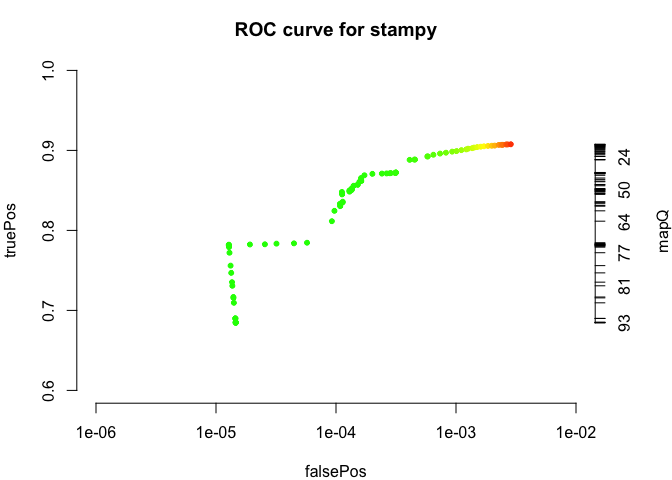

The ROC curve for `stampy` is certainly not as bad as the one determined by [Heng Li](http://lh3lh3.users.sourceforge.net/alnROC.shtml). The "True positive rates" are higher in Heng Li's ROC curves, but he has simulated 100bp long reads, while I only simulated 50 bp long reads. On the other hand, the *Heliconius* genome reference sequence is only 270Mb large and thus should contain fewer repetitive sequences.

``` r
l <- length(roc$mapQ)
par(mar=c(4,4,3,4))
plot(falsePos, truePos,
     xlim=c(10^-6, 10^-2),
     ylim=c(0.6, 1),
     log="x",
     pch=20,
     col=ifelse(roc$mapQ>=30, "green", "red"),
     bty="n",
     main="ROC curve for stampy"
     )
axis(side=4,
     at=truePos[seq(1, l, 1)],
     labels=rev(seq(min(roc$mapQ), max(roc$mapQ), 1))
     )
mtext(text="mapQ", side=4, line=3)
legend("topright",
       legend=c("mapQ >= 30", "mapQ < 30"),
       pch=20,
       col=c("green", "red")
       )
```

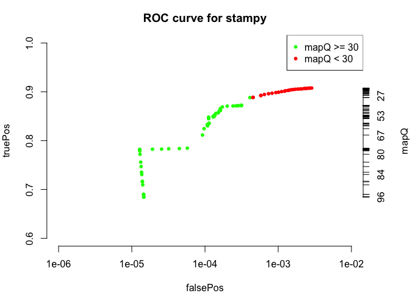

Below a mapping quality of 30, the false positive mappings increase without much gain in true positive mappings.

``` r
par(mar=c(4,4,3,4))

plot(falsePos, truePos,
     xlim=c(10^-6, 3*10^-3),
     ylim=c(0.6, 1),
     pch=20,
     col=hsv(h= 2/6 - falsePos*100),
     bty="n",
     main="ROC curve for stampy"
     )
axis(side=4,
     at=truePos[seq(1, length(truePos), 1)],
     labels=roc$mapQ[seq(min(roc$mapQ), max(roc$mapQ), 1)]
     )
mtext(text="mapQ", side=4, line=3)

text(x=falsePos[seq(1, l, 4)], 
     y=truePos[seq(1, l, 4)], 
     labels=roc$mapQ[seq(1, l, 4)], # label every 4th point with its mapping quality
     pos=4, 
     offset=0.2, 
     cex=0.8
     )

abline(v=1/2000, lty=2, col="grey")
abline(h=truePos[roc$mapQ==30], lty=2, col="grey")

rect(10^-6, 0.6, 0.0005, 
     truePos[roc$mapQ==30], 
     density=NA, 
     col=rgb(0, 1, 0, alpha=0.4)
     )
rect(0.0005, truePos[roc$mapQ==30], 0.003, 1,
     density=NA,
     col=rgb(1, 0, 0, alpha=0.4)
     )

legend("bottomright",
       legend=c("false pos. rate < 1/2000; mapQ >= 30", 
                "false pos. rate > 1/2000; mapQ < 30"),
       fill=c(rgb(0, 1, 0, alpha=0.4), rgb(1, 0, 0, alpha=0.4)),
       cex=0.8
       )
```

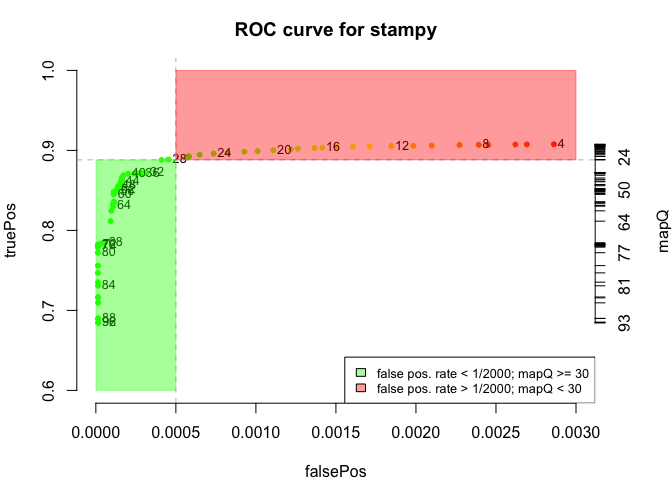

ROC curve with plotting of linear false positive rates shows where the ROC curve levels off. It seems as if a cutoff at mapping quality 30 would provide a maximal signal to noise ratio.

``` r
SN_ratio <- truePos/falsePos
plot(roc$mapQ, SN_ratio, 
     log="y",
     main="signal-to-noise ration of stampy mapping",
     pch=20,
     col=ifelse(roc$mapQ<30, "red", "green"),
     ylab="S to N ration",
     xlab="mapQ"
     )

legend("topleft",
       legend=c("mapQ >= 30", "mapQ < 30"),
       pch=20,
       col=c("green", "red")
       )
```

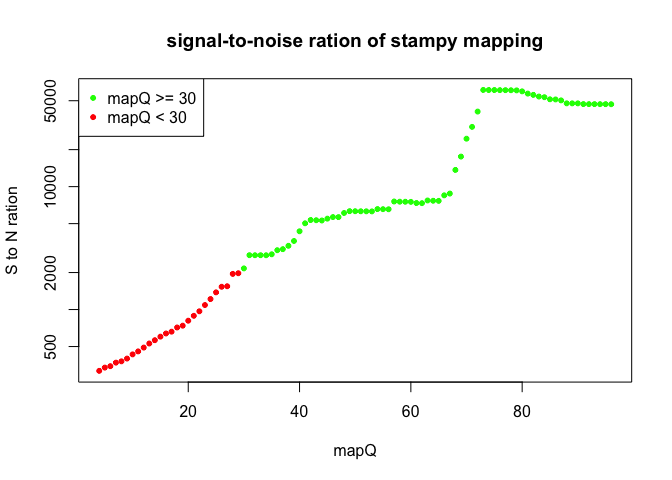

Below a mapping quality of 30, the signal to noise ratio of the `stampy` mapping drops exponentially.

------------------------------------------------------------------------

The `wgsim` programme claims that simulated indel sizes are drawn from a geometric distribution (`-X` switch). So I simulated 200,000 single end reads of 50 bp length from the *Heliconius* reference including a polymorphism frequency of 0.01:

    ./wgsim/wgsim -N200000 -e0 -150 -250 -S13 -r0.01 -R1.0 -X0.9 -d0 -h Hmel1-1_primary_contigs.fa only_indel_hapMode_Hme_sim_SE.fq_1 only_indel_hapMode_Hme_sim_SE.fq_1 1> only_indel_hapMode_wgsim.log

All polymorphisms are indels (i. e. no SNP's) and, according to the description of the `wgsim` programme at <https://github.com/lh3/wgsim>, the length of the indels is drawn from a geometric distribution with p=0.1 (and 1-p=0.9). The log output from the simulation contains information about the simulated polymorphisms in each reference contig. Inserted or deleted sequences are printed there. That allows me to extract the simulated indel sizes with the following command line:

    $ cat only_indel_hapMode_wgsim.log | cut -f 3-4 | sed 's/[^AGCT]//g' | awk '{print length}' > only_indel_hapMode_wgsim_indel.size

``` r
indel_size <- read.delim("only_indel_hapMode_wgsim_indel.size", header=F)
names(indel_size) <- list("indel size")
indel_size_dist <- table(indel_size)
sum(indel_size_dist)
```

    ## [1] 2573603

The simulation programme has simulated 2,573,603 indels in 200,000 read pairs of 50 bp length, i. e. in a total of 210^{7} bp length. Assuming the "rate of mutation" parameter for the `wgsim` programme is per base pair, this would roughly mean that only 210^{5} indels should have been found in the reads. However, I think `wgsim` first simulates polymorphisms (SNPs, indels) from the reference sequence (which is output in the log file) and then it simulates reads from this divergent (simulated) genome.

``` r
barplot(indel_size_dist,
        xlab="simulated indel size",
        ylab="count"
      )
lines(1:100, 
      dgeom(1:100, prob=0.1) * sum(indel_size_dist),
      col="red",
      lwd=3
      )
legend("topright",
       legend=c("simulated indel size", "geom. expectation"),
       col=c("white", "red"),
       fill=c("grey", "white"),
       lwd=c(0,3),
       border=c("black", "white"),
       bty="n"
       )
```

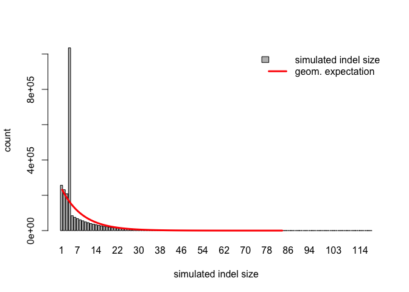

There is a clear artifact in the simulated indel size: 4bp indels are much more frequent than expected under a geometric distribution *p*(1 − *p*)<sup>*s**i**z**e* − 1</sup>, with p=0.1.

------------------------------------------------------------------------

Mason
-----

Judging from the reported indel length in the logging output of `Mason` it samples indel sizes from a uniform distribution. An upper bound of indel length needs to be given to the simulator.

I tried to use `Mason` in a way that its read simulation parameters are similar to the `wgsim` simulations, i. e. I turned off sequencing errors and specified a SNP rate of 0.008 and an indel rate of 0.002, resulting in a total polymorphism rate of 0.01. I specified a maximum indel size of 20 bp.

I then transformed the fastq header info so that it can be used by `wgsim_eval.pl` (with a minor modification on line 62: non-greedy first pattern) and ran `stampy` as before. I then ran `wgsim_eval.pl` on the SAM output of `stampy` in order to generate a ROC curve as I did before. See `Mason_sim.sh` for all command lines.

``` r
roc1 <- read.delim("Mason_Hme_sim_stampy.roc", header=T)
head(roc1)
```

    ##   MapQ Mapped falseMap
    ## 1   96 135113        0
    ## 2   95 137312        0
    ## 3   94 137765        0
    ## 4   93 137832        0
    ## 5   92 137897        0
    ## 6   91 137904        0

``` r
truePos1 <- (roc1$Mapped - roc1$falseMap) / 200000
falsePos1 <- roc1$falseMap / roc1$Mapped
par(mar=c(4,4,3,4))
plot(falsePos1, truePos1,
     xlim=c(10^-6, 4*10^-3),
     ylim=c(0.6, 1),
     pch=20,
     col=hsv(h=max(falsePos1)*100 - falsePos1*100),
     bty="n",
     main="ROC curve for stampy"
     )
axis(side=4,
     at=truePos1,
     labels=roc1$MapQ
     )
mtext(text="mapQ", side=4, line=3)
mtext(text="50bp reads simulated with Mason from Heliconius ref genome",
      side=3,
      cex=.8
      )

text(x=falsePos1[seq(1, l, 4)], 
     y=truePos1[seq(1, l, 4)], 
     labels=roc1$MapQ[seq(1, l, 4)], # label every 4th point with its mapping quality
     pos=4, 
     offset=0.2, 
     cex=0.8
     )
```

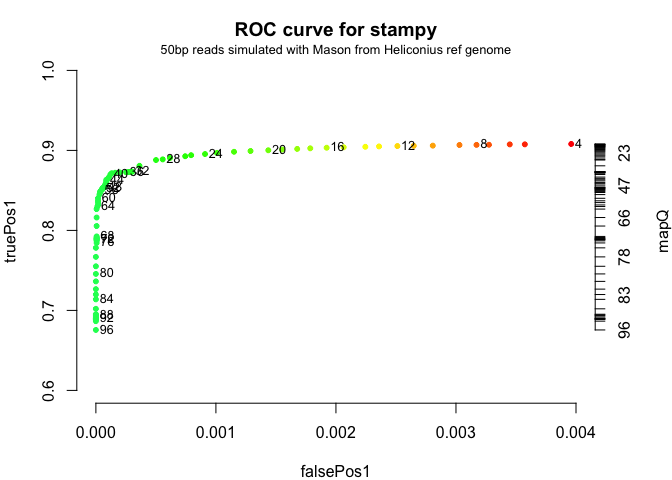

The ROC curve of `stampy` with reads simulated with `Mason` looks very similar to the ROC curve with reads simulated with `wgsim`. So, at least with the current settings, the simulator does not have a great influence on the ROC curves.

``` r
SN_ratio <- truePos/falsePos
SN_ratio1 <- truePos1/falsePos1
SN_ratio1[is.infinite(SN_ratio1)] <- roc1$Mapped[is.infinite(SN_ratio1)]

plot( 
     log="y",
     main="signal-to-noise ration of stampy mapping",
     roc1$MapQ, SN_ratio1,
       pch=17,
       col=ifelse(roc$mapQ<30, "red", "green"),
     ylab="S to N ration",
     xlab="mapQ"
     )

points(roc$mapQ, SN_ratio,
       pch=20,
     col=ifelse(roc$mapQ<30, "red", "green"),
       )

legend("topleft",
       legend=c("mapQ >= 30", "mapQ < 30"),
       pch=20,
       col=c("green", "red")
       )

legend("bottomright",
       legend=c("wgsim", "mason"),
       pch=c(20, 17)
       )
```


The low number of false positive mappings at high mapping qualities can explain the variance in signal to noise ratio and the difference between the two simulators. At lower mapping qualities and higher false positive rates the signal to noise ratio is less prone to chance variation and the the SN traces of both simulators a very similar at mapQ &lt; 40. A mapping quality of 30 still seems to be good cutoff when a high signal to noise ratio and a high sensitivity (i. e. maximal use of the available reads) need to be balanced.

RazerS3
-------

`Razers3` is a read mapping programme that claims to be fully sensitive for a specified maximal edit distance of the read towards the reference. I used the same 200,000 50 bp long SE reads simulated by Mason from the *Heliconius* reference sequence. I ran `razers3` with 80% identity threshold (i. e. up to 10 mismatches or indels), ran it in fully sensitive mode and made it output only unique mappings (with `--unique` switch). It took `razers3` 16min on 10 CPU's to finish the mapping. `Razers3`, unfortunately, does not calculate mapping quality scores. So it's ROC "curve" will just be a point.

``` r
Mason_razers_Hmel.roc <- read.delim("Mason_Hmel_sim_razers3.roc", header=T)
head(Mason_razers_Hmel.roc)
```

    ##   MapQ Mapped falseMap
    ## 1  255 181220      739

``` r
tail(Mason_razers_Hmel.roc)
```

    ##   MapQ Mapped falseMap
    ## 1  255 181220      739

``` r
tail(roc1)
```

    ##    MapQ Mapped falseMap
    ## 88    9 181903      551
    ## 89    8 181960      577
    ## 90    7 182001      596
    ## 91    6 182132      628
    ## 92    5 182167      651
    ## 93    4 182328      722

I am calculating true positive and false positive rate as before.

``` r
mason_razers_Hmel_falsePos <- Mason_razers_Hmel.roc$falseMap / Mason_razers_Hmel.roc$Mapped
mason_razers_Hmel_truePos <- (Mason_razers_Hmel.roc$Mapped - Mason_razers_Hmel.roc$falseMap) / 200000
```

I am plotting the truePos/falsePos value for `razers3` together with the result obtained for `stampy` from the same dataset.

``` r
par(mar=c(5,4,3,2))

plot(falsePos1, truePos1,
     xlim=c(10^-6, 10^-1),
     log="x",
     xaxp=c(10^-6, 10^-2, n=1),
     ylim=c(0.6, 1),
     pch=20,
     col=hsv(h= 2/6 - ifelse(falsePos1*100 >= 2/6, 2/6, falsePos1*100)),
     bty="n",
     main="ROC curves for stampy and razers3",
     xlab="False positive rate",
     ylab="True positive rate"
     )
```

    ## Warning in xy.coords(x, y, xlabel, ylabel, log): 20 x values <= 0 omitted
    ## from logarithmic plot

``` r
mtext("50 bp SE reads simulated from Heliconius genome with mason and long indels",
      side=3,
      line=0,
      cex=0.8
      )

points(mason_razers_Hmel_falsePos, mason_razers_Hmel_truePos,
       pch=8,
       col="magenta"
       )

text(x=falsePos1[seq(1, l, 4)], 
     y=truePos1[seq(1, l, 4)], 
     labels=roc1$MapQ[seq(1, l, 4)], # label every 4th point with its mapping quality
     pos=4, 
     offset=0.2, 
     cex=0.8
     )

abline(h=seq(0.6, 1, 0.05), col="gray", lty=2)
abline(v=10^(seq(-6, -1, 1)), col="gray", lty=2)

legend("bottomright",
       legend=c("stampy", "razers3"),
       pch=c(20, 8),
       col=c("red", "magenta")
       )
```

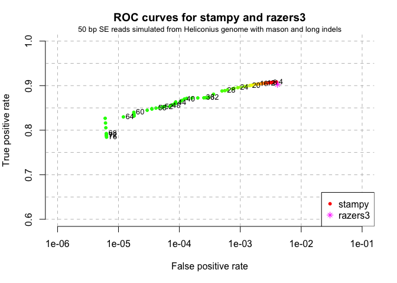

The precision is 1 - falsePos. For `razers3` the precision of the mapping against the *Heliconius* reference was 0.9959. There does not seem to be an advantage of using `razers3` compared to `stampy`. `wgsim_eval.pl` can output wrong alignments in SAM format. When transforming the read headers from the mason to wgsim\_eval.pl compatible I included in addition to the original begin and end position the number of SNP's and indels mason reported for a simulated read. Looking at the wrong alignments, I see that many only differ by 1 SNP from their genomic source. So clearly there was another match within the allowed maximal edit distance.

I tried another razers3 run, for which I replaced the `--unique` switch with the `-pa` (for purge ambiguous) switch. The `--unique` switch seems to put razers3 into any-best mode, so that it does not need to find all possible matches. Unfortunately, I had to abort the run after 7h41min running on 10 CPU's and with a maximal RAM usage of 91GiB. It seems that an identity threshold of 80% is too low for `razers3` to find all possible matches in the *Heliconius* reference sequence in reasonable time. However, an edit distance threshold of 10% is not unreasonable. With this threshold a 50 bp read with an 11 bp indel could not be detected. That means that the performance of `razers3` puts a limit on its maximal sensitivity. I think it is time to try `Yara`.

-   What does `rabema` say about these mappings?

Bowtie2
-------

I ran `bowtie2` with the Mason simulated reads from the *Heliconius* genome in "very-sensitive" mode and either with "end-to-end" or "local" alignments.

``` r
bowtie2_ete.roc <- read.delim("Mason_sim_Hmel_bowtie2.roc", header=T)
bowtie2_local.roc <- read.delim("Mason_sim_Hmel_bowtie2_local.roc", header=T)
head(bowtie2_ete.roc)
```

    ##   MapQ Mapped falseMap
    ## 1   42 128608        2
    ## 2   40 148319        2
    ## 3   39 150124        2
    ## 4   38 150658        2
    ## 5   37 151923        2
    ## 6   36 152236        3

``` r
tail(bowtie2_ete.roc)
```

    ##    MapQ Mapped falseMap
    ## 26    6 173679      454
    ## 27    5 173795      458
    ## 28    4 173817      460
    ## 29    3 174802      484
    ## 30    2 174899      558
    ## 31    1 190750    12653

``` r
head(bowtie2_local.roc)
```

    ##   MapQ Mapped falseMap
    ## 1   44 107215        0
    ## 2   42 112839        1
    ## 3   41 114340        1
    ## 4   40 137586        1
    ## 5   39 150921        3
    ## 6   38 157387        3

``` r
tail(bowtie2_local.roc)
```

    ##    MapQ Mapped falseMap
    ## 23   14 179106      503
    ## 24   12 179301      510
    ## 25   11 180776      794
    ## 26    9 181007      811
    ## 27    2 181328      956
    ## 28    1 198509    14074

``` r
bowtie2_ete.roc <- bowtie2_ete.roc[-length(bowtie2_ete.roc$MapQ),]
bowtie2_local.roc <- bowtie2_local.roc[-length(bowtie2_local.roc$MapQ),]
bowtie2_ete_truePos <- (bowtie2_ete.roc$Mapped - bowtie2_ete.roc$falseMap) / 200000
bowtie2_ete_falsePos <- bowtie2_ete.roc$falseMap / bowtie2_ete.roc$Mapped
bowtie2_local_truePos <- (bowtie2_local.roc$Mapped - bowtie2_local.roc$falseMap) / 200000
bowtie2_local_falsePos <- bowtie2_local.roc$falseMap / bowtie2_local.roc$Mapped
```

``` r
par(mar=c(5,4,3,2))
# stampy roc
plot(falsePos1, truePos1,
     xlim=c(10^-6, 10^-1),
     log="x",
     xaxp=c(10^-6, 10^-2, n=1),
     ylim=c(0.6, 1),
     pch=20,
     col="red",
     bty="n",
     main="ROC curves",
     xlab="False positive rate",
     ylab="True positive rate"
     )
```

    ## Warning in xy.coords(x, y, xlabel, ylabel, log): 20 x values <= 0 omitted
    ## from logarithmic plot

``` r
mtext("50 bp SE reads simulated from Heliconius genome with mason and long indels",
      side=3,
      line=0,
      cex=0.8
      )
# razers3 roc
points(mason_razers_Hmel_falsePos, mason_razers_Hmel_truePos,
       pch=8,
       col="magenta"
       )
# bowtie2 end-to-end roc
points(bowtie2_ete_falsePos, bowtie2_ete_truePos,
       pch=18,
       col="blue"
       )

points(bowtie2_local_falsePos, bowtie2_local_truePos,
       pch=17,
       col="cornflowerblue"
       )
# stampy mapQ label
text(x=falsePos1[seq(1, l, 4)], 
     y=truePos1[seq(1, l, 4)], 
     labels=roc1$MapQ[seq(1, l, 4)], # label every 4th point with its mapping quality
     pos=4, 
     offset=0.2, 
     cex=0.8
     )
# bowtie2 end-to-end mapQ label
text(x=bowtie2_ete_falsePos[seq(length(bowtie2_ete_falsePos), 1, -4)], 
     y=bowtie2_ete_truePos[seq(length(bowtie2_ete_truePos), 1, -4)], 
     labels=bowtie2_ete.roc$MapQ[seq(length(bowtie2_ete.roc$MapQ), 1, -4)], # label every 4th point with its mapping quality
     pos=4, 
     offset=0.2, 
     cex=0.8
     )
# bowtie2 local align mapQ label
text(x=bowtie2_local_falsePos[seq(length(bowtie2_local.roc$MapQ), 1, -4)],
     y=bowtie2_local_truePos[seq(length(bowtie2_local.roc$MapQ), 1, -4)],
     labels=bowtie2_local.roc$MapQ[seq(length(bowtie2_local.roc$MapQ), 1, -4)],
      pos=4, 
     offset=0.2, 
     cex=0.8
     )

abline(h=seq(0.6, 1, 0.05), col="gray", lty=2)
abline(v=10^(seq(-6, -1, 1)), col="gray", lty=2)

legend("bottomright",
       legend=c("stampy", "razers3", "bowtie2-ete", "bowtie2-local"),
       pch=c(20, 8, 18, 17),
       col=c("red", "magenta", "blue", "cornflowerblue")
       )
```

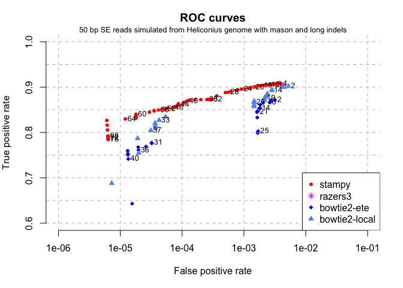

There is a great gain in sensitivity when `bowtie2` is run in local alignment mode, which runs as fast as in end-to-end mode. In both modes `bowtie` only needs about 4 **seconds** to complete the mapping on 10 cores! `stampy` took 31 seconds for the same task. So `stampy` is almost 10 times slower than `bowtie2`, but with a much higher sensitivity.

BWA MEM
-------

I ran `bwa mem` in default and custom settings that should make it more sensitive. The more sensitive run took about 25% longer than the default run to complete.

``` r
bwa_mem_default.roc <- read.delim("Mason_sim_Hmel_bwa_MEM_default.roc", header=T)
bwa_mem_default.falsePos <- bwa_mem_default.roc$falseMap / bwa_mem_default.roc$Mapped
bwa_mem_default.truePos <- (bwa_mem_default.roc$Mapped - bwa_mem_default.roc$falseMap) / 200000
```

``` r
bwa_mem.roc <-  read.delim("Mason_sim_Hmel_bwa_MEM.roc", header=T)
head(bwa_mem.roc)
```

    ##   MapQ Mapped falseMap
    ## 1   60 157497        5
    ## 2   59 157902        5
    ## 3   58 158181        5
    ## 4   57 159186        6
    ## 5   56 159550        6
    ## 6   55 159808        6

``` r
tail(bwa_mem.roc)
```

    ##    MapQ Mapped falseMap
    ## 55    6 178986      311
    ## 56    5 179239      331
    ## 57    4 179668      349
    ## 58    3 179966      410
    ## 59    2 180212      434
    ## 60    1 180640      483

``` r
bwa_mem.falsePos <- bwa_mem.roc$falseMap / bwa_mem.roc$Mapped
bwa_mem.truePos <- (bwa_mem.roc$Mapped - bwa_mem.roc$falseMap) / 200000
```

``` r
figure <- function () {
par(mar=c(5,4,3,2))
# stampy roc
plot(falsePos1, truePos1,
     xlim=c(10^-6, 10^-1),
     log="x",
     xaxp=c(10^-6, 10^-2, n=1),
     ylim=c(0.6, 1),
     pch=20,
     col="red",
     bty="n",
     main="ROC curves",
     xlab="False positive rate",
     ylab="True positive rate",
     type="o"
     )

mtext("50 bp SE reads simulated from Heliconius genome with mason and long indels",
      side=3,
      line=0,
      cex=0.8
      )
# razers3 roc
points(mason_razers_Hmel_falsePos, mason_razers_Hmel_truePos,
       pch=8,
       col="magenta",
       type="o"
       )
# bowtie2 end-to-end roc
points(bowtie2_ete_falsePos, bowtie2_ete_truePos,
       pch=18,
       col="blue",
       type="o"
       )

points(bowtie2_local_falsePos, bowtie2_local_truePos,
       pch=17,
       col="cornflowerblue",
       type="o"
       )
# stampy mapQ label
# text(x=falsePos1[seq(1, l, 4)], 
#      y=truePos1[seq(1, l, 4)], 
#      labels=roc1$MapQ[seq(1, l, 4)], # label every 4th point with its mapping quality
#      pos=4, 
#      offset=0.2, 
#      cex=0.8
#      )
# bowtie2 end-to-end mapQ label
# text(x=bowtie2_ete_falsePos[seq(length(bowtie2_ete_falsePos), 1, -4)], 
#      y=bowtie2_ete_truePos[seq(length(bowtie2_ete_truePos), 1, -4)], 
#      labels=bowtie2_ete.roc$MapQ[seq(length(bowtie2_ete.roc$MapQ), 1, -4)], # label every 4th point with its mapping quality
#      pos=4, 
#      offset=0.2, 
#      cex=0.8
#      )
# bowtie2 local align mapQ label
# text(x=bowtie2_local_falsePos[seq(length(bowtie2_local.roc$MapQ), 1, -4)],
#      y=bowtie2_local_truePos[seq(length(bowtie2_local.roc$MapQ), 1, -4)],
#      labels=bowtie2_local.roc$MapQ[seq(length(bowtie2_local.roc$MapQ), 1, -4)],
#       pos=4, 
#      offset=0.2, 
#      cex=0.8
#      )

# bwa mem default
points(bwa_mem_default.falsePos, bwa_mem_default.truePos,
       pch=4,
       col="firebrick",
       type="o"
       )
# text(x=bwa_mem_default.falsePos[seq(length(bwa_mem_default.roc$MapQ), 1, -4)],
#      y=bwa_mem_default.truePos[seq(length(bwa_mem_default.roc$MapQ), 1, -4)],
#      labels=bwa_mem_default.roc$MapQ[seq(length(bwa_mem_default.roc$MapQ), 1, -4)],
#      pos=4, 
#      offset=0.2, 
#      cex=0.8
#      )

# bwa mem, more sensitive
points(bwa_mem.falsePos, bwa_mem.truePos,
       pch=0,
       col="firebrick",
       type="o"
       )
# text(x=bwa_mem.falsePos[seq(length(bwa_mem.roc$MapQ), 1, -4)],
#      y=bwa_mem.truePos[seq(length(bwa_mem.roc$MapQ), 1, -4)],
#      labels=bwa_mem.roc$MapQ[seq(length(bwa_mem.roc$MapQ), 1, -4)],
#      pos=4, 
#      offset=0.2, 
#      cex=0.8
#      )

abline(h=seq(0.6, 1, 0.05), col="gray", lty=2)
abline(v=10^(seq(-6, -1, 1)), col="gray", lty=2)
}
figure()
```

    ## Warning in xy.coords(x, y, xlabel, ylabel, log): 20 x values <= 0 omitted
    ## from logarithmic plot

``` r
legend("bottomright",
       legend=c("stampy", "razers3", "bowtie2-ete", "bowtie2-local", "bwa mem default", "bwa mem sensitive"),
       pch=c(20, 8, 18, 17, 4, 0),
       col=c("red", "magenta", "blue", "cornflowerblue", "firebrick", "firebrick")
       )
```

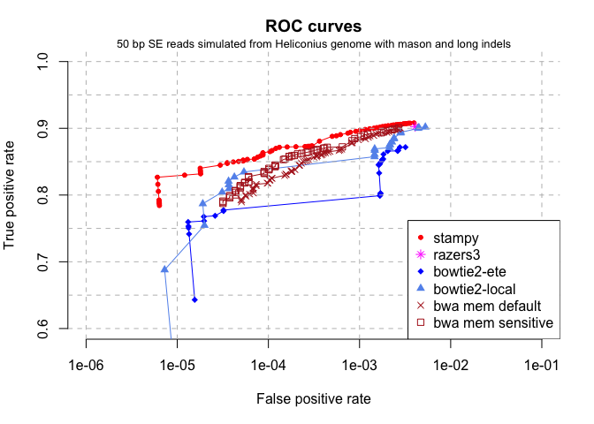

-   [a good seqanswers thread about mapping very divergent reads](http://seqanswers.com/forums/showthread.php?t=13871)
-   [Gerton Lunter explaining the use of stampy](http://seqanswers.com/forums/showthread.php?t=41704)

``` r
smalt.roc <- read.delim("Mason_sim_Hmel_smalt.roc", header=T)
head(smalt.roc)
```

    ##   MapQ Mapped falseMap
    ## 1   60  85083       19
    ## 2   59 103613       19
    ## 3   58 116536       22
    ## 4   57 143766       22
    ## 5   56 148191       24
    ## 6   55 152559       28

``` r
smalt.falsePos <- smalt.roc$falseMap / smalt.roc$Mapped
smalt.truePos <- (smalt.roc$Mapped - smalt.roc$falseMap) / 200000
```

``` r
figure()
```

    ## Warning in xy.coords(x, y, xlabel, ylabel, log): 20 x values <= 0 omitted
    ## from logarithmic plot

``` r
points(smalt.falsePos, smalt.truePos,
       pch=1,
       col="aquamarine",
       type="o"
       )

legend("bottomright",
       legend=c("stampy", "razers3", "bowtie2-ete", "bowtie2-local", "bwa mem default", "bwa mem sensitive", "smalt"),
       pch=c(20, 8, 18, 17, 4, 0, 1),
       col=c("red", "magenta", "blue", "cornflowerblue", "firebrick", "firebrick", "aquamarine")
       )
```

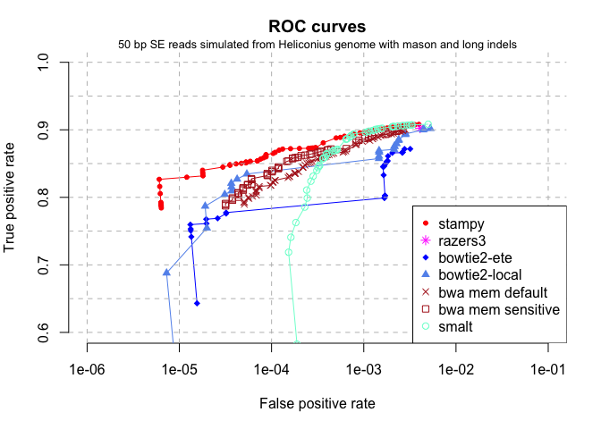

I ran `yara` with a maximal edit distance of 10 (a higher edit distance cannot be specified), on 10 cores in parallel. It took about 8 seconds to finish. Unfortunately it provides only the mapping quality scores \[1,2,3,40\].

``` r
yara.roc <- read.delim("Mason_sim_Hmel_ref_concat_yara.roc", header=T)
yara.falsePos <- yara.roc$falseMap / yara.roc$Mapped
yara.truePos <- (yara.roc$Mapped - yara.roc$falseMap) / 200000
```

``` r
figure()
```

    ## Warning in xy.coords(x, y, xlabel, ylabel, log): 20 x values <= 0 omitted
    ## from logarithmic plot

``` r
points(smalt.falsePos, smalt.truePos,
       pch=1,
       col="aquamarine",
       type="o"
       )

points(yara.falsePos, yara.truePos,
       pch=5,
       col="green4",
       type="o"
       )

legend("bottomright",
       legend=c("stampy", "razers3", "bowtie2-ete", "bowtie2-local", "bwa mem default", "bwa mem sensitive", "smalt", "yara"),
       pch=c(20, 8, 18, 17, 4, 0, 1, 5),
       col=c("red", "magenta", "blue", "cornflowerblue", "firebrick", "firebrick", "aquamarine", "green4")
       )
```

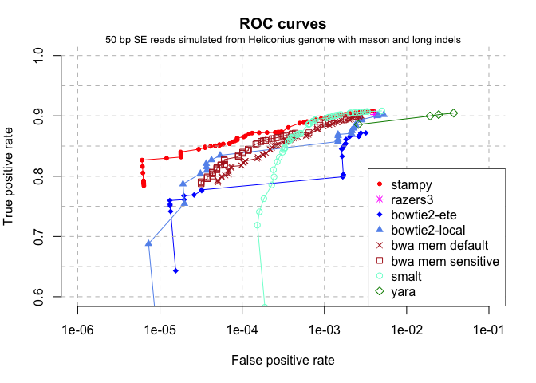

Only reads with a mapping quality of 40 for `yara` are useful, which is not equivalent to a false psotivie rate of 10^-4 but 10^-2.6. `Yara` cannot be tweaked, so that is the best that `yara` can do at the moment.

------------------------------------------------------------------------

How well are mapQ scores calibrated?
------------------------------------

``` r
head(bowtie2_ete.roc)
```

    ##   MapQ Mapped falseMap
    ## 1   42 128608        2
    ## 2   40 148319        2
    ## 3   39 150124        2
    ## 4   38 150658        2
    ## 5   37 151923        2
    ## 6   36 152236        3

The mapping quality score is the Phred scaled probability *p* that the true mapping position of the read **in the reference sequence** (i. e. assuming the true reference sequence is known without error) is not the reported mapping position (rounded to the next integer):
mapQ = −10*l**o**g*<sub>10</sub>*p*
 The observed false positive rate should be an estimator of the true mapping quality. I can therefore compare how well the reported mapping qualities of the different mapping programmes correspond to the observed false positive rate.

``` r
plot(bowtie2_ete_falsePos, 10^-(bowtie2_ete.roc$MapQ/10),
     xlab="false positive rate",
     ylab="mapping quality",
     log = "xy"
     )
abline(a=0, b=1)
```

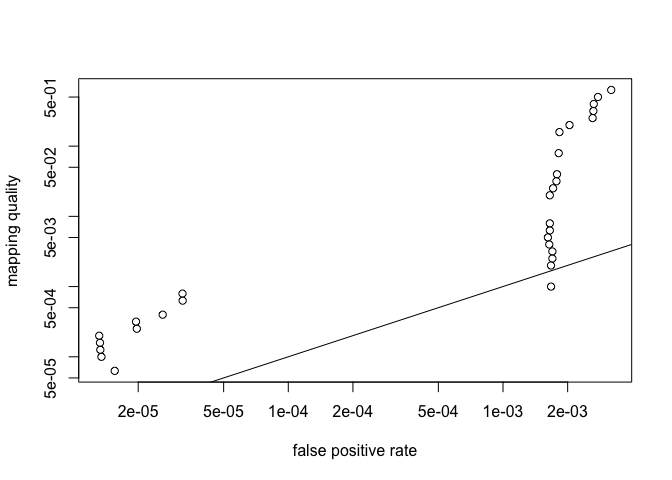

``` r
# replace 0's with 10^-10
falsePos1[falsePos1 == 0] = 10^-10

plot(falsePos1, 10^-(roc1$MapQ/10),
  #xlim = range(c(bowtie2_ete_falsePos, bwa_mem_default.falsePos, falsePos1))+10^-9,
  xlim = c(10^-6, 10^-2),
  ylim = c(10^-9, 1),
  xlab="observed false positive rate (FPR)",
  ylab="reported FPR (from mapQ score)",
  log = "xy",
  type="n",
  xaxp=c(10^-7, 10^-2, 2)
  ,xaxt="n"
  #,main="comparison of observed and reported mapping qualities"
)
axis(1, 
     at=c(seq(1e-6, 1e-5, 1e-6),seq(2e-5, 9e-5, 1e-5),seq(1e-4, 9e-4, 1e-4),seq(1e-3, 1e-2,1e-3)),
     labels=FALSE,
     tck=1,
     lty="dashed",
     col.ticks = "grey"
    )
axis(1, 
     at=c(1e-6, 1e-5, 1e-4, 1e-3, 1e-2),
     labels=TRUE
    )
points(
  falsePos1, 10^-(roc1$MapQ/10),
  col="red",
  pch=20,
  type="o"
)
abline(a=0, b=1)
points(bowtie2_ete_falsePos, 10^-(bowtie2_ete.roc$MapQ/10),
       col="blue",
       pch=18,
       type="o"
)
points(bwa_mem_default.falsePos, 10^-(bwa_mem_default.roc$MapQ/10),
  col="firebrick",
  pch=4,
  type="o"
)
# bowtie2 end-to-end mapQ label
text(x=bowtie2_ete_falsePos[seq(length(bowtie2_ete_falsePos), 1, -5)], 
     y=10^-(bowtie2_ete.roc$MapQ[seq(length(bowtie2_ete.roc$MapQ), 1, -5)]/10), 
     labels=bowtie2_ete.roc$MapQ[seq(length(bowtie2_ete.roc$MapQ), 1, -5)], # label every 4th point with its mapping quality
     pos=4, 
     offset=0.2, 
     cex=0.8
     )
legend("bottomright",
       legend=c("stampy", "bowtie2", "bwa mem"),
       pch=c(20, 18, 4),
       col=c("red", "blue", "firebrick")
       )
```

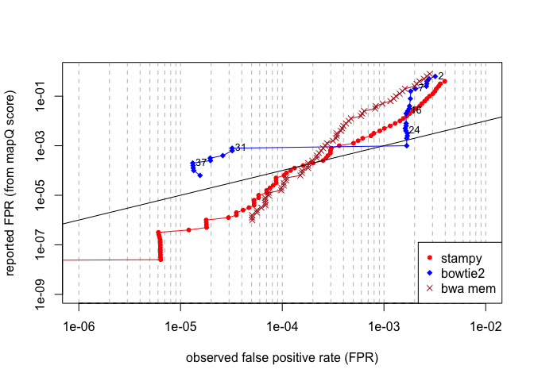

------------------------------------------------------------------------

### Reproducing ROC curve for stampy as on [Heng Li's](http://lh3lh3.users.sourceforge.net/alnROC.shtml) website

In order to have a direct comparison with the ROC curve for `stampy` produced by Heng Li, I downloaded the human genome reference sequence version 38 from the ensembl ftp server: <ftp://ftp.ensembl.org/pub/release-76/fasta/homo_sapiens/dna/>.

I then used `wgsim` to simulate 200,000 SE reads with read length 100bp from the human genome and incorporated polymorphisms at a frequency of 0.01 and 15% of them are indels.

    $ ../wgsim/wgsim -N200000 -e0 -1 100 -2 100 -S13 -r 0.01 -R 0.15 -X0.3 -d0 Homo_sapiens.GRCh38.dna_sm.primary_assembly.fa.gz human_sim.fq /dev/null > human_sim.log

Indels are short, since their default extension probability is only 0.3.

``` r
wgsim_default_indel_dist <- read.delim("human_wgsim.indelsize")
barplot(table(wgsim_default_indel_dist),
        ylab="count",
        xlab="indel size"
        )
```

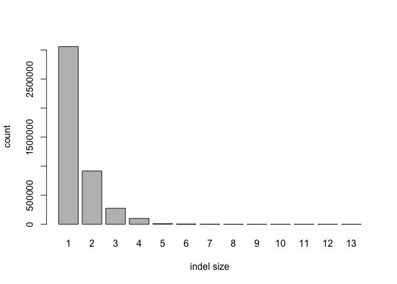

``` r
human_roc <- read.delim("human_sim.roc", header=T)
head(human_roc)
```

    ##   MapQ Mapped falseMap
    ## 1   96 148820        0
    ## 2   95 148835        0
    ## 3   94 148840        0
    ## 4   93 148849        0
    ## 5   92 148855        0
    ## 6   90 149555        0

``` r
tail(human_roc)
```

    ##    MapQ Mapped falseMap
    ## 87    9 187645      620
    ## 88    8 187691      662
    ## 89    7 188216      745
    ## 90    6 188578      854
    ## 91    5 189608     1533
    ## 92    4 189786     1711

``` r
htruePos <- (human_roc$Mapped - human_roc$falseMap) / 200000
hfalsePos <- human_roc$falseMap / human_roc$Mapped

par(mar=c(5,4,3,2))

plot(hfalsePos, htruePos,
     xlim=c(10^-6, 10^-1),
     log="x",
     xaxp=c(10^-6, 10^-2, n=1),
     ylim=c(0.9, 1),
     pch=20,
     col=hsv(h= 0.91 - hfalsePos*100),
     bty="n",
     main="ROC curve for stampy",
     cex.sub=0.8,
     xlab="False positive rate",
     ylab="True positive rate"
     )
```

    ## Warning in xy.coords(x, y, xlabel, ylabel, log): 40 x values <= 0 omitted
    ## from logarithmic plot

``` r
mtext("reads simulated from human genome using default wgsim",
      side=3,
      line=0,
      cex=0.8
      )

text(x=hfalsePos[seq(1, l, 2)], 
     y=htruePos[seq(1, l, 2)], 
     labels=human_roc$MapQ[seq(1, l, 2)], # label every 4th point with its mapping quality
     pos=4, 
     offset=0.2, 
     cex=0.8
     )

abline(h=seq(0.9, 1, 0.01), col="gray", lty=2)
abline(v=10^(seq(-6, -1, 1)), col="gray", lty=2)
```

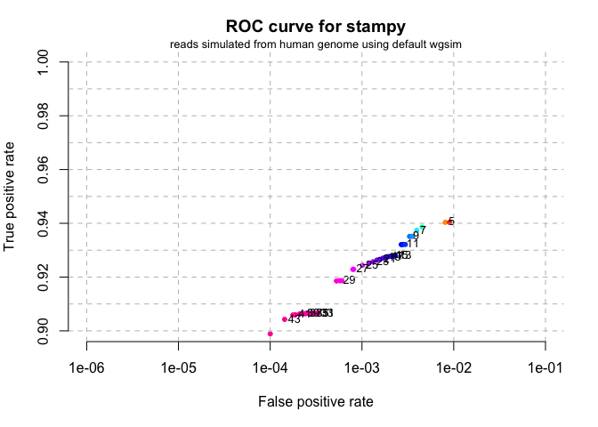

This ROC curve is very similar to the one created by [Heng Li](http://lh3lh3.users.sourceforge.net/alnROC.shtml). It demonstrates that `stampy` has an exceptionally high false positive rate with the simulated data.

``` r
par(mar=c(4,4,3,4))

plot(hfalsePos, htruePos,
     xlim=c(10^-6, 10^-2),
     ylim=c(0.6, 1),
     pch=20,
     xlab="False positive rate",
     ylab="True positive rate",
     col=hsv(h= 0.91 - hfalsePos*100),
     bty="n",
     main="ROC curve for stampy",
     yaxt="n"
     )

axis(side=2,
     at=c(0.6, 0.7, 0.8, 0.9, htruePos[human_roc$MapQ==30], 1),
     labels=c(0.6, 0.7, 0.8, 0.9, signif(htruePos[human_roc$MapQ==30], 2), 1),
     las=1
     )

mtext("reads simulated from human genome using default wgsim",
      side=3,
      line=0,
      cex=0.8
      )

axis(side=4,
     at=htruePos,
     labels=human_roc$MapQ
     )
mtext(text="mapQ", side=4, line=3)

text(x=hfalsePos[seq(1, l, 4)], 
     y=htruePos[seq(1, l, 4)], 
     labels=human_roc$MapQ[seq(1, l, 4)], # label every 4th point with its mapping quality
     pos=4, 
     offset=0.2, 
     cex=0.8
     )

abline(v=1/2000, lty=2, col="grey")
abline(h=htruePos[human_roc$MapQ==30], lty=2, col="grey")

rect(0, 0.6, 0.0005, htruePos[human_roc$MapQ==30], 
     density=NA, 
     col=rgb(0, 1, 0, alpha=0.4)
     )

rect(0.0005, htruePos[human_roc$MapQ==30], 0.01, 1,
     density=NA,
     col=rgb(1, 0, 0, alpha=0.4)
     )

legend("bottomright",
       legend=c("false pos. rate < 1/2000; mapQ >= 30", 
                "false pos. rate > 1/2000; mapQ < 30"),
       fill=c(rgb(0, 1, 0, alpha=0.4), rgb(1, 0, 0, alpha=0.4)),
       cex=0.8
       )
```

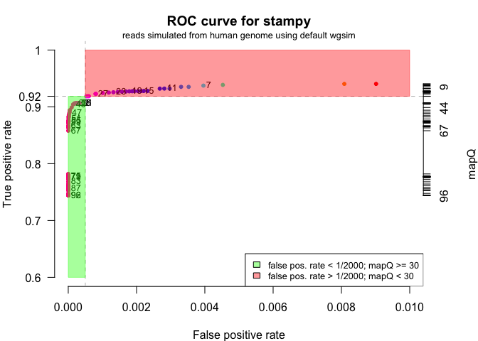

The mapping quality of 30 still seems to be a reasonable cutoff for stampy. The human reference sequence is more than 10x larger than the *Heliconius* reference. That means it is more repetitive and thus a greater challenge to read mappers. That's why I am going to continue using the human genome reference for read mapper testing.

I want to know how `stampy` behaves if I increase the indel size (`-X 0.9`) and slightly the proportion of polymorphisms that are indels (from 15% to 20%) while keeping the total polymorphism rate the same as before (0.01).

    ../wgsim/wgsim -N 200000 -e 0 -1 100 -2 100 -S 13 -r 0.01 -R 0.2 -X 0.9 -d 0 -h Homo_sapiens.GRCh38.dna_sm.primary_assembly.fa.gz human_wgsim.fq /dev/null > human_wgsim.log

``` r
h_wgsim_long_indel.roc <- read.delim("human_wgsim.roc")
head(h_wgsim_long_indel.roc)
```

    ##   MapQ Mapped falseMap
    ## 1   96 135852        4
    ## 2   95 135866        4
    ## 3   94 135868        4
    ## 4   93 135871        4
    ## 5   92 135877        4
    ## 6   91 135879        4

``` r
h_lindel_truePos <- (h_wgsim_long_indel.roc$Mapped - h_wgsim_long_indel.roc$falseMap) / 200000
h_lindel_falsePos <- h_wgsim_long_indel.roc$falseMap / h_wgsim_long_indel.roc$Mapped

par(mar=c(5,4,3,2))

plot(h_lindel_falsePos, h_lindel_truePos,
     xlim=c(10^-6, 10^-1),
     log="x",
     xaxp=c(10^-6, 10^-2, n=1),
     ylim=c(0.9, 1),
     pch=20,
     col=hsv(h= 1 - ifelse(h_lindel_falsePos*100 >= 1, 1, h_lindel_falsePos*100)),
     bty="n",
     main="ROC curve for stampy",
     cex.sub=0.8,
     xlab="False positive rate",
     ylab="True positive rate"
     )

mtext("reads simulated from human genome with wgsim and long indels",
      side=3,
      line=0,
      cex=0.8
      )

text(x=h_lindel_falsePos[seq(1, l, 4)], 
     y=h_lindel_truePos[seq(1, l, 4)], 
     labels=h_wgsim_long_indel.roc$MapQ[seq(1, l, 4)], # label every 4th point with its mapping quality
     pos=4, 
     offset=0.2, 
     cex=0.8
     )

abline(h=seq(0.9, 1, 0.01), col="gray", lty=2)
abline(v=10^(seq(-6, -1, 1)), col="gray", lty=2)
```

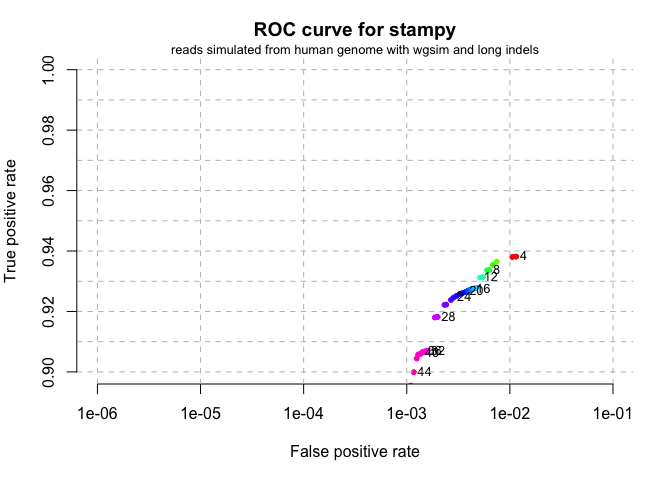

While the higher indel sizes do not lead to a decrease in sensitivity (roughly the same total number of reads are mapped as before), they do lead to a 10 fold increase in false positive rate for reads with an assigned mapping quality of &gt;= 44. I expect a similar result if I would use `Mason` to simulate the reads, given my comparison of the two simulators above.
